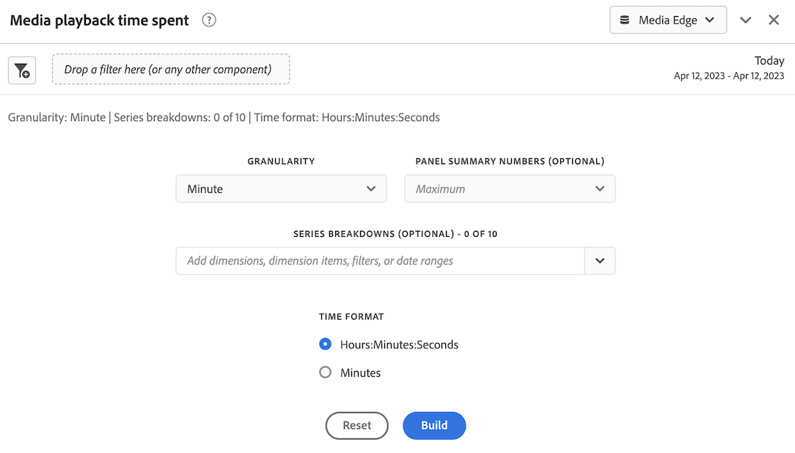

# 使用Edge Network實作串流媒體收集

Adobe Experience Platform Edge Network 可讓您將預計要送給多個產品的資料傳送到一個集中位置。Experience Edge 會將適當的資訊轉送給所需的產品。 此概念可讓您整合實施工作，特別是橫跨多個資料解決方案時。

下圖說明如何實作串流媒體收集附加元件，以使用Experience Platform Edge在Adobe Analytics或Customer Journey Analytics中讓資料可在Analysis Workspace中使用：

如需所有實作選項的概觀，包括未使用Experience Platform Edge的實作方法，請參閱[實作Adobe Analytics或Customer Journey Analytics的串流媒體服務](/help/implementation/overview.md)。

無論您使用Adobe Experience Platform Web SDK、Adobe Experience Platform Mobile SDK、Adobe Experience Platform Roku SDK或API來使用Experience Edge實作串流媒體收集，您都必須先完成下列章節：

## 在Adobe Experience Platform中設定結構

為了標準化資料彙集以跨利用 Adobe Experience Platform 的應用程式使用，Adobe 建立了開放且公開記錄標準，即體驗資料模型 (XDM)。

若要建立及設定綱要：

1. 在Adobe Experience Platform中，開始建立結構描述，如[在UI中建立和編輯結構描述](https://experienceleague.adobe.com/docs/experience-platform/xdm/ui/resources/schemas.html?lang=zh-Hant)中所述。

1. 在建立結構描述時，請在[結構描述詳細資訊]頁面上，為結構描述選擇基底類別時，選擇&#x200B;[!UICONTROL **體驗事件**]。

   

1. 選取&#x200B;[!UICONTROL **「下一步」**]。

1. 指定結構描述顯示名稱和說明，然後選取&#x200B;[!UICONTROL **完成**]。

1. 在&#x200B;[!UICONTROL **構成**]&#x200B;區域中，在&#x200B;[!UICONTROL **欄位群組**]&#x200B;區段中，選取&#x200B;[!UICONTROL **新增**]，然後搜尋下列新欄位群組並將其新增至結構描述：
   * `End User ID Details`
   * `Implementation Details`
   * `MediaAnalytics Interaction Details`

   新增欄位群組後，它們應該顯示在&#x200B;[!UICONTROL **欄位群組**]&#x200B;區段中，如下所示：

   

1. 選取&#x200B;[!UICONTROL **儲存**]&#x200B;以儲存您的變更。

1. （選用）您可以隱藏Media Edge API未使用的特定欄位。 隱藏這些欄位可讓結構描述更容易閱讀和理解，但並非必要。 這些欄位僅參考`MediaAnalytics Interaction Details`欄位群組中的欄位。

   +++ 展開此處以檢視可隱藏欄位的指示。

   1. 在&#x200B;[!UICONTROL **結構**]&#x200B;區域中，選取`Media Collection Details`欄位，然後選取&#x200B;[!UICONTROL **管理相關欄位**]。

      

   1. 啟用選項&#x200B;[!UICONTROL **顯示欄位**]&#x200B;的顯示名稱，然後更新結構描述，如下所示：

      * 在`Media Collection Details` > `Advertising Details`欄位中，隱藏下列報告欄位： `Ad Completed`、`Ad Started`和`Ad Time Played`。

      * 在`Media Collection Details` > `Advertising Pod Details`欄位中，隱藏下列報告欄位： `Ad Break ID`

      * 在`Media Collection Details` > `Chapter Details`欄位中，隱藏下列報告欄位： `Chapter Completed`、`Chapter ID`、`Chapter Started`和`Chapter Time Played`。

      * 在`Media Collection Details`欄位中，隱藏`List Of States`欄位。

        

      * 在`Media Collection Details` > `List Of States End`和`Media Collection Details` > `List Of States Start`欄位中，隱藏下列報告欄位： `Player State Count`、`Player State Set`和`Player State Time`。

        要隱藏的

      * 在`Media Collection Details` > `Qoe Data Details`欄位中，隱藏下列報告欄位： `Average Bitrate`、`Average Bitrate Bucket`、`Bitrate Change Impacted Streams`、`Bitrate Changes`、`Buffer Impacted Streams`、`Buffer Events`、`Dropped Frame Impacted Streams`、`Drops Before Starts`、`Errors`、`External Error IDs`、`Error Impacted Streams`、`Media SDK Error IDs`、`Player SDK Error IDs`、`Stalling Impacted Streams`、`Stalling Events`、`Total Buffer Duration`和`Total Stalling Duration`。

      * 在`Media Collection Details` > `Session Details`欄位中，隱藏下列報告欄位： `10% Progress Marker`、`25% Progress Marker`、`50% Progress Marker`、`75% Progress Marker`、`95% Progress Marker`、`Ad Count`、`Average Minute Audience`、`Content Completes`、`Chapter Count`、`Content Starts`、`Content Time Spent`、`Estimated Streams`、`Federated Data`、`Media Segment Views`、`Media Downloaded Flag`、`Media Starts`、`Media Session ID`、`Media Session Server Timeout`、`Media Time Spent`、`Pause Events`、`Pause Impacted Streams`、`Pev3`、`Pccr`、`Total Pause Duration`、`Unique Time Played`以及`Video Segment`。

   1. 選取&#x200B;[!UICONTROL **確認**]&#x200B;以儲存變更。

   1. 在&#x200B;[!UICONTROL **結構**]&#x200B;區域中，啟用選項&#x200B;[!UICONTROL **顯示欄位顯示名稱**]，然後選取`List Of Media Collection Downloaded Content Events`欄位。

   1. 選取&#x200B;[!UICONTROL **管理相關欄位**]，然後依照下列方式更新結構描述：

      * 在`List Of Media Collection Downloaded Content Events` > `Media Details` > `Advertising Details`欄位中，隱藏下列報告欄位： `Ad Completed`、`Ad Started`和`Ad Time Played`。

      * 在`List Of Media Collection Downloaded Content Events` > `Media Details` > `Advertising Pod Details`欄位中，隱藏下列報告欄位： `Ad Break ID`

      * 在`List Of Media Collection Downloaded Content Events` > `Media Details` > `Chapter Details`欄位中，隱藏下列報告欄位： `Chapter Completed`、`Chapter ID`、`Chapter Started`和`Chapter Time Played`。

      * 在`List Of Media Collection Downloaded Content Events` > `Media Details`欄位中，隱藏`List Of States`欄位。

      * 在`List Of Media Collection Downloaded Content Events` > `Media Details` > `List Of States End`和`Media Collection Details` > `List Of States Start`欄位中，隱藏下列報告欄位： `Player State Count`、`Player State Set`和`Player State Time`。

      * 在`List Of Media Collection Downloaded Content Events` > `Media Details` > `Qoe Data Details`欄位中，隱藏下列報告欄位： `Average Bitrate`、`Average Bitrate Bucket`、`Bitrate Change Impacted Streams`、`Bitrate Changes`、`Buffer Events`、`Buffer Impacted Streams`、`Drops Before Starts`、`Dropped Frame Impacted Streams`、`Error Impacted Streams`、`Errors`、`External Error IDs`、`Media SDK Error IDs`、`Player SDK Error IDs`、`Stalling Events`、`Stalling Impacted Streams`、`Total Buffer Duration`以及`Total Stalling Duration`。

      * 在`List Of Media Collection Downloaded Content Events` > `Media Details` > `Session Details`欄位中，隱藏下列報告欄位： `10% Progress Marker`、`25% Progress Marker`、`50% Progress Marker`、`75% Progress Marker`、`95% Progress Marker`、`Ad Count`、`Average Minute Audience`、`Chapter Count`、`Content Completes`、`Content Starts`、`Content Time Spent`、`Estimated Streams`、`Federated Data`、`Media Downloaded Flag`、`Media Segment Views`、`Media Session ID`、`Media Session Server Timeout`、`Media Starts`、`Media Time Spent`、`Pause Events`、`Pause Impacted Streams`、`Pccr`、`Pev3`、`Total Pause Duration`、`Unique Time Played`和`Video Segment`。

      * 在`List Of Media Collection Downloaded Content Events` > `Media Details`欄位中，隱藏`Media Session ID`欄位。

   1. 選取&#x200B;[!UICONTROL **確認**]&#x200B;以儲存變更。

   1. 在&#x200B;[!UICONTROL **結構**]&#x200B;區域中，選取`Media Reporting Details`欄位，選取&#x200B;[!UICONTROL **管理相關欄位**]。

   1. 啟用選項&#x200B;[!UICONTROL **顯示欄位**]&#x200B;的顯示名稱，然後更新結構描述，如下所示：

      * 在`Media Reporting Details`欄位中，隱藏下列欄位： `Error Details`、`List Of States End`、`List of States Start`和`Media Session ID`。

   1. 選取&#x200B;[!UICONTROL **確認**] > [!UICONTROL **儲存**]&#x200B;以儲存變更。

   +++

1. （選用）您可以將自訂中繼資料新增到結構描述。 這可讓您包含其他使用者定義的中繼資料，這些中繼資料可以根據特定需求或內容進行自訂。 若現有結構描述未涵蓋所需的資料點，此彈性就相當實用。 (您也可以搭配Media Edge API使用自訂中繼資料。 如需詳細資訊，請參閱[使用Media Edge API建立自訂中繼資料](https://developer.adobe.com/cja-apis/docs/endpoints/media-edge/custom-metadata/)。

   +++ 展開此處以檢視如何新增自訂中繼資料至結構描述的指示。

   1. 選取&#x200B;[!UICONTROL **帳戶資訊**] > [!UICONTROL **指派的組織**] > [!UICONTROL _**組織名稱**_] > [!UICONTROL **租使用者**]，以找出組織的租使用者名稱稱。

      將透過此路徑接收這些自訂欄位。 (例如，租使用者名稱稱： _dcbl → myCustomField路徑： _dcbl.myCustomField。)

   1. 新增自訂欄位群組至您定義的媒體結構描述。

      

   1. 將您想要追蹤的任何自訂欄位新增至欄位群組。

      

   1. [使用產生的路徑](https://experienceleague.adobe.com/zh-hant/docs/experience-platform/xdm/ui/fields/overview#type-specific-properties)作為要求承載中的自訂欄位。

      

   +++

1. 繼續[在Adobe Experience Platform](#create-a-dataset-in-adobe-experience-platform)中建立資料集。

## 在 Adobe Experience Platform 中建立資料集

1. 請確定您已依照[在Adobe Experience Platform中設定結構描述](#set-up-the-schema-in-adobe-experience-platform)中的說明設定結構描述。

1. 在Adobe Experience Platform中，依照[資料集UI指南](https://experienceleague.adobe.com/docs/experience-platform/catalog/datasets/user-guide.html?lang=zh-Hant#create)中的說明開始建立資料集。

   為資料集選取結構描述時，請選擇您先前建立的結構描述，如[在Adobe Experience Platform中設定結構描述](#set-up-the-schema-in-adobe-experience-platform)中所述。

1. 繼續[在Customer Journey Analytics](#configure-a-datastream-in-adobe-experience-platform)中設定資料串流。

## 在Adobe Experience Platform中設定資料串流

1. 請確定您已按照[在Adobe Experience Platform中建立資料集](#create-a-dataset-in-adobe-experience-platform)中的說明建立資料集。

1. 如[設定資料流](https://experienceleague.adobe.com/docs/experience-platform/edge/datastreams/configure.html?lang=zh-Hant)中所述，建立新的資料流。

   建立資料串流時，請務必選取下列設定：

   * 在建立資料流時，請在&#x200B;[!UICONTROL **事件結構描述**]&#x200B;欄位中，確定您選取您在[中建立的結構描述。在Adobe Experience Platform](#set-up-the-schema-in-adobe-experience-platform)中設定結構描述。 選取「[!UICONTROL **儲存**]」。

     >[!IMPORTANT]
     >
     >請勿選取&#x200B;[!UICONTROL **儲存並新增對應**]，因為這樣做會導致Timestamp欄位的對應錯誤。

     

   * 根據您使用的是Adobe Analytics還是Customer Journey Analytics，將以下任一服務新增至資料流：

      * [!UICONTROL **Adobe Analytics**] (若使用Adobe Analytics)

        如果您使用Adobe Analytics，請務必定義報表套裝，如[建立報表套裝](https://experienceleague.adobe.com/zh-hant/docs/analytics/admin/admin-tools/manage-report-suites/c-new-report-suite/t-create-a-report-suite)中所述。

      * [!UICONTROL **Adobe Experience Platform**] (若使用Customer Journey Analytics)

     如需有關如何將服務新增至資料串流的資訊，請參閱[設定資料串流](https://experienceleague.adobe.com/docs/experience-platform/edge/datastreams/configure.html?lang=zh-Hant#view-details)中的「將服務新增至資料串流」區段。

     

      * 展開&#x200B;[!UICONTROL **進階選項**]，然後啟用&#x200B;[!UICONTROL **Media Analytics**]&#x200B;選項。

     

1. 您現在已準備好實作[Media Edge API](/help/implementation/edge/implementation-edge-api.md)或[Media Edge SDK](/help/implementation/edge/edge-mobile-sdk.md)以開始收集媒體分析資料。

   收集一些資料後，您可以[在Customer Journey Analytics中建立連線](#create-a-connection-in-customer-journey-analytics)。

## 在 Customer Journey Analytics 中建立連線

>[!NOTE]
>
>只有在使用Customer Journey Analytics時，才需要執行下列程式。

1. 請確定您已按照[在Customer Journey Analytics中設定資料流](#configure-a-datastream-in-adobe-experience-platform)中的說明建立資料流。

1. 在Customer Journey Analytics中建立連線，如[建立連線](https://experienceleague.adobe.com/docs/analytics-platform/using/cja-connections/create-connection.html?lang=zh-Hant)中所述。

   建立連線時，實作串流媒體收集需要下列設定選項：

   1. 選取您先前建立的資料集，如[在Adobe Experience Platform中建立資料集](#create-a-dataset-in-adobe-experience-platform)中所述。

   1. 確定已啟用&#x200B;[!UICONTROL **匯入所有新資料**]&#x200B;設定。

1. 繼續[在Customer Journey Analytics](#create-a-new-data-view-in-customer-journey-analytics)中建立資料檢視。

## 在 Customer Journey Analytics 中建立資料檢視

>[!NOTE]
>
>只有在使用Customer Journey Analytics時，才需要執行下列程式。

1. 請確定您已依照[在Customer Journey Analytics中建立連線](#create-a-connection-in-customer-journey-analytics)中的說明在Customer Journey Analytics中建立連線。

1. 在Customer Journey Analytics中，依照[建立或編輯資料檢視](https://experienceleague.adobe.com/docs/analytics-platform/using/cja-dataviews/create-dataview.html?lang=zh-Hant)中的說明建立資料檢視。

   建立資料檢視時，實施串流媒體收集需要以下設定選擇：

   1. 在&#x200B;[!UICONTROL **連線**]&#x200B;欄位中，選取您先前建立的連線，如[在Customer Journey Analytics中建立連線](#create-a-connection-in-customer-journey-analytics)中所述。

      您建立的連線最長可能需要15分鐘才能選取。

   1. 在&#x200B;[!UICONTROL **元件**]&#x200B;標籤的&#x200B;[!UICONTROL **結構描述欄位**]&#x200B;區段中，搜尋下清單格中列出的每個元件，並將其拖曳至&#x200B;[!UICONTROL **量度**]&#x200B;面板。 如果存在多個相同名稱的欄位，請使用XDM路徑來確保它是正確欄位。

      **主要內容 — 內容量度**

      | 元件名稱 | XDM 路徑 |
      |----------|---------|
      | 媒體開始次數 | mediaReporting.sessionDetails.isViewed |
      | 媒體區段檢視次數 | mediaReporting.sessionDetails.hasSegmentView |
      | 內容開始 | mediaReporting.sessionDetails.isPlayed |
      | 內容完成 | mediaReporting.sessionDetails.isCompleted |
      | 內容逗留時間 | mediaReporting.sessionDetails.timePlayed |
      | 媒體逗留時間 | mediaReporting.sessionDetails.totalTimePlayed |
      | 不重複播放時間 | mediaReporting.sessionDetails.uniqueTimePlayed |
      | 10% 進度標記 | mediaReporting.sessionDetails.hasProgress10 |
      | 平均分鐘觀眾數 | mediaReporting.sessionDetails.averageMinuteAudience |

      **章節與廣告 — 章節與廣告量度**

      | 元件名稱 | XDM 路徑 |
      |----------|---------|
      | 章節已開始 | mediaReporting.chapterDetails.isStarted |
      | 章節已完成 | mediaReporting.chapterDetails.isCompleted |
      | 章節時間已播放 | mediaReporting.chapterDetails.timePlayed |
      | 廣告開始 | mediaReporting.advertisingDetails.isStarted |
      | 廣告完成 | mediaReporting.advertisingDetails.isCompleted |
      | 廣告播放時間 | mediaReporting.advertisingDetails.timePlayed |

      **QoE - QoE量度**

      | 元件名稱 | XDM 路徑 |
      |----------|---------|
      | 開始時間 | mediaReporting.qoeDataDetails.timeToStart |
      | 開始前掉格 | mediaReporting.qoeDataDetails.isDroppedBeforeStart |
      | 緩衝影響的資料流 | mediaReporting.qoeDataDetails.hasBufferImpactedStreams |
      | 位元速率變更影響的資料流 | mediaReporting.qoeDataDetails.hasBitrateChangeImpactedStreams |
      | 位元速率變更 | mediaReporting.qoeDataDetails.bitrateChangeCount |
      | 平均位元速率 | mediaReporting.qoeDataDetails.bitrateAverage |
      | 掉格 | mediaReporting.qoeDataDetails.droppedFrames |
      | 錯誤 | mediaReporting.qoeDataDetails.errorCount |
      | 錯誤影響的資料流 | mediaReporting.qoeDataDetails.hasErrorImpactedStreams |
      | 掉格影響的資料流 | mediaReporting.qoeDataDetails.hasDroppedFrameImpactedStreams |

      **播放器狀態 — 播放器狀態量度**

      | 元件名稱 | XDM 路徑 |
      |----------|---------|
      | 播放器狀態集 | mediaReporting.states.isSet |
      | 播放器狀態計數 | mediaReporting.states.count |
      | 播放器狀態時間 | mediaReporting.states.time |

   1. 更新下表中元件的標籤（在&#x200B;[!UICONTROL **內容標籤**]&#x200B;下拉式功能表中）。 搜尋並拖曳量度面板中尚未的任何元件至面板。

      | 元件名稱 | 內容標籤 |
      |---------|----------|
      | 媒體工作階段伺服器逾時 | 媒體：自上次呼叫以來的秒數 |
      | 媒體逗留時間 | 媒體：媒體逗留時間 |
      | 總緩衝期間 | 媒體：總緩衝期間 |
      | 開始時間 | 媒體：開始時間 |
      | 總暫停期間 | 媒體：總暫停期間 |

   1. 若要將劃分加入您的Customer Journey Analytics專案，請將下列維度新增至「[!UICONTROL **維度**]」面板：

      | XDM 路徑 | 元件名稱 |
      |---------|----------|
      | mediaReporting.states.name | 播放器狀態名稱 |
      | mediaReporting.sessionDetails.ID | 媒體工作階段 ID |

      除了此表格中的維度外，您也可以新增任何其他維度，以便在Customer Journey Analytics專案中依其篩選資料。

1. 選取「儲存並繼續」[!UICONTROL **>「**]&#x200B;儲存並完成」[!UICONTROL **以儲存您的變更。**]

1. 繼續[在Customer Journey Analytics](#create-and-configure-a-project-in-customer-journey-analytics)中建立及設定專案。

## 在Customer Journey Analytics中建立及設定專案

1. 請確定您已依照[在Customer Journey Analytics中建立資料檢視](#create-a-new-data-view-in-customer-journey-analytics)中的說明在Customer Journey Analytics中建立資料檢視。

1. 在Customer Journey Analytics的&#x200B;[!UICONTROL **Workspace**]&#x200B;索引標籤的&#x200B;[!UICONTROL **專案**]&#x200B;區域中，選取&#x200B;[!UICONTROL **建立專案**]。

1. 選取&#x200B;[!UICONTROL **空白專案**] > [!UICONTROL **建立**]。

1. 在新專案中，選取您先前建立的資料檢視。

   在專案中建立面板時，您可以使用新增至資料檢視的任何元件，如[在Customer Journey Analytics中建立資料檢視](#create-a-new-data-view-in-customer-journey-analytics)中所述。

   下列4個面板是您可以建立的面板範例：

   

   

   

   

1. 選取左側邊欄中的&#x200B;**面板**&#x200B;圖示，然後拖曳至&#x200B;[!UICONTROL **媒體同時檢閱者**]&#x200B;面板和&#x200B;[!UICONTROL **媒體播放時間**]&#x200B;面板。

   這2個面板看起來應該像這樣：

   

   

1. （視條件而定）如果您將自訂中繼資料新增至結構描述，如[在Adobe Experience Platform](#set-up-the-schema-in-adobe-experience-platform)中設定結構描述中的步驟8所述，則您需要為自訂欄位設定持續性，如Customer Journey Analytics指南中的[持續性元件設定](https://experienceleague.adobe.com/zh-hant/docs/analytics-platform/using/cja-dataviews/component-settings/persistence)所述。

   資料到達Customer Journey Analytics時，可使用自訂使用者ID維度。

   

   >[!NOTE]
   >
   >如果您將Adobe Analytics設定為您的資料串流的上游，自訂中繼資料也會出現在ContextData中，其名稱為您在結構描述中設定（沒有租使用者首碼，例如myCustomField）。 這可讓您使用所有可用於ContextData的Adobe Analytics功能，例如[建立處理規則](https://experienceleague.adobe.com/zh-hant/docs/analytics/admin/admin-tools/manage-report-suites/edit-report-suite/report-suite-general/c-processing-rules/processing-rules)。

1. 依照[共用專案](https://experienceleague.adobe.com/docs/analytics-platform/using/cja-workspace/curate-share/share-projects.html?lang=zh-Hant)中的說明共用專案。

   >[!NOTE]
   >
   >   如果您想要共用的使用者無法使用，請確定使用者擁有Adobe Admin Console中Customer Journey Analytics的使用者和管理員存取權。

1. 繼續[傳送資料至Experience Platform Edge](#send-data-to-experience-platform-edge)。

## 將資料傳送至Experience Platform Edge

根據您要傳送至Experience Platform Edge的資料型別，您可以使用下列任一方法：

### 網路：使用Adobe Experience Platform網路SDK

* [快速入門](https://developer.adobe.com/client-sdks/documentation/media-for-edge-network/)

* [使用Adobe Experience Platform Web SDK將網頁資料傳送至Edge](/help/implementation/edge/edge-web-sdk.md)

* [移轉至Adobe Streaming Media for Edge Network擴充功能](https://developer.adobe.com/client-sdks/documentation/adobe-media-analytics/migration-guide/)

### 行動：使用Adobe Experience Platform Mobile SDK

使用下列檔案資源來完成iOS和Android的實作：

* [快速入門](https://developer.adobe.com/client-sdks/documentation/media-for-edge-network/)

* [API 參考資料](https://developer.adobe.com/client-sdks/documentation/media-for-edge-network/api-reference/)

* [移轉至Adobe Streaming Media for Edge Network擴充功能](https://developer.adobe.com/client-sdks/documentation/adobe-media-analytics/migration-guide/)

### Roku： Adobe Experience Platform Roku SDK

* [快速入門](https://developer.adobe.com/client-sdks/documentation/media-for-edge-network/)

* [Adobe Experience Platform Roku SDK](https://github.com/adobe/aepsdk-roku/tree/main)

* [移轉至Adobe Streaming Media for Edge Network擴充功能](https://developer.adobe.com/client-sdks/documentation/adobe-media-analytics/migration-guide/) <!-- is the information here also applicable for Roku? -->

### API：網頁及其他

此API是目前唯一支援將網路資料傳送至Experience Platform Edge的方式。

如果您想要使用Edge API的自訂實作，也可使用此API。

如需Media Edge API的詳細資訊，請參閱下列資源：

* [Media Edge API總覽](https://experienceleague.adobe.com/docs/experience-platform/edge-network-server-api/media-edge-apis/overview.html?lang=zh-Hant)

* [Media Edge API快速入門](https://experienceleague.adobe.com/docs/experience-platform/edge-network-server-api/media-edge-apis/getting-started.html?lang=zh-Hant)

* [Media Edge API疑難排解指南](https://experienceleague.adobe.com/docs/experience-platform/edge-network-server-api/media-edge-apis/troubleshooting.html)

* [使用Media Edge API的Open API規格檔案](https://developer.adobe.com/data-collection-apis/docs/api/media-edge/)
