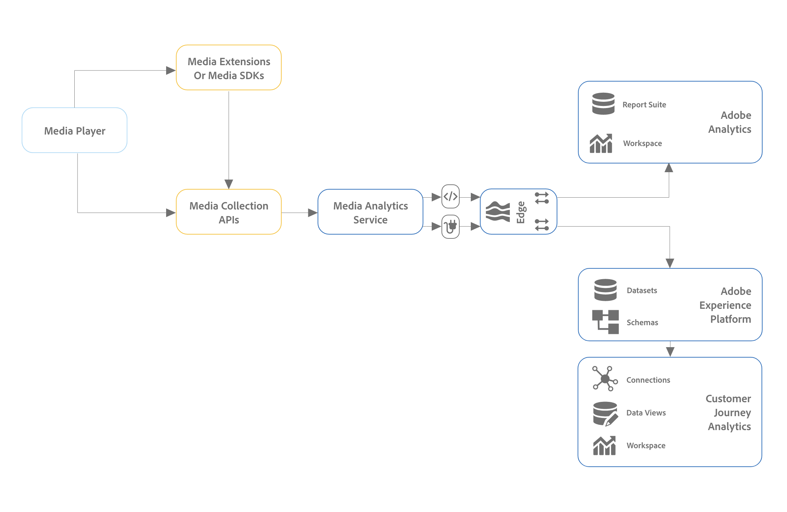

# 使用Experience Platform邊緣安裝媒體分析

Adobe Experience Platform Edge 可讓您將預計要送給多個產品的資料傳送到一個集中位置。 Experience Edge 會將適當的資訊轉送給所需的產品。 此概念可讓您整合實作工作，特別是橫跨多個資料解決方案時。

下圖說明了使用Experience Platform邊緣的媒體分析實現：

>[!IMPORTANT]
>
>目前，您只能使用Adobe Experience Platform移動SDK向體驗邊緣發送資料。

<!-- Replace the above sentence with this after it web releases: You can send data to Experience Edge using any of the following implementation methods:

* Adobe Experience Platform Web SDK (Coming soon)
* Adobe Experience Platform Mobile SDK
* Edge Network Server API

Regardless of which Experience Edge implementation method you use for configuring media tracking, you must first complete the following sections:

-->

完成以下部分，使用Experience Platform邊緣實現媒體分析：

* [定義報表套件](#define-a-report-suite)
* [在Adobe Experience Platform設定架構](#set-up-the-schema-in-adobe-experience-platform)
* [在Adobe Experience Platform建立資料集](#create-a-dataset-in-adobe-experience-platform)
* [在Adobe Experience Platform配置資料流](#configure-a-datastream-in-adobe-experience-platform)
* [在 Customer Journey Analytics 中建立連線](#create-a-connection-in-customer-journey-analytics)
* [在Customer Journey Analytics中建立資料視圖](#create-a-data-view-in-customer-journey-analytics)
* [在Customer Journey Analytics中建立和配置項目](#create-and-configure-a-project-in-customer-journey-analytics)
* [將資料發送到具有邊擴展的Experience Platform邊](#send-data-to-experience-platform-edge-with-the-edge-extension)

## 定義報表套件

>[!NOTE]
>
>只有在您使用Adobe Analytics時，才需要報告套件。 如果您計畫使用Customer Journey Analytics進行報告，則不需要報告套件。

如果您計畫使用Adobe Analytics進行報告，則需要有一個報告套件來與您的流媒體實施一起使用。 有關定義報表套件的資訊，請參閱 [報表套件管理器](https://experienceleague.adobe.com/docs/analytics/admin/admin-tools/manage-report-suites/report-suites-admin.html?lang=en)。

定義報表套件後，繼續 [在Adobe Experience Platform設定架構](#set-up-the-schema-in-adobe-experience-platform)。

## 在Adobe Experience Platform設定架構

為了標準化資料彙集以跨利用 Adobe Experience Platform 的應用程式使用，Adobe 建立了開放且公開記錄標準，即體驗資料模型 (XDM)。

建立和設定架構：

1. 在Adobe Experience Platform，開始建立架構，如中所述 [在UI中建立和編輯架構](https://experienceleague.adobe.com/docs/experience-platform/xdm/ui/resources/schemas.html?lang=en)。

   建立架構時，選擇 [!UICONTROL **XDM體驗事件**] 從 [!UICONTROL **建立架構**] 的下界。

1. 在 [!UICONTROL **組合**] 的 [!UICONTROL **欄位組**] 選擇 [!UICONTROL **添加**]，然後搜索以下新欄位組並將其添加到架構中：
   * `Adobe Analytics ExperienceEvent Template`
   * `Implementation Details`
   * `MediaAnalytics Interaction Details`

   添加欄位組後，應在 [!UICONTROL **欄位組**] ，如下所示：

   

1. 在 [!UICONTROL **結構**] 的 `endUserIds` > `_experience` 欄位組，然後選擇 [!UICONTROL **管理相關欄位**]。

   

1. 按如下方式更新架構：

   * 在 `Adobe Analytics ExperienceEvent Template` 欄位組，隱藏除外的所有欄位 `EndUserIDs`。

   * 在 `endUserIds` > `_experience` > `Adobe Advertising Cloud end user IDs` 欄位組，隱藏除外的所有欄位 `Identifier` 的子菜單。

   * 在 `endUserIds` > `_experience` > `Adobe Analytics Cloud Custom end user IDs` 欄位組，隱藏除外的所有欄位 `Identifier` 的子菜單。

      

1. 選擇 [!UICONTROL **確認**] 的子菜單。

1. 在 [!UICONTROL **結構**] 的 `Implementation Details` 欄位組，選擇 [!UICONTROL **管理相關欄位**]，然後按如下方式更新架構：

   * 在 `Implementation Details` > `Implementation details` 欄位組，隱藏除 `version`。

      

1. 選擇 [!UICONTROL **確認**] 的子菜單。

1. 在 [!UICONTROL **結構**] 的 `Media Collection Details` 欄位組，選擇 [!UICONTROL **管理相關欄位**]，然後按如下方式更新架構：

   * 在 `Media Collection Details` 欄位組，隱藏 `List Of States` 欄位組。

      

   * 在 `Media Collection Details` > `Advertising Details` 欄位組，隱藏以下報表欄位： `Ad Completed`。 `Ad Started`, `Ad Time Played`。

   * 在 `Media Collection Details` > `Advertising Pod Details` 欄位組，隱藏以下報告欄位： `Ad Break ID`

   * 在 `Media Collection Details` > `Chapter Details` 欄位組，隱藏以下報告欄位： `Chapter ID`。 `Chapter Completed`。 `Chapter Started`, `Chapter Time Played`。

   * 在 `Media Collection Details` > `Qoe Data Details` 欄位組，隱藏以下報告欄位： `Average Bitrate`。 `Average Bitrate Bucket`。 `Bitrate Changes`。 `Buffer Events`。 `Total Buffer Duration`。 `Errors`。 `External Error IDs`。 `Bitrate Change Impacted Streams`。 `Buffer Impacted Streams`。 `Dropped Frame Impacted Streams`。 `Error Impacted Streams`。 `Stalling Impacted Streams`。 `Drops Before Starts`。 `Media SDK Error IDs`。 `Player SDK Error IDs`。 `Stalling Events`, `Total Stalling Duration`。

   * 在 `Media Collection Details` > `Session Details` 欄位組，隱藏以下報告欄位： `Media Session ID`。 `Ad Count`。 `Average Minute Audience`。 `Chapter Count`。 `Estimated Streams`。 `Pause Impacted Streams`。 `10% Progress Marker`。 `25% Progress Marker`。 `50% Progress Marker`。 `75% Progress Marker`。 `95% Progress Marker`。 `Media Segment Views`。 `Content Completes`。 `Media Downloaded Flag`。 `Federated Data`。 `Content Starts`。 `Media Starts`。 `Pause Events`。 `Total Pause Duration`。 `Media Session Server Timeout`。 `Video Segment`。 `Content Time Spent`。 `Media Time Spent`。 `Unique Time Played`。 `Pev3`, `Pccr`。

   * 在 `Media Collection Details` > `List Of States End` 和 `Media Collection Details` > `List Of States Start` 欄位組，隱藏以下報告欄位： `Player State Count`。 `Player State Set`, `Player State Time`。

      

1. 選擇 [!UICONTROL **確認**] 的子菜單。

1. 在 [!UICONTROL **結構**] 的 `List Of Media Collection Downloaded Content Events` 欄位組，選擇 [!UICONTROL **管理相關欄位**]，然後按如下方式更新架構：

   * 在 `List Of Media Collection Downloaded Content Events` > `Media Details` 欄位組，隱藏 `List Of States` 欄位組。

   * 在 `List Of Media Collection Downloaded Content Events` > `Media Details` > `Advertising Details` 欄位組，隱藏以下報表欄位： `Ad Completed`。 `Ad Started`, `Ad Time Played`。

   * 在 `List Of Media Collection Downloaded Content Events` > `Media Details` > `Advertising Pod Details` 欄位組，隱藏以下報告欄位： `Ad Break ID`

   * 在 `List Of Media Collection Downloaded Content Events` > `Media Details` > `Chapter Details` 欄位組，隱藏以下報告欄位： `Chapter ID`。 `Chapter Completed`。 `Chapter Started`, `Chapter Time Played`。

   * 在 `List Of Media Collection Downloaded Content Events` > `Media Details` > `Qoe Data Details` 欄位組，隱藏以下報告欄位： `Average Bitrate`。 `Average Bitrate Bucket`。 `Bitrate Changes`。 `Buffer Events`。 `Total Buffer Duration`。 `Errors`。 `External Error IDs`。 `Bitrate Change Impacted Streams`。 `Buffer Impacted Streams`。 `Dropped Frame Impacted Streams`。 `Error Impacted Streams`。 `Stalling Impacted Streams`。 `Drops Before Starts`。 `Media SDK Error IDs`。 `Player SDK Error IDs`。 `Stalling Events`, `Total Stalling Duration`。

   * 在 `List Of Media Collection Downloaded Content Events` > `Media Details` > `Session Details` 欄位組，隱藏以下報告欄位： `Media Session ID`。 `Ad Count`。 `Average Minute Audience`。 `Chapter Count`。 `Estimated Streams`。 `Pause Impacted Streams`。 `10% Progress Marker`。 `25% Progress Marker`。 `50% Progress Marker`。 `75% Progress Marker`。 `95% Progress Marker`。 `Media Segment Views`。 `Content Completes`。 `Media Downloaded Flag`。 `Federated Data`。 `Content Starts`。 `Media Starts`。 `Pause Events`。 `Total Pause Duration`。 `Media Session Server Timeout`。 `Video Segment`。 `Content Time Spent`。 `Media Time Spent`。 `Unique Time Played`。 `Pev3`, `Pccr`。

   * 在 `List Of Media Collection Downloaded Content Events` > `Media Details` > `List Of States End` 和 `Media Collection Details` > `List Of States Start` 欄位組，隱藏以下報告欄位： `Player State Count`。 `Player State Set`, `Player State Time`。

   * 在 `List Of Media Collection Downloaded Content Events` > `Media Details`  欄位組，隱藏 `Media Session ID` 的子菜單。

1. 選擇 [!UICONTROL **確認**] 的子菜單。

1. 在 [!UICONTROL **結構**] 的 `Media Reporting Details` 欄位組，選擇 [!UICONTROL **管理相關欄位**]，然後按如下方式更新架構：

   * 在 `Media Reporting Details` 欄位組，隱藏以下欄位組： `Error Details`。 `List Of States End`。 `List of States Start`。 `Playhead`, `Media Session ID`。

1. 選擇 [!UICONTROL **確認**] > [!UICONTROL **保存**]  的子菜單。

1. 繼續 [在Adobe Experience Platform建立資料集](#create-a-dataset-in-adobe-experience-platform)。

## 在Adobe Experience Platform建立資料集

1. 確保按中所述設定架構 [在Adobe Experience Platform設定架構](#set-up-the-schema-in-adobe-experience-platform)。

1. 在Adobe Experience Platform，開始建立資料集，如中所述 [資料集UI指南](https://experienceleague.adobe.com/docs/experience-platform/catalog/datasets/user-guide.html?lang=zh-Hant#create)。

   為資料集選擇架構時，請選擇先前建立的架構，如中所述 [在Adobe Experience Platform設定架構](#set-up-the-schema-in-adobe-experience-platform)。

1. 繼續 [在Customer Journey Analytics中配置資料流](#configure-a-datastream-in-adobe-experience-platform)。

## 在Adobe Experience Platform配置資料流

1. 確保已建立資料集，如所述 [在Adobe Experience Platform建立資料集](#create-a-dataset-in-adobe-experience-platform)。

1. 建立新資料流（如所述） [配置資料流](https://experienceleague.adobe.com/docs/experience-platform/edge/datastreams/configure.html?lang=zh-Hant)。

   建立資料流時，請確保選擇以下配置：

   * 在 [!UICONTROL **事件架構**] 欄位建立資料流時，請確保選擇在中建立的架構 [在Adobe Experience Platform設定架構](#set-up-the-schema-in-adobe-experience-platform)。 選取&#x200B;[!UICONTROL **「儲存」**]。

      >[!IMPORTANT]
          >
      >不選擇 [!UICONTROL **保存和添加映射**] 因為這樣做會導致Timestamp欄位的映射錯誤。
      

      

   * 根據您是使用Adobe Analytics還是Customer Journey Analytics，將以下任一服務添加到資料流：

      * [!UICONTROL **Adobe Analytics**] (如果使用Adobe Analytics)

         如果使用Adobe Analytics，請確保定義報告套件，如一節中所述 [定義報表套件](#define-a-report-suite) 在本文中。

      * [!UICONTROL **Adobe Experience Platform**] (如果使用Customer Journey Analytics)
      有關如何將服務添加到資料流的資訊，請參閱中的「將服務添加到資料流」部分 [配置資料流](https://experienceleague.adobe.com/docs/experience-platform/edge/datastreams/configure.html?lang=en#view-details)。

      

   * 展開 [!UICONTROL **高級選項**]，然後啟用 [!UICONTROL **媒體分析**] 的雙曲餘切值。

      

1. 繼續 [在Customer Journey Analytics中建立連接](#create-a-connection-in-customer-journey-analytics)。

## 在 Customer Journey Analytics 中建立連線

>[!NOTE]
>
>只有在使用Customer Journey Analytics時，才需要執行以下過程。

1. 確保已建立資料流（如所述） [在Customer Journey Analytics中配置資料流](#configure-a-datastream-in-adobe-experience-platform)。

1. 在Customer Journey Analytics中，按中所述建立連接 [建立連接](https://experienceleague.adobe.com/docs/analytics-platform/using/cja-connections/create-connection.html?lang=zh-Hant)。

   建立連接時，實現流媒體需要以下配置選擇：

   1. 選擇以前建立的資料集，如中所述 [在Adobe Experience Platform建立資料集](#create-a-dataset-in-adobe-experience-platform)。

   1. 確保 [!UICONTROL **導入所有新資料**] 設定已啟用。

1. 繼續 [在Customer Journey Analytics中建立資料視圖](#create-a-new-data-view-in-customer-journey-analytics)。

## 在Customer Journey Analytics中建立資料視圖

>[!NOTE]
>
>只有在使用Customer Journey Analytics時，才需要執行以下過程。

1. 確保按中所述在Customer Journey Analytics中建立連接 [在Customer Journey Analytics中建立連接](#create-a-connection-in-customer-journey-analytics)。

1. 在「客戶行程分析」中，建立資料視圖（如所述） [建立或編輯資料視圖](https://experienceleague.adobe.com/docs/analytics-platform/using/cja-dataviews/create-dataview.html?lang=zh-Hant)。

   建立資料視圖時，實施流媒體需要以下配置選擇：

   1. 在 [!UICONTROL **連接**] 欄位中，選擇先前建立的連接，如中所述 [在Customer Journey Analytics中建立連接](#create-a-connection-in-customer-journey-analytics)。

      您建立的連接可供選擇，最多需要15分鐘。

   1. 在 [!UICONTROL **元件**] 的 [!UICONTROL **架構欄位**] 部分，搜索下表中列出的每個元件，並將其拖入 [!UICONTROL **度量**] 的子菜單。 如果存在多個同名欄位，請使用XDM路徑確保該欄位正確。

      **主要內容 — 內容度量**

      | 元件名稱 | XDM路徑 |
      |----------|---------|
      | 媒體開始次數 | mediaReporting.sessionDetails.isViewed |
      | 媒體段視圖 | mediaReporting.sessionDetails.hasSegmentView |
      | 內容開始 | mediaReporting.sessionDetails.isPlayed |
      | 內容完成 | mediaReporting.sessionDetails.isCompleted |
      | 內容逗留時間 | mediaReporting.sessionDetails.timePlayed |
      | 媒體逗留時間 | mediaReporting.sessionDetails.totalTimePlayed |
      | 不重複播放時間 | mediaReporting.sessionDetails.uniqueTimePlayed |
      | 10% 進度標記 | mediaReporting.sessionDetails.hasProgress10 |
      | 平均每分鐘對象數 | mediaReporting.sessionDetails.averageMinuteAudience |

      **章和廣告 — 章和廣告指標**

      | 元件名稱 | XDM路徑 |
      |----------|---------|
      | 開始 | mediaReporting.chapterDetails.isStarted |
      | 章完 | mediaReporting.chapterDetails.isCompleted |
      | 章播放時間 | mediaReporting.chapterDetails.timePlayed |
      | 廣告已啟動 | mediaReporting.advertisingDetails.isStarted |
      | 廣告已完成 | mediaReporting.advertisingDetails.isCompleted |
      | 廣告播放時間 | mediaReporting.advertisingDetails.timePlayed |

      **QoE - QoE度量**

      | 元件名稱 | XDM路徑 |
      |----------|---------|
      | 開始時間 | mediaReporting.qoeDataDetails.timeToStart |
      | 開始前丟棄 | mediaReporting.qoeDataDetails.isDroppedBeforeStart |
      | 緩衝影響的資料流 | mediaReporting.qoeDataDetails.hasBufferImpactedStreams |
      | 位元速率變更影響的資料流 | mediaReporting.qoeDataDetails.hasBitrateChangeImpactedStreams |
      | 位元速率變更 | mediaReporting.qoeDataDetails.bitrateChangeCount |
      | 平均位元速率 | mediaReporting.qoeDataDetails.bitrateAverage |
      | 掉格 | mediaReporting.qoeDataDetails.droppedFrames |
      | 錯誤 | mediaReporting.qoeDataDetails.errorCount |
      | 錯誤影響的資料流 | mediaReporting.qoeDataDetails.hasErrorImpactedStreams |
      | 掉格影響的資料流 | mediaReporting.qoeDataDetails.hasDroppedFrameImpactedStreams |

      **播放器狀態 — 播放器狀態度量**

      | 元件名稱 | XDM路徑 |
      |----------|---------|
      | 播放器狀態集 | mediaReporting.states.isSet |
      | 播放器狀態計數 | mediaReporting.states.count |
      | 玩家狀態時間 | mediaReporting.states.time |

   1. 更新標籤(在 [!UICONTROL **上下文標籤**] 下拉菜單)。 搜索未在度量面板中的任何元件並將其拖到面板中。

      | 元件名稱 | 內容標籤 |
      |---------|----------|
      | 媒體會話伺服器超時 | 介質：上次呼叫後的秒數 |
      | 媒體逗留時間 | 介質：已花費的媒體時間 |
      | 總緩衝期間 | 介質：緩衝區總持續時間 |
      | 開始時間 | 介質：開始時間 |
      | 總暫停期間 | 介質：暫停持續時間合計 |

   1. 要向Customer Journey Analytics項目添加細目，請向 [!UICONTROL **Dimension**] 面板：

      | XDM路徑 | 元件名稱 |
      |---------|----------|
      | mediaReporting.states.name | 播放器狀態名稱 |
      | mediaReporting.sessionDetails.ID | 媒體工作階段 ID |

      除了此表中的維外，您還可以添加任何其它維，以便通過Customer Journey Analytics項目篩選資料。

1. 選擇 [!UICONTROL **保存並繼續**] > [!UICONTROL **保存並完成**] 的子菜單。

1. 繼續 [在Customer Journey Analytics中建立和配置項目](#create-and-configure-a-project-in-customer-journey-analytics)。

## 在Customer Journey Analytics中建立和配置項目

1. 確保按中所述在Customer Journey Analytics中建立了資料視圖 [在Customer Journey Analytics中建立資料視圖](#create-a-new-data-view-in-customer-journey-analytics)。

1. 在Customer Journey Analytics，在 [!UICONTROL **工作區**] 的 [!UICONTROL **項目**] ，選擇 [!UICONTROL **建立項目**]。

1. 選擇 [!UICONTROL **空白項目**] > [!UICONTROL **建立**]。

1. 在新項目中，選擇先前建立的資料視圖。

   在項目中建立面板時，可以使用添加到資料視圖中的任何元件，如中所述 [在Customer Journey Analytics中建立資料視圖](#create-a-new-data-view-in-customer-journey-analytics)。

   以下4個面板是可建立的面板的示例：

   

   

   

   

1. 選擇 **面板** 表徵圖，然後在 [!UICONTROL **媒體併發查看器**] 面板和 [!UICONTROL **媒體播放所花費的時間**] 的子菜單。

   2個面板應如下所示：

   

   

1. 按中所述共用項目 [共用項目](https://experienceleague.adobe.com/docs/analytics-platform/using/cja-workspace/curate-share/share-projects.html?lang=en)。

   >[!NOTE]
   >
   >   如果要與共用的用戶不可用，請確保用戶具有用戶和管理員在Adobe Admin ConsoleCustomer Journey Analytics的訪問權限。

1. 繼續 [將資料發送到Experience Platform邊緣](#send-data-to-experience-platform-edge)。

## 使用AEP Mobile SDK將資料發送到Experience Platform邊緣

您可以使用Adobe Experience Platform移動SDK將移動資料發送到體驗平台邊緣。 (或者，也可以使用邊緣API的自定義實現。<!-- I guess we don't need/want to document this? -->)

使用以下文檔資源完成實施：

| 移動作業系統 | 資源 |
|---------|----------|
| **iOS 應用程式** | 以下資源可用於發送iOS移動資料： <ul><li>[使用資料收集UI配置移動SDK](https://github.com/adobe/aepsdk-edgemedia-ios/blob/dev/Documentation/getting-started.md)</li><li>[從媒體SDK遷移到邊緣媒體SDK](https://github.com/adobe/aepsdk-edgemedia-ios/blob/dev/Documentation/migration-guide.md)</li><li>[邊緣媒體API參考](https://github.com/adobe/aepsdk-edgemedia-ios/blob/dev/Documentation/api-reference.md)</li></ul> |
| **Android** | 以下資源可用於發送Android移動資料： <ul><li>[使用資料收集UI配置移動SDK](https://github.com/adobe/aepsdk-edgemedia-android/blob/dev/Documentation/getting-started.md)</li><li>[從媒體SDK遷移到邊緣媒體SDK](https://github.com/adobe/aepsdk-edgemedia-android/blob/dev/Documentation/migration-guide.md)</li><li>[邊緣媒體API參考](https://github.com/adobe/aepsdk-edgemedia-android/blob/dev/Documentation/api-reference.md)</li></ul> |

<!--

+++Adobe Experience Platform Mobile SDK

If you plan to use the Mobile SDK extension in Adobe Experience Platform Data Collection to send data to Edge, complete the following sections:

### Create a mobile property

Create a mobile property, as described in [Set up a mobile property](https://developer.adobe.com/client-sdks/documentation/getting-started/create-a-mobile-property/). 

Content initially copied from here: https://experienceleague.adobe.com/docs/analytics/implementation/aep-edge/mobile-sdk/overview.html?lang=en 

The Adobe Experience Platform Mobile SDK helps power Adobe's Experience Cloud solutions and services in your mobile apps. It is available for Android, iOS, and various cross-platform development frameworks. Configuration is handled through Adobe Experience Platform Data Collection.
>[!IMPORTANT]
>
>An Adobe Analytics extension is also available in Adobe Experience Platform Data Collection. If you install this extension, you do not take advantage of XDM or the Edge Network.

### Register the extensions and load your tag configuration

Use code in your app to register the necessary extensions and load your tag configuration. For more information, see [Set up the configuration](https://developer.adobe.com/client-sdks/documentation/user-guides/getting-started-with-platform/overview/#set-up-the-configuration) in [Getting started with Adobe Experience Platform](https://developer.adobe.com/client-sdks/documentation/user-guides/getting-started-with-platform/overview/#set-up-the-configuration).

### Implement and test fuctionality

Implement and test app functionality using a combination of tags data elements, rules, additional extensions, and SDK API calls. Inspect, validate, and debug data collection and experiences for your mobile application.

For more information, see [Use the sample application](https://developer.adobe.com/client-sdks/documentation/user-guides/getting-started-with-platform/overview/#use-the-sample-application) in [Getting started with Adobe Experience Platform](https://developer.adobe.com/client-sdks/documentation/user-guides/getting-started-with-platform/overview/#set-up-the-configuration).

### Extend and validate your mobile app implementation

Before pushing the mobile app extension to your production environment, first validate that it works.

(What are the steps to do this?)

-->

<!--

+++Adobe Experience Platform Web SDK (Coming soon)

>[!NOTE]
>
>The Adobe Experience Platform Web SDK is not yet available. This page will be updated when it becomes available.

<!-- Content initially copied from here: https://experienceleague.adobe.com/docs/analytics/implementation/aep-edge/web-sdk/overview.html?lang=en -->

<!-- Use the Web SDK extension in Adobe Experience Platform Data Collection to send data to Edge.

You can use the [Adobe Experience Platform Web SDK](https://experienceleague.adobe.com/docs/experience-platform/tags/extensions/client/sdk/overview.html) to send data to Adobe Analytics. This implementation method works by translating the [Experience Data Model (XDM)](https://experienceleague.adobe.com/docs/experience-platform/xdm/home.html) into a format used by Analytics.

You can send data to Experience Edge directly using the Web SDK, or through the Web SDK extension in Tags. -->

<!-- ### Web SDK

A high-level overview of the implementation tasks:

<table style="width:100%">

<tr>
<th style="width:5%"></th><th style="width:60%"><b>Task</b></th><th style="width:35%"><b>More Information</b></th>
</tr>

<tr>
<td>1</td>
<td>Ensure you have <b>defined a report suite</b>.</td>
<td><a href="../../../admin/admin/c-manage-report-suites/report-suites-admin.md">Report Suite Manager</a></td>
</tr>

<tr>
<td>2</td>
<td><b>Setup schemas and datasets</b>. To standardize data collection for use across applications that leverage Adobe Experience Platform, Adobe has created the open and publicly documented standard, Experience Data Model (XDM).</td>
<td><a href="https://experienceleague.adobe.com/docs/experience-platform/xdm/ui/overview.html?lang=en">Schemas UI overview</a> and <a href="https://experienceleague.adobe.com/docs/experience-platform/catalog/datasets/user-guide.html?lang=en">Datasets UI overview</a></td>
</tr>

<tr>
<td>3</td>
<td><b>Create a data layer</b> to manage the tracking of the data on your website.</td>
<td><a href="../../prepare/data-layer.md">Create a data layer</a></td>
</tr>

<tr>
<td> 4</td>
<td><b>Install the prebuilt standalone version</b>. You can reference the library (<code>alloy.js</code>) on the CDN directly on your page or download and host it on your own infrastructure. Alternatively, you can use the NPM package.</td>
<td><a href="https://experienceleague.adobe.com/docs/experience-platform/edge/fundamentals/installing-the-sdk.html?lang=en#option-2%3A-installing-the-prebuilt-standalone-version">Installing the prebuilt standalone version</a> and <a href="https://experienceleague.adobe.com/docs/experience-platform/edge/fundamentals/installing-the-sdk.html?lang=en#option-3%3A-using-the-npm-package">Using the NPM package</a></td>
</tr>

<tr>
<td>5</td>
<td><b>Configure a datastream</b>. A datastream represents the server-side configuration when implementing the Adobe Experience Platform Web SDK.</td>
<td><a href="https://experienceleague.adobe.com/docs/experience-platform/edge/datastreams/configure.html?lang=en">Configure a datastream<a></td> 
</tr>

<td>6</td>
<td><b>Add an Adobe Analytics service</b> to your datastream. That service controls whether and how data is sent to Adobe Analytics.</td>
<td><a href="https://experienceleague.adobe.com/docs/experience-platform/edge/datastreams/configure.html?lang=en#analytics">Add Adobe Analytics service to a datastream</a></td>
</tr>

<tr>
<td>7</td>
<td><b>Configure the Web SDK</b>. Ensure the library that you installed in step 4 is properly configured with the datastream ID (formerly known as edge configuration id (<code>edgeConfigId</code>)), organization id (<code>orgId</code>), and other available options.</td>
<td><a href="https://experienceleague.adobe.com/docs/experience-platform/edge/fundamentals/configuring-the-sdk.html?lang=en">Configure the Web SDK</a></td>
</tr>

<tr>
<td>8</td>
<td><b>Execute commands</b> and/or <b>track events</b>. After the base code has been implemented on your webpage, you can begin executing commands and tracking events with the SDK.
</td>
<td><a href="https://experienceleague.adobe.com/docs/experience-platform/edge/fundamentals/executing-commands.html?lang=en">Execute commands</a> and <a href="https://experienceleague.adobe.com/docs/experience-platform/edge/fundamentals/tracking-events.html?lang=en">Track events</a></td>
</tr>

<tr>
<td>9</td><td><b>Extend and validate your implementation</b> before pushing it out to production.</td><td></td> 
</tr>
</table>

### Web SDK extension

A high-level overview of the implementation tasks:

<table style="width:100%">

<tr>
<th style="width:5%"></th><th style="width:60%"><b>Task</b></th><th style="width:35%"><b>More Information</b></th>
</tr>

<tr>
<td>1</td>
<td>Ensure you have <b>defined a report suite</b>.</td>
<td><a href="../../../admin/admin/c-manage-report-suites/report-suites-admin.md">Report Suite Manager</a></td>
</tr>

<tr>
<td>2</td>
<td><b>Setup schemas and datasets</b>. To standardize data collection for use across applications that leverage Adobe Experience Platform, Adobe has created the open and publicly documented standard, Experience Data Model (XDM).</td>
<td><a href="https://experienceleague.adobe.com/docs/experience-platform/xdm/ui/overview.html?lang=en">Schemas UI overview</a> and <a href="https://experienceleague.adobe.com/docs/experience-platform/catalog/datasets/user-guide.html?lang=en">Datasets UI overview</a></td>
</tr>

<tr>
<td>3</td>
<td><b>Create a data layer</b> to manage the tracking of the data on your website.</td>
<td><a href="../../prepare/data-layer.md">Create a data layer</a></td>
</tr>

<tr>
<td>4</td>
<td><b>Configure a datastream</b>. A datastream represents the server-side configuration when implementing the Adobe Experience Platform Web SDK.</td>
<td><a href="https://experienceleague.adobe.com/docs/experience-platform/edge/datastreams/configure.html?lang=en">Configure a datastream<a></td> 
</tr>

<tr>
<td>5</td> 
<td><b>Add an Adobe Analytics service</b> to your datastream. That service controls whether and how data is sent to Adobe Analytics.</td>
<td><a href="https://experienceleague.adobe.com/docs/experience-platform/edge/datastreams/configure.html?lang=en#analytics">Add Adobe Analytics service to a datastream</a></td>
</tr>

<tr>
<td>6</td>
<td><b>Create a tag property</b>. Properties are overarching containers used to reference tag management data.</td>
<td><a href="https://experienceleague.adobe.com/docs/experience-platform/tags/admin/companies-and-properties.html?lang=en#for-web">Create or configure a tag property for web</a></td>
</tr>

<tr>
<td>7</td> 
<td><b>Install and configure the Web SDK extension</b> in your tag property. Configure the Web SDK extension to send data to the datastream configured in step 4.</td>
<td><a href="https://experienceleague.adobe.com/docs/experience-platform/tags/extensions/client/sdk/overview.html?lang=en">Adobe Experience Platform Web SDK extension overview</a></td>
</tr>

<tr>
<td>8</td>
<td><b>Iterate, validate, and publish</b> to production. Add the tag property to your web site. Then use data elements, rules, and so on, to customize your implementation.</td>
<td><a href="https://experienceleague.adobe.com/docs/experience-platform/tags/publish/overview.html?lang=en">Publishing overview</a></td>
</tr>

</table>

### Additional resources

Tags can be highly customized. Learn more about how you can get the most out of Adobe Analytics by including the right data in your implementation.

-   [Tags documentation](https://experienceleague.adobe.com/docs/experience-platform/tags/home.html#): Learn how the interface works and what extensions are available.

-   [Adobe Experience Platform Web SDK documentation](https://experienceleague.adobe.com/docs/web-sdk.html?lang=en)

+++

-->

<!--

### Adobe Experience Platform SDK

A high-level overview of the implementation tasks:

<table style="width:100%">

<tr>
<th style="width:5%"></th><th style="width:60%"><b>Task</b></th><th style="width:35%"><b>More Information</b></th>
</tr>

<tr>
<td>1</td>
<td>Ensure you have <b>defined a report suite</b>.</td>
<td><a href="../../../admin/admin/c-manage-report-suites/report-suites-admin.md">Report Suite Manager</a></td>
</tr>

<tr>
<td>2</td>
<td><b>Setup schemas and datasets</b>. To standardize data collection for use across applications that leverage Adobe Experience Platform, Adobe has created the open and publicly documented standard, Experience Data Model (XDM).</td>
<td><a href="https://experienceleague.adobe.com/docs/experience-platform/xdm/ui/overview.html?lang=en">Schemas UI overview</a> and <a href="https://experienceleague.adobe.com/docs/experience-platform/catalog/datasets/user-guide.html?lang=en">Datasets UI overview</a></td>
</tr>

<tr>
<td>3</td>
<td><b>Configure a datastream</b>. A datastream represents the server-side configuration when implementing the Adobe Experience Platform Web SDK.</td>
<td><a href="https://experienceleague.adobe.com/docs/experience-platform/edge/datastreams/configure.html?lang=en">Configure a datastream<a></td> 
</tr>

<td>4</td>
<td><b>Add an Adobe Analytics service</b> to your datastream. That service controls whether and how data is sent to Adobe Analytics.</td>
<td><a href="https://experienceleague.adobe.com/docs/experience-platform/edge/datastreams/configure.html?lang=en#analytics">Add Adobe Analytics service to a datastream</a></td>
</tr>

<tr>
<td>5</td>
<td><b>Create a mobile property</b>. A property is a container that you fill with extensions, rules, data elements, and libraries.</td>
<td><a href="https://developer.adobe.com/client-sdks/documentation/getting-started/create-a-mobile-property/">Set up a mobile property</a></tr>

<tr>
<td>6</td>
<td><b>Install the Adobe Experience Platform Edge Network extension</b> in the mobile tag property and configure the datastream in the extension.</td>
<td><a href="https://developer.adobe.com/client-sdks/documentation/edge-network/">Adobe Experience Platform Edge Network</a>
</tr>

<tr>
<td>7</td>
<td><b>Use code in your app</b> to register the necessary extensions and load your tag configuration.</td>
<td><a href="https://developer.adobe.com/client-sdks/documentation/user-guides/getting-started-with-platform/overview/#set-up-the-configuration">Set up the configuration</a></td>
</tr>

<tr>
<td>8</td>
<td><b>Implement and test functionality</b> using combination of tag's data elements, rules, additional extensions, and SDK API calls in your app. Inspect, validate, and debug data collection and experiences for your mobile application.</td>
<td><a href="https://developer.adobe.com/client-sdks/documentation/user-guides/getting-started-with-platform/overview/#use-the-sample-application">Use the sample application</a>
</tr>

<tr>
<td>9</td>
<td><b>Extend and validate your mobile app implementation</b> before pushing it out to production.</td>
<td></td> 
</tr>

</table>

### Adobe Analytics extension.

A high-level overview of the implementation tasks:

<table style="width:100%">

<tr>
<th style="width:5%"></th><th style="width:60%"><b>Task</b></th><th style="width:35%"><b>More Information</b></th>
</tr>

<tr>
<td>1</td>
<td>Ensure you have <b>defined a report suite</b>.</td>
<td><a href="../../../admin/admin/c-manage-report-suites/report-suites-admin.md">Report Suite Manager</a></td>
</tr>

<tr>
<td>2</td>
<td><b>Setup schemas and datasets</b>. To standardize data collection for use across applications that leverage Adobe Experience Platform, Adobe has created the open and publicly documented standard, Experience Data Model (XDM).</td>
<td><a href="https://experienceleague.adobe.com/docs/experience-platform/xdm/ui/overview.html?lang=en">Schemas UI overview</a> and <a href="https://experienceleague.adobe.com/docs/experience-platform/catalog/datasets/user-guide.html?lang=en">Datasets UI overview</a></td>
</tr>

<tr>
<td>3</td>
<td><b>Install the Adobe Analytics extension</b> in the mobile tag property and configure the extension to point to your report suite.</td>
<td><a href="https://developer.adobe.com/client-sdks/documentation/adobe-analytics/">Adobe Analytics extension for mobile property</a>
</tr>

<tr>
<td>4</td>
<td><b>Use code in your app</b> to register the necessary extensions and load your tag configuration.</td>
<td><a href="https://developer.adobe.com/client-sdks/documentation/user-guides/getting-started-with-platform/overview/#set-up-the-configuration">Set up the configuration</a></td>
</tr>

<tr>
<td>5</td>
<td><b>Implement and test functionality</b> using combination of tag's data elements, rules, additional extensions, and SDK API calls in your app. Inspect, validate, and debug data collection and experiences for your mobile application.</td>
<td><a href="https://developer.adobe.com/client-sdks/documentation/user-guides/getting-started-with-platform/overview/#use-the-sample-application">Use the sample application</a>
</tr>

<tr>
<td>6</td>
<td><b>Extend and validate your mobile app implementation</b> before pushing it out to production.</td>
<td></td> 
</tr>

</table>

### Additional resources

-   [Tags documentation](https://experienceleague.adobe.com/docs/experience-platform/tags/home.html#)

-   [Mobile SDK documentation](https://developer.adobe.com/client-sdks/documentation/)

-->

<!--

+++

+++Edge Network Server API

Send data directly to Edge using an API.

Content initially copied from here: https://experienceleague.adobe.com/docs/analytics/implementation/aep-edge/edge-api/overview.html?lang=en 

If you are unable to use the Adobe Experience Platform [Web SDK](../web-sdk/overview.md) or [Mobile SDK](../mobile-sdk/overview.md), you can send data to the Edge Network directly through an API.

See [Edge Network Server API documentation](https://experienceleague.adobe.com/docs/experience-platform/edge-network-server-api/overview.html), and an example [integrating with Adobe Analytics](https://experienceleague.adobe.com/docs/experience-platform/edge-network-server-api/interacting-other-adobe-solutions/interacting-adobe-analytics.html).

+++ 

-->

