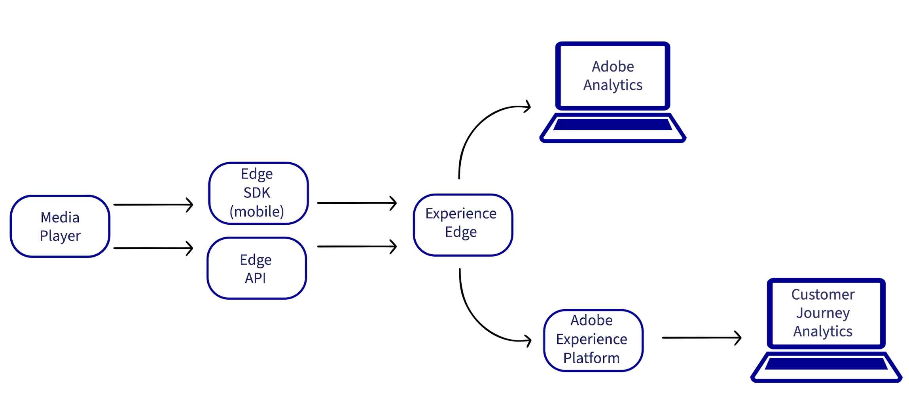

# 實作適用於串流媒體的 Adobe Analytics 或Customer Journey Analytics

實作串流媒體有多種方式。 如需此頁面上說明之實作方法的支援裝置和平台的詳細比較，請參閱 [支援的裝置和平台](/help/getting-started/supported-devices.md).

## 邊緣實作方法

在大多數情況下，我們建議為所有新Adobe Analytics或Customer Journey Analytics (CJA)客戶實作Media Analytics時使用Edge。

* **Edge Network SDK /擴充功能的媒體：** 從iOS和Android裝置收集資料，並傳送至Edge。 然後，資料可以傳送到CJA或Adobe Analytics。

  如需Edge Network SDK/擴充功能所用媒體的詳細資訊，請參閱 [安裝Media Analytics與Experience Platform Edge](/help/implementation/implementation-edge.md).

  >[!NOTE]
  >
  >此實作方法目前不支援Web SDK或Roku。 不過，使用Media Edge API實作時，兩者皆支援。

* **Media Edge API：** 可自訂以從任何裝置或格式（包括行動裝置、網頁和過頂裝置）收集資料，並傳送資料給Edge。 然後，資料可以傳送到CJA或Adobe Analytics。

  <!-- For more information about the Media Edge API, see (link to John's docs when they're ready) -->

## 其他實作方法

在大多數情況下，建議將上述邊緣實作方法用於CJA和Adobe Analytics，尤其是新的實作。

除了Edge實作方法之外，您也可以使用其他實作方法。 這些實作方法最初是專為與Adobe Analytics搭配使用而設計。 但是，具有以下任何實施方法的客戶仍然可以透過建立 [Analytics來源連線](https://experienceleague.adobe.com/docs/experience-platform/sources/ui-tutorials/create/adobe-applications/analytics.html?lang=zh-Hant).

* **具有標籤的媒體擴充功能：** Adobe Medium Analytics for Audio and Video擴充功能提供將Media追蹤器例項新增至已啟用標籤的網站或專案的功能。 資料會傳送至Adobe Analytics。

  如需使用標籤安裝、設定和實作Media擴充功能的詳細資訊，請參閱 [Adobe Medium Analytics (3.x SDK) for Audio and Video擴充功能概觀](https://experienceleague.adobe.com/docs/experience-platform/tags/extensions/client/media-analytics-3x/overview.html).

* **Media SDK：**  資料會傳送至Adobe Analytics。

  如需有關下載和安裝 Media SDK 和擴充功能的資訊，請參閱[取得 Media SDK、使用標記的擴充功能和 OTT SDK](/help/getting-started/download-sdks.md)。

* **Media Collection API：** 使用RESTful HTTP呼叫追蹤音訊和視訊事件。 資料會傳送至Adobe Analytics。

  如需關於使用 Media Collection API 的資訊，請參閱[Media Collection API](media-collection-api/mc-api-overview.md)。

<!--
(Not sure if we need the following paragraph and graphic. Paragraph is somewhat redundant with the intro paragraph of this article)
Choose the implementation method depending on the supported platforms. Some players are not supported by the Media SDKs or the Adobe Experience Platform Media Extensions. The Media Collection APIs provide a way to support those players. For information on supported devices, see [Supported devices and platforms](/help/getting-started/supported-devices.md).

-->
