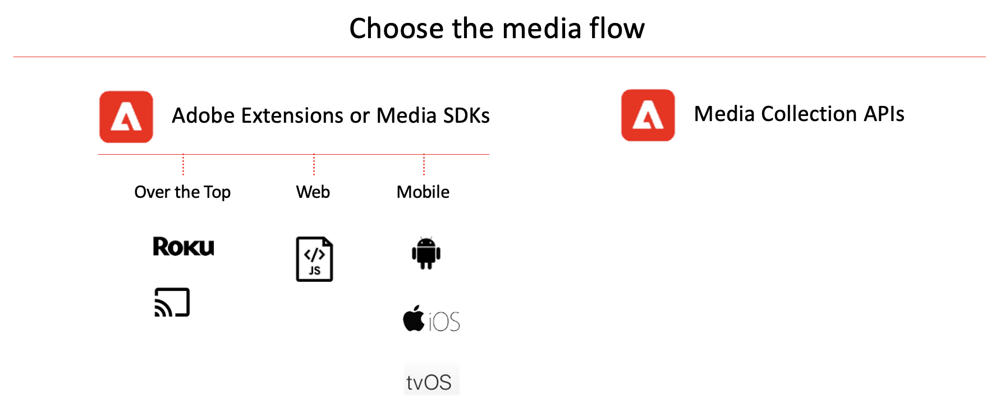

# 實施適用於串流媒體的 Adobe Analytics

您遵循的實施路徑取決於您是選擇使用媒體 SDK 的內建邏輯 (標準、建議的實施)，還是選擇自己動手並使用簡單但功能強大且可自訂的 Media Collection API (RESTful)。

根據支援的平台選擇實施路徑。Media SDK 或 Adobe Experience Platform Media SDK 不支援某些播放器，而 Media Collection API 提供了一種支援這些播放器的方法。如需關於受支援裝置的資訊，請參閱[支援的裝置和平台](/help/getting-started/supported-devices.md)。

如需關於下載和安裝 Media SDK 和擴充功能的資訊，請參閱[取得 Media SDK、使用標記的擴充功能和 OTT SDK](/help/getting-started/download-sdks.md)。

如需關於使用 Media Collection API 的資訊，請參閱[Media Collection API](media-collection-api/mc-api-overview.md)。
