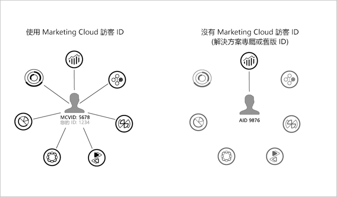

# 先決條件{#prerequisites}

## 決策 {#decision}

在開始實施追蹤前，請先決定與您的情況最為相關的實施：

* **Media Analytics -** 使用最新 Media SDK (標準建議實施) 及/或 Media Collection API (RESTful)
* **里程碑 -** 舊版 Adobe 追蹤實施
* **Data Insertion API -** 不使用 Media SDK 實施追蹤

## 工作 {#prereq-tasks}

若為 *Media Analytics* 實施，以下是您必須在開始前完成的工作：

1. **啟用 Experience Cloud。**

   您必須實施 Adobe Experience Platform Identity 服務。

    Identity 服務可為 Experience Cloud 核心服務、解決方案以及 People 核心服務的客戶屬性和對象啟用共同識別架構。其運用方式為指派一個唯一的永久性 ID 給網站訪客。當您的組織實施 ID 服務時，此 ID 可讓您在不同的 Experience Cloud 解決方案中識別相同的網站訪客及其資料。

   

   ID 服務也可以取代不同的解決方案特定 ID (例如 Analytics AID)。透過[客戶 ID 和驗證狀態](https://experienceleague.adobe.com/docs/id-service/using/reference/authenticated-state.html?lang=zh-Hant)功能，ID 服務可讓您將您的客戶 ID 傳遞至 Experience Cloud。請記住，ID 服務僅適用於您已訂閱的解決方案。如果您未註冊存取其他產品，則 ID 服務不提供存取權。

   展望未來，ID 服務將成為許多目前與未來 Experience Cloud 特色、增強功能與服務的必要元件。目前 ID 服務支援 [Analytics](https://www.adobe.com/tw/marketing-cloud/web-analytics.html)、[Audience Manager](https://www.adobe.com/tw/marketing-cloud/data-management-platform.html) 和 [Target](https://www.adobe.com/tw/marketing-cloud/testing-targeting.html)。

   如果您尚未實施 ID 服務，現在就是開始考慮移轉策略的最佳時機。如需 ID 服務之重要性和角色的詳細資訊，請參閱[為何您應認真考慮 Identity 服務](https://theblog.adobe.com/why-new-adobe-marketing-cloud-id-service-should-be-on-your-radar/)。

   如需 Experience Cloud ID 的詳細資訊，請參閱 [Experience Cloud ID 服務總覽](https://experienceleague.adobe.com/docs/id-service/using/intro/overview.html?lang=zh-Hant)和 [Adobe Experience Platform Identity Service](https://experienceleague.adobe.com/docs/id-service/using/home.html?lang=zh-Hant)。

1. **啟用 Adobe Analytics 報表。**

   若要在 Analytics 中啟用報表及查看收集中的內容和廣告資料，請參閱[啟用媒體報表](/help/media-reports/media-reports-enable.md)。
