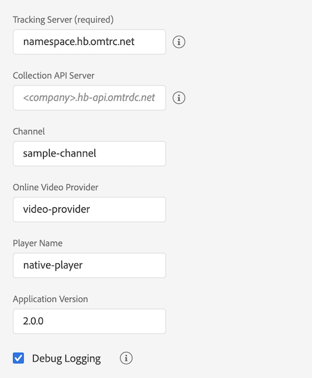

# 從獨立 Media SDK 移轉至 Adobe Launch - Android

>[!NOTE]
>Adobe Experience Platform Launch 已經過品牌重塑，現在是 Experience Platform 中的一套資料收集技術。 因此，所有產品文件中出現了幾項術語變更。 如需術語變更的彙整參考資料，請參閱以下[文件](https://experienceleague.adobe.com/docs/experience-platform/tags/term-updates.html?lang=zh-TW)。


## 設定

### 獨立 Media SDK

在獨立Media SDK中，您可在應用程式中設定追蹤，並將其傳遞至
建立追蹤器時的SDK 。

```java
MediaHeartbeatConfig config = new MediaHeartbeatConfig();
config.trackingServer = "namespace.hb.omtrdc.net";
config.channel = "sample-channel";
config.appVersion = "v2.0.0";
config.ovp = "video-provider";
config.playerName = "native-player";
config.ssl = true;
config.debugLogging = true;

MediaHeartbeat tracker = new MediaHeartbeat(... , config);
```

### Launch 擴充功能

1. 在Experience Platform Launch中，按一下您專屬的[!UICONTROL 擴充功能]標籤
行動屬性。
1. 在[!UICONTROL 目錄]標籤上，找到Adobe Media Analytics for Audio
和Video延伸模組，然後按一下[安裝]。
1. 在擴充功能設定頁面中，設定追蹤參數。
Media 擴充功能會使用已設定的參數進行追蹤。



[使用行動擴充功能](https://developer.adobe.com/client-sdks/documentation/adobe-media-analytics/)

## 建立追蹤器

### 獨立 Media SDK

在獨立Media SDK中，您可以手動建立`MediaHeartbeatConfig`物件
和設定追蹤引數。 實作委派介面公開
`getQoSObject()`和 `getCurrentPlaybackTime()functions.`
建立`MediaHeartbeat`執行個體以進行追蹤。

```java
MediaHeartbeatConfig config = new MediaHeartbeatConfig();
config.trackingServer = "namespace.hb.omtrdc.net";
config.channel = "sample-channel";
config.appVersion = "v2.0";
config.ovp = "video-provider";
config.playerName = "native-player";
config.ssl = true;
config.debugLogging = true;

MediaHeartbeatDelegate delegate = new MediaHeartbeatDelegate() {
    @Override
    public MediaObject getQoSObject() {
        // When called should return the latest qos values.
        return MediaHeartbeat.createQoSObject(<bitrate>,  
                                              <startupTime>,  
                                              <fps>,  
                                              <droppedFrames>);
    }

    @Override
    public Double getCurrentPlaybackTime() {
        // When called should return the current player time in seconds.
        return <currentPlaybackTime>;
    }

    MediaHeartbeat tracker = new MediaHeartbeat(delegate, config);
}
```

### Launch 擴充功能

[媒體API參考 — 建立媒體追蹤器](https://developer.adobe.com/client-sdks/documentation/adobe-media-analytics/api-reference/#createtracker)

建立追蹤器之前，請務必先註冊媒體擴充功能，然後
具有行動核心的相依擴充功能。

```java
// Register the extension once during app launch
try {
    // Media needs Identity and Analytics extension
    // to function properly
    Identity.registerExtension();
    Analytics.registerExtension();

    // Initialize media extension.
    Media.registerExtension();                
    MobileCore.start(new AdobeCallback () {
        @Override
        public void call(Object o) {
            // Launch mobile property to pick extension settings.
            MobileCore.configureWithAppID("LAUNCH_MOBILE_PROPERTY");
        }
    });
} catch (InvalidInitException ex) {
    ...
}
```

註冊媒體擴充功能後，請使用以下 API 建立追蹤器。
追蹤器會自動從已設定的啟動屬性中挑選設定。

```java
Media.createTracker(new AdobeCallback<MediaTracker>() {
    @Override
    public void call(MediaTracker tracker) {
        // Use the instance for tracking media.
    }
});
```

## 更新播放點和體驗品質值。

### 獨立 Media SDK

在獨立Media SDK中，您傳遞的委派物件會實作
建立追蹤器期間的`MediaHeartbeartDelegate`介面。  實施
當追蹤器呼叫
`getQoSObject()`和`getCurrentPlaybackTime()`介面方法。

### Launch 擴充功能

實作應呼叫「 」，更新目前播放器播放點
追蹤器公開的`updateCurrentPlayhead`方法。 進行精確追蹤
您應每秒至少呼叫一次此方法。

[媒體API參考 — 更新目前的播放器](https://developer.adobe.com/client-sdks/documentation/adobe-media-analytics/api-reference/#updatecurrentplayhead)

實作應呼叫「 」，以更新QoE資訊 `updateQoEObject`
追蹤器公開的方法。 我們預期每當出現此問題時，都會呼叫此方法
是品品質度的變更。

[媒體API參考 — 更新QoE物件](https://developer.adobe.com/client-sdks/documentation/adobe-media-analytics/api-reference/#createqoeobject)

## 傳遞標準媒體 / 廣告中繼資料

### 獨立 Media SDK

* 標準媒體中繼資料：

  ```java
  MediaObject mediaInfo =
    MediaHeartbeat.createMediaObject("media-name",
                                     "media-id",
                                     60D,
                                     MediaHeartbeat.StreamType.VOD,
                                     MediaHeartbeat.MediaType.Video);
  
  // Standard metadata keys provided by adobe.
  Map <String, String> standardVideoMetadata =
    new HashMap<String, String>();
  standardVideoMetadata.put(MediaHeartbeat.VideoMetadataKeys.EPISODE,
                            "Sample Episode");
  standardVideoMetadata.put(MediaHeartbeat.VideoMetadataKeys.SHOW,
                            "Sample Show");
  standardVideoMetadata.put(MediaHeartbeat.VideoMetadataKeys.SEASON,
                            "Sample Season");
  mediaInfo.setValue(MediaHeartbeat.MediaObjectKey.StandardMediaMetadata,
                     standardVideoMetadata);
  
  // Custom metadata keys
  HashMap<String, String> mediaMetadata = new HashMap<String, String>();
  mediaMetadata.put("isUserLoggedIn", "false");
  mediaMetadata.put("tvStation", "Sample TV Station");
  tracker.trackSessionStart(mediaInfo, mediaMetadata);
  ```

* 標準廣告中繼資料：

  ```java
  MediaObject adInfo =
    MediaHeartbeat.createAdObject("ad-name",
                                  "ad-id",
                                  1L,
                                  15D);
  
  // Standard metadata keys provided by adobe.
  Map <String, String> standardAdMetadata =
    new HashMap<String, String>();
  standardAdMetadata.put(MediaHeartbeat.AdMetadataKeys.ADVERTISER,
                         "Sample Advertiser");
  standardAdMetadata.put(MediaHeartbeat.AdMetadataKeys.CAMPAIGN_ID,
                         "Sample Campaign");
  adInfo.setValue(MediaHeartbeat.MediaObjectKey.StandardAdMetadata,
                  standardAdMetadata);
  
  HashMap<String, String> adMetadata =
    new HashMap<String, String>();
  adMetadata.put("affiliate",
                 "Sample affiliate");
  
  tracker.trackEvent(MediaHeartbeat.Event.AdStart,
                     adObject,
                     adMetadata);
  ```

### Launch 擴充功能

* 標準媒體中繼資料：

  ```java
  HashMap<String, Object> mediaObject =
    Media.createMediaObject("media-name",
                            "media-id",
                            60D,
                            MediaConstants.StreamType.VOD,
                            Media.MediaType.Video);
  
  HashMap<String, String> mediaMetadata =
    new HashMap<String, String>();
  
  // Standard metadata keys provided by adobe.
  mediaMetadata.put(MediaConstants.VideoMetadataKeys.EPISODE,
                    "Sample Episode");
  mediaMetadata.put(MediaConstants.VideoMetadataKeys.SHOW,
                    "Sample Show");
  
  // Custom metadata keys
  mediaMetadata.put("isUserLoggedIn", "false");
  mediaMetadata.put("tvStation", "Sample TV Station");
  
  tracker.trackSessionStart(mediaInfo, mediaMetadata);
  ```

* 標準廣告中繼資料：

  ```java
  HashMap<String, Object> adObject =
    Media.createAdObject("ad-name",
                         "ad-id",
                         1L,
                         15D);
  HashMap<String, String> adMetadata =
    new HashMap<String, String>();
  
  // Standard metadata keys provided by adobe.
  adMetadata.put(MediaConstants.AdMetadataKeys.ADVERTISER,
                 "Sample Advertiser");
  adMetadata.put(MediaConstants.AdMetadataKeys.CAMPAIGN_ID,
                 "Sample Campaign");
  
  // Custom metadata keys
  adMetadata.put("affiliate",
                 "Sample affiliate");
  _tracker.trackEvent(Media.Event.AdStart,
                      adObject,
                      adMetadata);
  ```
