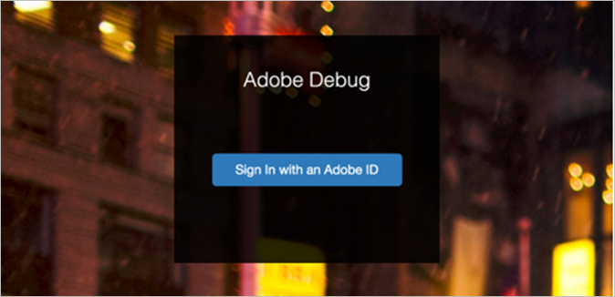

# 設定 Adobe Debug{#configure-adobe-debug}

## 存取 Adobe Debug {#accessing-adobe-debug}

若要存取 Adobe Debug：

1. 前往 [Experience Cloud](https://www.marketing.adobe.com/) 並建立新的 Adobe Experience Cloud 使用者。

   >[!TIP]
   >
   >這裡的登入資訊與用來登入 Adobe Analytics 的使用者名稱/密碼不同。

1. 擁有 Experience Cloud 帳戶後，請聯絡 Adobe 代表索取 Adobe Debug 存取權限。
1. 取得存取權限後，請前往 [https://debug.adobe.com](https://debug.adobe.com) 並使用 Experience Cloud 認證登入。

   

   支援該工具的瀏覽器包括：
   * Google Chrome
   * Mozilla Firefox
   * Apple Safari
   * Microsoft Internet Explorer 9-11 版

建議瀏覽器是最新版本的 Chrome 和 Firefox。

## 除錯代理 {#debug-proxy}

下載及設定除錯代理：

1. 前往 [App Downloads](https://debug.adobe.com/#/downloads) 下載除錯代理。

   支援的作業系統包括：
   * OS X 10.7 64 位元或更新版本
   * Windows 7.1 64 位元或更新版本

   

1. 除錯代理伺服器會在本機電腦上執行並透過連接埠 33284 通訊，同時也會設定為系統代理。

   您可能需要根據 OS 和瀏覽器調整瀏覽器設定。

## 下載 SSL 憑證並安裝在桌上型電腦或應用程式上 {#download-and-install-sSL-desktop}

首次執行 Adobe Debug 時，系統會產生唯一的 SSL 憑證。如果您的桌上型電腦和/或應用程式支援 HTTPS 流量，便需要下載及安裝我們的 SSL 憑證。

下載及安裝 SSL 憑證：

1. 在安裝及啟動 Adobe Debug 之後，前往 [https://proxy.debug.adobe.com/ssl](https://proxy.debug.adobe.com/ssl) 下載憑證。
1. 匯入憑證

   **Mac OS**
   1. 連按兩下根 CA 憑證，以在鑰匙圈存取中開啟。
   1. 根 CA 憑證會出現在「登入」中。
   1. 將根 CA 憑證移動 (拖曳) 到「系統」。
   1. 您必須將憑證複製到「系統」，確保獲得所有使用者和本機系統程序信任。
   1. 開啟根 CA 憑證、展開「信任」、選取「必須信任」，然後儲存變更。

   **Windows**
   1. 完成下列其中一項程序：

      * [將憑證新增到本機電腦的「受信任的根憑證授權單位」存放區](https://technet.microsoft.com/zh-tw/library/cc754841.aspx#BKMK_addlocal)
   1. Firefox 使用者，請完成[在 Mozilla Firefox 中安裝根憑證](https://wiki.wmtransfer.com/projects/webmoney/wiki/Installing_root_certificate_in_Mozilla_Firefox)中的程序。

      您可能需要結束並重新開啟 Firefox，變更才會生效。
   **iOS 裝置**
   1. 按一下&#x200B;**[!UICONTROL 「設定應用程式]** **>** **[!UICONTROL Wifi 設定」]**，將 iOS 裝置設定為將 Adobe Debug 當作 HTTP 代理。

   1. 在 Safari 中，前往[「Debug」](https://proxy.debug.adobe.com/ssl)。

      Safari 會提示您安裝 SSL 憑證。

## 為行動裝置安裝 SSL 憑證 {#install-sSL-for-mobile-device}

如果您的 Adobe Debug 遺失 HTTPS 呼叫，就必須在行動裝置上安裝 Adobe Debug 的 SSL 憑證。

### iOS

若要在 iOS 裝置上安裝 SSL 憑證：

1. 在筆記型電腦上開啟除錯代理，然後前往 [Adobe Debug](https://debug.adobe.com)。
1. 在 iOS 裝置上完成以下步驟：
   1. 將裝置切換為飛航模式。
   1. 選取筆記型電腦使用的同一個 Wi-Fi 訊號。
   1. 在筆記型電腦上，手動設定除錯代理應用程式顯示的 IP 和連接埠。
   1. 開啟 Apple Safari 瀏覽器視窗。
   1. 前往 [https://proxy.debug.adobe.com/ssl](https://proxy.debug.adobe.com/ssl)。
   1. 下載及安裝 SSL 憑證。

1. 在筆記型電腦上啟動 Adobe Debug 工作階段。
1. 開始在 iOS 裝置上進行測試。

### Android

若要在 Android 裝置上安裝 SSL 憑證：

1. 在筆記型電腦上開啟除錯代理，然後前往 [Adobe Debug](https://debug.adobe.com)。
1. 在 Android 裝置上完成以下步驟：
   1. 將裝置設為飛航模式。
   1. 選取筆記型電腦使用的同一個 Wi-Fi 訊號。
   1. 在筆記型電腦上，手動設定除錯代理應用程式顯示的 IP 和連接埠。
   1. 開啟瀏覽器視窗。
   1. 前往 [https://proxy.debug.adobe.com/ssl](https://proxy.debug.adobe.com/ssl)。
   1. 下載及安裝 SSL 憑證。

1. 在筆記型電腦上啟動 Adobe Debug 工作階段。
1. 開始在 Android 裝置上進行測試。
