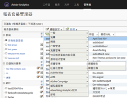
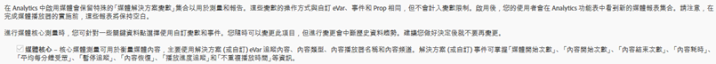
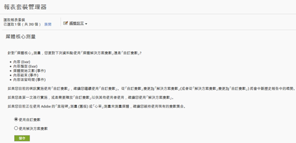
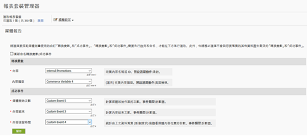

# 里程碑概述{#milestone-overview}

>[!CAUTION]
>
>此度量選項已過時。

[舊版里程碑文件](milestone_analytics_video.pdf)

## 設定 {#section_rzx_j1z_cfb}

### 里程碑視訊設定

若要追蹤視訊，請指定一組要用來追蹤及報告的「自訂轉換變數」**(eVar) 與「自訂事件」**。路徑功能還會使用一個「自訂分析」**&#x200B;變數 (`s.prop`

您對每個度量選取的變數會新增至視訊設定頁面。這會讓系統自動產生和格式化標準視訊報表。「視訊名稱」** eVar 和「視訊檢視」**&#x200B;計數器均為必要。其他變數為選擇性，但為完整測量的建議選項。啟用視訊追蹤之後，您可以檢視從您使用視訊追蹤報表的視訊資料所產生的報表。

您也可以對視訊追蹤任何數量的其他度量。例如，如果在您的網站上使用多個視訊播放器，可以填入具有播放器名稱的 eVar。您選取的部分變數可能也會用於網站的其他區域。例如，如果是在整個網站上使用，「內容類型」**&#x200B;變數可讓您測量來自視訊的頁面檢視的百分比，並讓您將轉換事件與視訊產生關連。

### 里程碑報告設定

To set-up video reporting for a Milestone implementation, go to **[!UICONTROL Admin &gt; Report Suite Manager].** 選取報表套裝，然後選擇 **[!UICONTROL 「視訊管理&gt;視訊報告]」：**

{width=「248」}

第一個畫面，只有「視訊核心」可搭配「里程碑」中繼資料使用。選取&#x200B;**[!UICONTROL 「視訊核心」]**，然後按一下&#x200B;**[!UICONTROL 「儲存」]。**



On the next screen, select **[!UICONTROL Use Custom Variables].**

{width=「470」}

在最後一個畫面，選取要搭配視訊測量使用的兩個 eVar 和三個事件:



## 視訊變數參考資料 {#section_emg_c1z_cfb}

下表包含視訊的商務變數和自訂事件的其他詳細資料:

| 視訊度量 | 變數類型 | 說明 |
| --- | --- | --- |
| 內容 | eVar <br/>Default expiration: Visit | (必要) 依實作指示收集視訊名稱。 |
| 內容類型 | eVar <br/>Default expiration: Page view | 收集訪客所檢視內容類型的相關資料。Hits sent by video measurement are assigned a content type of `video.` <br/>This variable does not need to be reserved exclusively for video tracking. 使用此相同變數的其他內容報告內容類型，可讓您分析不同類型內容的訪客分布。舉例來說，使用了這個變數，您就可以利用像是 `article` 或 `product page` 等值來標記其他內容類型。<br/>從視訊測量觀點，「內容類型」**&#x200B;可讓您識別視訊訪客，並因此計算視訊轉換率。 |
| 內容逗留時間 | Event <br/>Type: Counter | 計算自上次資料收集程序 (影像請求) 以來，用於觀看視訊的時間 (以秒為單位)。 |
| 視訊起始 | Event <br/>Type: Counter | 指出有訪客檢視了視訊的某部分。但此量度並不會針對訪客所檢視的視訊提供任何關於檢視內容的多少、哪一部分的資訊。 |
| 視訊完成 | 事件 <br/>類型: 計數器 | 指出使用者已檢視完整的視訊。預設情況下，完成事件會在視訊結尾之前 1 秒測量。<br/>實施期間，您可以指定想要將距離視訊結尾幾秒視為檢視完成。針對即時視訊和沒有已定義結尾的其他資料流，您可以指定測量完成的自訂點。例如，在檢視特定時間之後。 |

## 媒體模組變數 {#section_ts5_11z_cfb}

下列變數可讓您設定視訊測量。您必須為需要的變數表格中的變數定義值。此外，若要追蹤您的視訊播放器中的事件，您必須使用開啟、播放、停止和關閉方法來啟用 autoTrack (針對支援的播放器)，或實施自訂播放器事件追蹤。

| 變數    | 說明 |
| --- | --- |
| `Media.trackUsingContextData` | **語法:** <br/><br/> `s.Media.trackUsingContextData = true;`<br/>此選項可啟用整合式視訊追蹤。When set to true, the media module generates context data for media tracking, instead of the legacy `pev3`. <br/>使用 `Media.contextDataMapping` 來映射上下文資料至選取的 eVar 和事件。<br/>預設值： `false` |
| `Media.contextDataMapping` | **語法:** <br/><br/> `s.Media.contextDataMapping = {`<br/>      `"a.media.name":"eVar2, prop2",` <br/>     `"a.media.segment":"eVar3",` <br/>     `"a.contentType":"eVar1",` <br/>     `"a.media.timePlayed":"event3",` <br/>     `"a.media.view":"event1",` <br/>     `"a.media.segmentView":"event2",` <br/>     `"a.media.complete":"event7",` <br/>     `"a.media.milestones":{` <br/>         `25:"event4",` <br/>         `50:"event5",` <br/>         `75:"event6"` <br/>     ` }` <br/> `};`<br/><br/>一個物件，定義您要用於視訊測量的變數映射至 eVar 和事件。物件必須映射下列欄位: <br/><br/> **a.media.name:** (必要) 以視訊名稱填入變數。提供您選取要儲存視訊名稱的 eVar，以及要用於視訊路徑的「自訂分析視訊」變數 (`s.prop`)。Provide the values in a comma-separated list. <br/><br/> **a.media.segment:** (可選) 您要儲存媒體區段名稱的 eVar。a.contentType: (可選) 您要儲存視訊值的 eVar，其包含已啟用的造訪和訪客追蹤，用以產生視訊造訪和訪客報表。您選取的變數似乎已用來儲存文章投影片放映或產品頁面之類的資料 <br/><br/> **a. media. view：** (必要)您要計算媒體檢視的事件。 <br/><br/> **a. media. segmentView：** (可選)您想計算區段檢視的事件。 <br/><br/> **a. media. complete：** (可選)您要計算完整檢視的事件。 <br/><br/> **a. media. TimePlayed：** (選擇性、高度建議)您要儲存播放視訊秒數的數值事件。 <br/><br/> **a.media.milestones:** (可選) 將 s.Media.trackMilestones 里程碑與計數器事件對應的物件。Media.segmentByMilestones should be set to true if you define milestones. <br/><br/> **廣告追蹤** 若要追蹤廣告，可使用下列上下文資料變數： <br/> **a.media.ad.name:** (必要) 以廣告名稱填入變數。提供您選取要儲存廣告名稱的 eVar，以及要用於路徑的「自訂分析視訊」變數 (`s.prop`)。Provide the values in a comma-separated list. <br/><br/> **visid：** 主要內容中播放廣告的位置。 <br/><br/> **socialDocation：** pod內播放廣告的位置。 <br/><br/> **管理員：** 適用於此播放的CPM或加密CPM(加上「~」)。 <br/><br/> **a.media.ad.view:** 與 的作用相同。`a.media.view`<br/><br/> **所需的a.media.ad.cl：** 計算廣告(`Media.click` 呼叫)的點按次數 <br/><br/> **a.media.ad.timePlayed:** 與 的作用相同。`a.media.timePlayed`<br/><br/> **食譜：** 其運作方式與 `a.media.complete` a.media.ad.segment相同：與 `a.media.segment`<br/><br/> **a.media.ad.segmentView:** 與 的作用相同。`a.media.segmentView`<br/><br/> **a.media.ad.milestones:** 與 的作用相同。`a.media.milestones`<br/><br/> **a.media.ad.offsetMilestones:** 與 的作用相同。`a.media.offsetMilestones` |
| `Media.trackVars` | **語法:** <br/><br/> `s.Media.trackVars =` <br/> `"events,``prop2,``eVar1,``eVar2,``eVar3";`<br/><br/>視訊追蹤程式碼中設定之所有變數的逗號分隔清單。 |
| `Media.trackEvents` | **語法:** <br/><br/> `s.Media.trackEvents =` <br/> `"event1,``event2,``event3,``event4,``event5,``event6,``event7"`<br/><br/>視訊追蹤程式碼中設定之所有事件的逗號分隔清單。 |

## 選擇性變數 {#section_ufg_zzy_cfb}

|  變數    | 說明 |
| --- | --- |
| `Media.autoTrack` | **語法:** <br/><br/> `s.Media.autoTrack = true`<br/><br/>啟用對支援的播放器的自動追蹤。支援的播放器如下所示: <ul> <li> Open Source Media Framework (OSMF) </li> <li> FLVPlayback (透過 Flash Professional 中的匯入視訊精靈建立的視訊播放器) </li> <li> Silverlight </li> <li> MediaDisplay </li> <li> MediaPlayback </li> <li> Brightcove API 版本 2 與 3 (請參閱 [Brightcove](https://marketing.adobe.com/resources/help/en_US/sc/appmeasurement/video/video_other_players.html)) </li> <li> 使用 JavaScript 的 Windows Media Player、Quicktime 或 Real Player </li> </ul> <br/><br/>如果您未使用上述任一個播放器來追蹤 `Media.open``Media.play``Media.stop``Media.close` 播放器事件。 |
| `Media.autoTrackNetStreams` | **語法:** <br/><br/> `s.Media.autoTrackNetStreams = true`<br/><br/>Flash 10.3 推出 NetStream 元件的新功能，可啟用進階視訊追蹤。如果您使用自訂 Flash NetStream 播放器，則可以啟用此變數以啟用類似於 autoTrack 的功能。此方法要求在 Flash 10.3 或更新版本中檢視視訊。 |
| `Media.completeByCloseOffset` | **語法:** <br/><br/> <br/><br/>`s.Media.completeByCloseOffset = true`<br/><br/>此設定可讓您在視訊實際結束之前幾秒計算所完成的視訊檢視。<br/><br/>會根據 `completeCloseOffsetThreshold` 中指定的秒數來傳送事件。這可讓您在從不會報告等於視訊長度的位移的視訊播放器中測量完成。<br/><br/>預設情況下，此值會設為 true，而臨界值設為 1 秒。有了這些預設值，完成事件會在視訊結尾之前 1 秒傳送。 |
| `Media.completeCloseOffsetThreshold` | **語法:** <br/><br/> `s.Media.completeCloseOffsetThreshold = 1`<br/><br/>此臨界值可讓您在視訊實際結束之前幾秒計算所完成的視訊檢視。必須將 `Media.completeByCloseOffset` 設為 true，才能使用此臨界值。<br/><br/>您提供的整數值會決定位移可以距離視訊長度關閉處，仍被計為完成的秒數。這可讓您在從不會報告等於視訊長度的位移的視訊播放器中測量完成。<br/><br/>預設臨界值為 1 秒。 |
| `Media.playerName` | **語法:** <br/><br/> `s.Media.playerName = "Custom Player Name"`<br/><br/>指定自訂視訊播放器名稱。 |
| `Media.trackSeconds` | **語法:** <br/><br/> `s.Media.trackSeconds = 15`<br/><br/>以秒數定義間隔，用於在視訊播放時傳送視訊追蹤資料至 Adobe 資料收集伺服器。值必須設定為 5 秒的增量。<br/><br/> 啓用 `Media.trackSeconds` 僅觸發所定義的事件 `Media.contextDataMapping`。除了為視訊測量指定的這些以外，若要傳送其他變數，您必須使用 Media.monitor. |
| `Media.trackMilestones` | Tracks milestones as percentage of the video length.  <br/><br/> **語法:** <br/><br/> `s.Media.trackMilestones = "25, 50, 75";`<br/><br/>以視訊長度的百分比定義間隔，用於傳送視訊追蹤資料至 Adobe 資料收集伺服器。以整數、逗號分隔的清單指定里程碑。例如: 10 = 10%, 23 = 23%。<br/><br/>因為這些里程碑在視訊中是固定的點，如果訪客檢視超過 10% 里程碑，然後倒轉並再次超過 10% 里程碑，媒體模組會傳送多次追蹤資料。類似地，如果訪客快轉超過某個里程碑，媒體模組不會為該里程碑傳送追蹤資料。<br/><br/>啓用 `Media.trackMilestones` 僅觸發所定義的事件 `Media.contextDataMapping`。除了為視訊測量指定的這些以外，若要傳送其他變數，您必須使用 Media.monitor. |
| `Media.trackOffsetMilestones` | Tracks milestones as seconds elapsed from the beginning of the video.  <br/><br/> **語法:** <br/><br/> `s.Media.trackOffsetMilestones = "20, 40, 60";`<br/><br/>以從視訊開始的經過秒數定義間隔，用於傳送視訊追蹤資料至 Adobe 資料收集伺服器。以整數、逗號分隔的清單指定里程碑。例如: 20 = 20 秒, 40 = 40 秒。<br/><br/>因為這些里程碑在視訊中是固定的點，如果訪客檢視超過里程碑 20 秒，然後倒轉並再次超過 20 秒里程碑，媒體模組會傳送多次追蹤資料。類似地，如果訪客快轉超過某個里程碑，媒體模組不會為該里程碑傳送追蹤資料。<br/><br/> 啓用 `Media.trackOffsetMilestones` 僅觸發所定義的事件 `Media.contextDataMapping`。除了為視訊測量指定的這些以外，若要傳送其他變數，您必須使用 Media.monitor. |
| `Media.segmentByMilestones` | **語法:** <br/><br/> `s.Media.segmentByMilestones = true;`<br/><br/>根據媒體長度以及依里程碑指定的 `Media.trackMilestones`<br/><br/>里程碑，自動產生區段名稱、區段號碼和區段長度資料，是在使用時定義區段的唯一方式 `autoTrack`。<br/><br/>預設值： `false` |
| `Media.segmentByOffsetMilestones` | **語法:** <br/><br/> `s.Media.segmentByOffsetMilestones = true;`<br/><br/>根據媒體長度以及依里程碑指定的 `Media.trackOffsetMilestones`<br/><br/>里程碑，自動產生區段名稱、區段號碼和區段長度資料，是在使用時定義區段的唯一方式 `autoTrack`。<br/><br/>預設值： `false` |

## 廣告追蹤變數 {#section_bhv_xzy_cfb}

這些變數用來結合 openAd 方法傳送廣告資訊。See [VAST Video Ad Tracking.](https://marketing.adobe.com/resources/help/en_US/sc/appmeasurement/video/video_ads.html)

| 變數    | 說明 |
| --- | --- |
| `Media.adTrackSeconds` | **語法:** <br/><br/> `s.Media.adTrackSeconds = 15;`<br/><br/>以秒數定義間隔，用於在視訊播放時傳送視訊廣告追蹤資料至 Adobe 資料收集伺服器。值必須設定為 5 秒的增量。<br/><br/> 啓用 `Media.adTrackSeconds` 僅觸發所定義的事件 `Media.contextDataMapping`。除了為視訊測量指定的這些以外，若要傳送其他變數，您必須使用 `Media.monitor`。 |
| `Media.adTrackMilestones` | Tracks ad milestones as percentage of the ad length.  <br/><br/> **語法:** <br/><br/> `s.Media.adTrackMilestones = "25, 50, 75";`<br/><br/>以廣告長度的百分比定義間隔，用於傳送廣告追蹤資料至 Adobe 資料收集伺服器。以整數、逗號分隔的清單指定里程碑。例如：10=10%，23=23%)。<br/><br/>因為這些里程碑在廣告中是固定的點，如果訪客檢視超過 10% 里程碑，然後倒轉並再次超過 10% 里程碑，媒體模組會傳送多次追蹤資料。類似地，如果訪客快轉超過某個里程碑，媒體模組不會為該里程碑傳送追蹤資料。<br/><br/> 啓用 `Media.adTrackMilestones` 僅觸發所定義的事件 `Media.contextDataMapping`。除了為視訊測量指定的這些以外，若要傳送其他變數，您必須使用 `Media.monitor`。 |
| `Media.adTrackOffsetMilestones` | Tracks ad milestones as seconds elapsed from the beginning of the ad.  <br/><br/> **語法:** <br/><br/> `s.Media.adTrackOffsetMilestones = "20, 40, 60";`<br/><br/>以從廣告開始的經過秒數定義間隔，用於傳送廣告追蹤資料至 Adobe 資料收集伺服器。以整數、逗號分隔的清單指定里程碑。例如: 20 = 20 秒, 40 = 40 秒。<br/><br/>因為這些里程碑在廣告中是固定的點，如果訪客檢視超過里程碑 20 秒，然後倒轉並再次超過 20 秒里程碑，媒體模組會傳送多次追蹤資料。類似地，如果訪客快轉超過某個里程碑，媒體模組不會為該里程碑傳送追蹤資料。<br/><br/> 啓用 `Media.adTrackOffsetMilestones` 僅觸發所定義的事件 `Media.contextDataMapping`。除了為視訊測量指定的這些以外，若要傳送其他變數，您必須使用 `Media.monitor`。 |
| `Media.adSegmentByMilestones` | **語法:** <br/><br/> `s.Media.adSegmentByMilestones = true;`<br/><br/>根據媒體長度以及依里程碑指定的 `Media.adTrackMilestones`<br/><br/>里程碑，自動產生區段名稱、區段號碼和區段長度資料，是在使用時定義區段的唯一方式 `autoTrack`。<br/><br/>預設值： `false` |
| `Media.adSegmentByOffsetMilestones` | **語法:** <br/><br/> `s.Media.adSegmentByOffsetMilestones = true;`<br/><br/>根據媒體長度以及依里程碑指定的 `Media.adTrackOffsetMilestones`<br/><br/>里程碑，自動產生區段名稱、區段號碼和區段長度資料，是在使用時定義區段的唯一方式 `autoTrack`。<br/><br/>預設值： `false` |

## 媒體模組方法 {#section_xp1_wzy_cfb}

媒體模組方法可用來手動追蹤播放器事件和追蹤不屬於標準視訊報表的其他度量。

如果您使用 `Media.autoTrack`，並且未追蹤 其他度量，則不需要直接呼叫這些方法的任一個。除非指定為選用，否則所有引數都為必要。

| 方法    | 說明 |
| --- | --- |
| `Media.open` | **語法:** <br/><br/> `s.Media.open(mediaName, mediaLength, mediaPlayerName)`<br/><br/>準備用來收集視訊追蹤資料的媒體模組。此方法會採用下列參數: <ul><li> **mediaName:** (必要) 您要其顯示在視訊報表中的名稱。 </li><li>  **mediaLength:** (必要) 視訊的長度 (以秒為單位)。  </li><li> **mediaPlayerName:** (必要) 用來檢視視訊的媒體播放器名稱，您要其顯示在視訊報表中的名稱。 </li></ul> |
| `Media.openAd` | **語法:** <br/><br/> `s.Media.openAd(name, length, playerName, parentName,`<br/>`parentPod, parentPodPosition, CPM)`<br/><br/>準備媒體模組以收集廣告追蹤資料。此方法會採用下列參數: <ul> <li> **name:** (必要) 廣告的名稱或 ID。  </li> <li> **length:** (必要) 廣告的長度。  </li> <li> **playerName:** (必要) 用來檢視廣告的媒體播放器的名稱。  </li> <li> **parentName:** 內嵌廣告所在主要內容的名稱或 ID。  </li> <li> **parentPod:** 主要內容中播放廣告的位置。  </li> <li> **parentPodPosition:** Pod 內播放廣告的位置。  </li> <li> **CPM:** 套至用此播放的 CPM 或加密的 CPM (首碼為 "~")。  </li> </ul> |
| `Media.click` | **語法:** <br/><br/> `s.Media.click(name, offset)`<br/><br/>追蹤何時在視訊中點按了廣告。此方法會採用下列參數: <ul> <li> **name:** 廣告的名稱。這必須符合 Media.openAd 中使用的名稱。  </li> <li> **offset:** 發生按一下時進入廣告的位移。  </li> </ul> |
| `Media.close` | **語法:** <br/><br/> `s.Media.close(mediaName)`<br/><br/>結束視訊資料收集並傳送資訊至 Adobe 資料收集伺服器。在視訊結束時呼叫此方法。此方法會採用下列參數: <br/><br/> **mediaName:** 視訊的名稱。這必須符合 `Media.open` 中使用的名稱。 |
| `Media.complete` | **語法:** <br/><br/> `s.Media.complete(name, offset)`<br/><br/>此方法會手動追蹤完成的事件。當您需要觸發無法使用`Media.completeByCloseOffset` 處理的特殊邏輯事件時，會使用此方法。<br/><br/>例如，如果您要測量未定義結尾的即時資料流，則可以在使用者檢視即時資料流 X 秒後觸發完成。您可能會使用百分比計算根據內容的長度和類型來測量完成。此方法會採用下列參數: <ul> <li> **mediaName:** 視訊的名稱。這必須符合 Media.open 中使用的名稱。  </li> <li> **mediaOffset:** 視訊中應該傳送結束事件的秒數。根據從零秒開始的視訊指定位移。<br/><br/>如果您的媒體播放器使用毫秒追蹤，在呼叫 Media.complete 之前，請確定值轉換為秒。  </li> </ul> If you plan to call complete manually, set <br/><br/> `s.Media.completeByCloseOffset = false`。 |
| `Media.play` | **語法:** <br/><br/> `s.Media.play(name, offset, segmentNum, segment, segmentLength)`<br/><br/>在視訊開始播放對隨時可呼叫此方法。使用手動視訊測量時，您可以在傳送視訊測量資料時提供目前的區段資料。<br/><br/>如果您的播放器從一個區段變更為另一個群體 `Media.stop``Media.play`，則應呼叫。<br/><br/>此方法會採用下列參數: <br/><br/> **mediaName:** 視訊的名稱。這必須符合 Media.open 中使用的名稱。  <br/><br/> **mediaOffset:** 視訊中開始播放的秒數。根據從零秒開始的視訊指定位移。如果您的媒體播放器使用毫秒追蹤，在呼叫 Media.play 之前，請確定值轉換為秒。  <br/><br/> **segmentNum:** (可選) 目前的區段號碼，行銷報表用來在報表中排序顯示區段。segmentNum 參數必須大於零。  <br/><br/> **區段：** (可選)目前區段名稱。 <br/><br/> **segmentLength：** (可選) <br/><br/>目前區段長度，以秒為單位。<br/><br/>例如: <br/><br/> `s.Media.play("My Video", 1800, 2,"Second Quarter", 1800)` <br/><br/> `s.Media.play("My Video", 0, 1,"Preroll", 30)` |
| `Media.stop` | **語法:** <br/><br/> `s.Media.stop(mediaName, mediaOffset)`<br/><br/>追蹤指定的視訊的停止事件 (停止、暫停等等)。此方法會採用下列參數: <ul> <li> **mediaName:** 視訊的名稱。這必須符合 `Media.open` 中使用的名稱。  </li> <li> **mediaOffset:** 視訊中發生停止或暫停事件的秒數。根據從零秒開始的視訊指定位移。  </li> </ul> |
| `Media.monitor` | **語法:** <br/><br/> `s.Media.monitor(s, media)` <br/><br/> **Silverlight 語法:** <br/><br/> `s.Media.monitor =`<br/>`new AppMeasurement_Media_Monitor(myMediaMonitor);`<br/><br/>Silverlight應用程式媒體監視器實作Objective-C委派設計模式。`myMediaMonitor` 類別方法會採用 `s` 和 `media` 參數。<br/><br/>使用此方法來傳送其他視訊測量。您可以設定其他變數 (Prop、eVar、事件)，並在播放視訊時根據視訊的目前狀態，使用 `Media.track` 傳送它們。<br/><br/>請參閱 [「使用Media. monitor測量其他度量」。](https://marketing.adobe.com/resources/help/en_US/sc/appmeasurement/video/video_mediamonitor.html) <br/><br/>此方法會採用下列參數: <br/><br/>  **s：**`AppMeasurement` 例項(或JavaScript `s` 物件)。 <br/><br/> **媒體：** 提供視訊狀態的成員。這些成員包括:  <ul><li> `media.name:` 視訊的名稱。This must match the name used in `Media.open`; </li><li> `media.length:` 影片的長度(以呼叫 `Media.open`的秒數表示)； </li><li> `media.playerName:` 呼叫中指定之媒體播放器的名稱 `Media.open`； </li><li> `media.openTime:` 一個NSDate物件，包含被呼叫時 `Media.open` 的相關資料； </li><li> `media.offset:` 視訊中的目前偏移(以秒為單位)，視訊中的實際點。偏移量從零開始(視訊的第二秒為秒)； </li><li> `media.percent:` 目前播放的視訊百分比，視視訊長度和目前偏移量而定；  </li><li> `media.timePlayed:` 目前播放秒數的總數；  </li><li> `media.eventFirstTime:` 指出這是第一次呼叫此視訊的媒體事件； </li><li> `media.mediaEvent:` 包含導致監視器呼叫之事件名稱的字串。 </li></ul> |
|  | `media.mediaEvent` 事件： <ul><li> `OPEN:` 第一次觀察到播放時 `Media.autoTrack` ，或呼叫 `Media.play`； </li><li> `CLOSE:` 播放結束於視訊結束或 `Media.autoTrack` 呼叫 `Media.close`結束時；</li><li> `PLAY:` 在暫停或拖曳後 `Media.autoTrack` 繼續播放或第二次呼叫 `Media.play`時；</li><li> `STOP:` 播放停止時，由於暫停或 `Media.autoTrack` 呼叫的開頭暫停 `Media.stop`；</li><li> `MONITOR:` 當我們的自動監視在播放視訊時檢查狀態(每秒)；</li><li> `SECONDS:``Media.trackSeconds` 變數定義的第二個間隔；</li><li> `MILESTONE:` 在 `Media.trackMilestones` 變數定義的里程碑中； </li></ul> |
| `Media.track` | **語法:** <br/><br/> `s.Media.track(mediaName)`<br/><br/>立即傳送目前的視訊狀態，以及您定義的任何 `Media.trackVars` 和 Media.trackEvents。此方法是在 `Media.monitor` 內使用。<br/><br/>請參閱 [「使用Media. monitor測量其他度量」。](https://marketing.adobe.com/resources/help/en_US/sc/appmeasurement/video/video_mediamonitor.html)<br/><br/>呼叫此方法之前， `Media.open` 請先呼叫和 `Media.play` 上視訊。此方法會採用下列參數: <ul> <li> **mediaName**: 視訊的名稱。這必須符合 `Media.open` 中使用的名稱。</li> </ul> 此方法是在播放視訊時傳送其他變數的唯一方式。此方法會將秒數間隔和百分比里程碑計數器重設為零，以避免多個追蹤點擊。 |


## 追蹤視訊播放器事件 {#section_dsg_rzy_cfb}

您可以透過建立附加至視訊播放器事件處理常式的函式來追蹤媒體播放器.This lets you call `Media.open`, `Media.play`, `Media.stop`, and `Media.close` at the appropriate times. 例如:

* **載入：** 呼叫 `Media.open` 和 `Media.play`
* **暫停：** 呼叫 `Media.stop`。例如，使用者若在 15 秒後暫停視訊，則呼叫 `s.Media.stop("Video1", 15)`
* **緩衝:** 當視訊緩衝時呼叫 `Media.stop`。`Media.play` 在播放時呼叫。
* **繼續：** 呼叫 `Media.play`。例如，使用者若在起始播放視訊 15 秒後繼續播放視訊，則呼叫 `s.Media.play("Video1", 15)`。
* **Scrub (滑桿):** 當使用者拖曳視訊滑桿時，呼叫 `Media.stop`。當使用者放開視訊滑桿時，呼叫 `Media.play`。
* **結束：** 然後呼叫。`Media.stop``Media.close`For example, at the end of a 100-second video, call `s.Media.stop("Video1", 100)`, then `s.Media.close("Video1")`.

若要完成此操作，可以定義能夠從媒體播放器事件處理常式呼叫的四個自訂函數。The various parameters passed into `Media.open`, `Media.play`, `Media.stop`, and `Media.close` come from the player. 下列偽代碼說明如何進行操作:

```javascript
/* Call on video load */ 
function startMovie() { 
    s.Media.open(mediaName, mediaLength, mediaPlayerName); 
    playMovie(); 
} 
 
/* Call on video resume from pause and slider release */ 
function playMovie() { 
    s.Media.play(mediaName, 
                 mediaOffset,  
                 segmentNum,  
                 segment,  
                 segmentLength); 
} 
/* Call on video pause and slider grab */ 
function stopMovie() { 
    s.Media.stop(mediaName, mediaOffset); 
} 
 
/* Call on video end */ 
/* Measuring Video for Developers 43 */ 
function endMovie() { 
    stopMovie(); 
    s.Media.close(mediaName); 
} 
```

## JavaScript 自動追蹤 {#section_ahz_pzy_cfb}

The JavaScript media module identifies all `<embed>` or `<object>` tags in the page HTML. 然後它會搜尋每個標記中的資料，以決定要使用的媒體播放器 (如果有的話)。如果播放器為 Windows Media Player、Quicktime 或 Real Player，則可以使用 `autoTrack`，不過 Windows Media Player 適用的 僅能對 Internet Explorer 運作。`autoTrack`需要手動追蹤 Windows Media Player，才能支援所有其他瀏覽器。

您必須在要追蹤的物件上設定 `classid` 屬性。需要 `classid`，才能公開媒體模組使用的事件處理常式，以自動追蹤視訊。

```javascript
s.Media.autoTrack = true
```

## JavaScript 程式碼範例 {#section_i4g_4zy_cfb}

```javascript
// Sample implementation 
s.usePlugins=true 
function s_doPlugins(s) { 
    /* Add manual calls to modules and plugins here */ 
} 
 
s.doPlugins=s_doPlugins 
 
/*********Media Module Calls**************/ 
s.loadModule("Media") 
 
/*Configure Media Module Functions */ 
s.Media.autoTrack= true; 
s.Media.trackVars="events, prop2, eVar1, eVar2, eVar3"; 
s.Media.trackEvents="event1, event2, event3, event4, event5, event6, event7" 
s.Media.trackMilestones="25, 50, 75"; 
s.Media.playerName="My Media Player"; 
s.Media.segmentByMilestones = true; 
s.Media.trackUsingContextData = true; 
s.Media.contextDataMapping = { 
    "a.media.name":"eVar2, prop2", 
    "a.media.segment":"eVar3", 
    "a.contentType":"eVar1", 
    "a.media.timePlayed":"event3", 
    "a.media.view":"event1", 
    "a.media.segmentView":"event2", 
    "a.media.complete":"event7", 
    "a.media.milestones":{ 
        25:"event4", 
        50:"event5", 
        75:"event6" 
    } 
} 
 
s.Media.monitor = function (s, media) { } //If Needed

/* Turn on and configure debugging here */ 
s.debugTracking = true; 
s.trackLocal = true; 
 
/* WARNING: Changing any of the below variables will cause drastic changes to how your visitor 
data is collected. Changes should only be made when instructed to do so by your account 
manager.*/ 
s.visitorNamespace = "yourNamespace"; 
s.trackingServer="metrics.mysite.com" //Use only if using first party cookies 
s.trackingServerSecure="smetrics.mysite.com" // Use only if using first party cookies in  
                                             // conjunction with SSL 
s.dc = '122'; 
 
/************************** PLUGINS SECTION *************************/ 
/* Insert any plugins code you want to use here. */ 
 
/****************************** MODULES *****************************/ 
/* Insert the media module tracking code here. */ 
```

