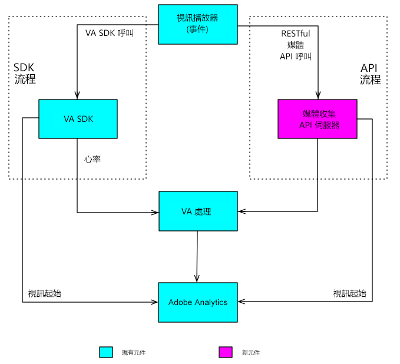

# 概述{#overview}

媒體收集 API 是 Adobe 用戶端 Media SDK 的 RESTful 替代方案。透過媒體收集 API，您的播放器可以使用 RESTful HTTP 呼叫追蹤音訊和視訊事件。Media Collection API提供與Media SDK相同的即時追蹤功能，另外還有一項功能：

* **下載的內容追蹤**

   此功能可讓您在使用者離線時，透過本機儲存事件資料，直到使用者裝置返回線上為止，追蹤媒體。 (如需詳細資訊，請參閱[追蹤下載內容](track-downloaded-content.md)。)

媒體收集 API 本質上是轉接程式，可做為伺服器端的 Media SDK。這表示Media SDK檔案的某些方面也與Media Collection API相關。 例如，兩個解決方案都使用相同的 [音訊和視訊參數](/help/metrics-and-metadata/audio-video-parameters.md)，而收集的音訊和視訊追蹤資料會導致相同的報 [告和分析。](/help/media-reports/media-reports-enable.md)

## 媒體追蹤資料流程 {#media-tracking-data-flows}

實作Media Collection API的媒體播放器會直接對媒體追蹤後端伺服器進行REST風格的API追蹤呼叫，而實作Media SDK的播放器則會對播放器應用程式內的SDK API進行追蹤呼叫。 透過網路發出呼叫的其中一個效應，就是實作媒體收集 API 的播放器需要處置一些 Media SDK 自動處置的處理工作。(媒體收集實 [作的詳細資訊。](mc-api-impl/mc-api-quick-start.md))

使用媒體收集API擷取的追蹤資料會以與在Media SDK播放器中擷取的追蹤資料不同的方式傳送和最初處理，但後端的相同處理引擎會用於這兩種解決方案。



## API概觀 {#api-overview}

**URI:** 請向 Adobe 代表索取。

**HTTP 方法:** POST，搭配 JSON 要求內文。

### API 呼叫 {#mc-api-calls}

* **`sessions`-** 建立與伺服器的作業，並傳回用於後續呼叫的作業 `events` ID。 應用程式會在追蹤工作階段開始時呼叫一次。

   ```
   {uri}/api/v1/sessions
   ```

* **`events`-傳送** 媒體追蹤資料。

   ```
   {uri}/api/v1/sessions/{session-id}/events
   ```

### 要求內文 {#mc-api-request-body}

```
{ 
    "playerTime": { 
        "playhead": {playhead position in seconds}, 
        "ts": {timestamp in milliseconds} 
    }, 
    "eventType": {event-type}, 
    "params": { 
        {parameter-name}: {parameter-value}, 
        ... 
        {parameter-name}: {parameter-value} 
    }, 
    "qoeData" : { 
        {parameter-name}: {parameter-value}, 
        ... 
        {parameter-name}: {parameter-value} 
    }, 
    "customMetadata": { 
        {parameter-name}: {parameter-value}, 
        ... 
        {parameter-name}: {parameter-value} 
    } 
} 
```

* `playerTime` -所有請求皆為必填。
* `eventType` -所有請求皆為必填。
* `params` - 某些 `eventTypes` 強制使用。若要判斷哪些 eventTypes 屬於強制性質，哪些屬於選用性質，請參閱 [JSON 驗證結構](mc-api-ref/mc-api-json-validation.md)。

* `qoeData` -可選，適用於所有請求。
* `customMetadata` -適用於所有請求，但僅隨、 `sessionStart`和事 `adStart`件類型 `chapterStart` 傳送。

您可以利用開放使用的 `eventType`JSON 驗證結構[來驗證每種 ](mc-api-ref/mc-api-json-validation.md) 的參數類型，以及特定事件的參數屬於選用或必要性質。

### 事件類型 {#mc-api-event-types}

* `sessionStart`
* `play`
* `ping`
* `pauseStart`
* `bufferStart`
* `adStart`
* `adComplete`
* `adSkip`
* `adBreakStart`
* `adBreakComplete`
* `chapterStart`
* `chapterSkip`
* `chapterComplete`
* `sessionEnd`
* `sessionComplete`

