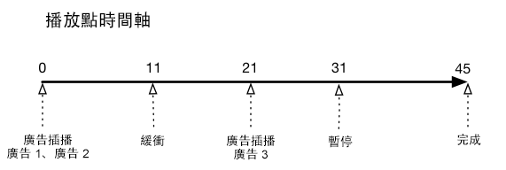
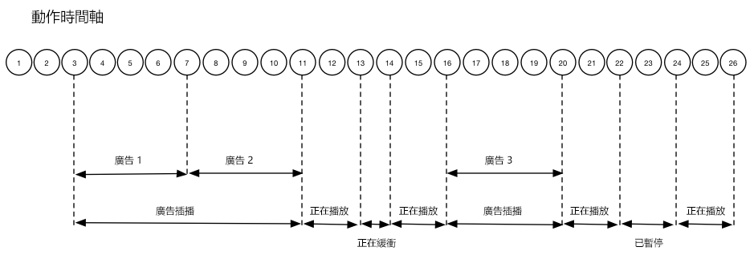

# 時間軸 1 - 檢視到內容結尾{#timeline-view-to-end-of-content}

## VOD、前段廣告、暫停、緩衝、檢視內容到結束為止

下列圖表說明播放點時間軸和使用者動作的對應時間軸。以下呈現每個動作的詳細資料及其隨附要求。








## 動作詳細資料

### 動作 1 - 開始工作階段 {#Action-1}

| 動作 | 動作時間軸 (秒) | 播放點位置 (秒) | 用戶端要求 |
| --- | :---: | :---: | --- |
| 按下「自動播放」或「播放」按鈕後，影片開始載入。 | 0 | 0 | `/api/v1/sessions` |

**實作詳細資料**

這個呼叫代表&#x200B;_使用者有意願播放_&#x200B;影片。<br/><br/>這會傳回工作階段 ID (`{sid}`) 給用於識別工作階段中所有後續追蹤呼叫的用戶端。播放器狀態尚未進入「正在播放」，而是「正在開始」。要求內容的 <br/><br/>[ 對映必須包含](/help/media-collection-api/mc-api-ref/mc-api-sessions-req.md)強制工作階段參數`params`。<br/><br/>這個呼叫會在後端產生 Adobe Analytics 起始呼叫。

**範例要求內文**

```
{
    playerTime: {
        playhead: 0, ts: <timestamp>
    },
    eventType:sessionStart, params: {
        "media.playerName": "sample-html5-api-player",
        "analytics.trackingServer": "[ _YOUR_TS_ ]",
        "analytics.reportSuite": "[ _YOUR_RSID_ ]",
        "analytics.visitorId": "[ _YOUR_VISITOR_ID_ ]",
        "media.contentType": "VOD",
        "media.length": 60.3333333333333,
        "media.id": "VA API Sample Player",
        "visitor.marketingCloudOrgId": "[YOUR_MCID]",
        "media.name": "ClickMe",
        "media.channel": "sample-channel",
        "media.sdkVersion": "va-api-0.0.0",
        "analytics.enableSSL": false
    }
}
```

### 動作 2 - 啟動 Ping 計時器 {#Action-2}

| 動作 | 動作時間軸 (秒) | 播放點位置 (秒) | 用戶端要求 |
| --- | :---: | :---: | --- |
| 應用程式啟動 Ping 事件計時器 | 0 | 0 | `/api/v1/sessions/{sid}/events` |  |

**實作詳細資料**

啟動應用程式的 Ping 計時器。如果有前段廣告，第一個 Ping 事件則應在 1 秒引發；如果沒有，則為 10 秒。

### 動作 3 - 廣告插播開始 {#Action-3}

| 動作 | 動作時間軸 (秒) | 播放點位置 (秒) | 用戶端要求 |
| --- | :---: | :---: | --- |
| 追蹤前段廣告插播開始 | 0 | 0 | `/api/v1/sessions/{sid}/events` |

**實作詳細資料**

廣告追蹤只能在廣告插播中進行。

**範例要求內文**

```
{
    playerTime: {
        playhead: 0,
        ts: <timestamp>
    },
    eventType:adBreakStart, params: {
        "media.ad.podFriendlyName": "ad_pod1",
        "media.ad.podIndex": 0,
        "media.ad.podSecond": 0
    }
}
```

### 動作 4 - 廣告開始 {#Action-4}

| 動作 | 動作時間軸 (秒) | 播放點位置 (秒) | 用戶端要求 |
| --- | :---: | :---: | --- |
| 追蹤前段廣告 #1 開始 | 0 | 0 | `/api/v1/sessions/{sid}/events` |

**實作詳細資料**

開始追蹤第一個前段廣告，其持續時間為 15 秒。包括該 `adStart` 的中繼資料。

**範例要求內文**

```
{
    playerTime: {
        playhead: 0,
        ts: &lt;timestamp&gt;
    },
    eventType:adStart,
    params: {
        "media.ad.podFriendlyName": "ad_pod1",
        "media.ad.name": "Ad 1",
        "media.ad.id": "001",
        "media.ad.length": 15,
        "media.ad.podPosition": 1,
        "media.ad.playerName": "Sample Player",
        "media.ad.advertiser": "Ad Guys",
        "media.ad.campaignId": "1",
        "media.ad.creativeId": "42",
        "media.ad.siteId": "XYZ",
        "media.ad.creativeURL": "https://xyz_creative.com",
        "media.ad.placementId": "sample_placement"
    },
    customMetadata: {
        "myCustomData1": "CustomData1",
        "myCustomData2": "CustomData2"
    }
}
```

**注意：在 AdBreakStart 和 AdStart 事件之間不應有任何額外的播放事件。**

### 動作 5 - 廣告 Ping {#Action-5}

#### 動作 5.1 - 廣告 Ping 1 {#Action-5-1}

| 動作 | 動作時間軸 (秒) | 播放點位置 (秒) | 用戶端要求 |
| --- | :---: | :---: | --- |
| 應用程式傳送 Ping 事件 | 1 | 0 | `/api/v1/sessions/{sid}/events` |

**實作詳細資料**

在廣告內時，每隔 1 秒 Ping 後端一次。

**範例要求內文**

```
{
    playerTime: {
        playhead: 0,
        ts: <timestamp>
    },
    eventType:ping
}
```

#### 動作 5.2 - 廣告 Ping 2 {#Action-5-2}

| 動作 | 動作時間軸 (秒) | 播放點位置 (秒) | 用戶端要求 |
| --- | :---: | :---: | --- |
| 應用程式傳送 Ping 事件 | 2 | 0 | `/api/v1/sessions/{sid}/events` |

**實作詳細資料**

在廣告內時，每隔 1 秒 Ping 後端一次。

**範例要求內文**

```
{
    playerTime: {
        playhead: 0,
        ts: <timestamp>
    },
    eventType:ping
}
```

#### 動作 5.3 - 廣告 Ping 3 {#Action-5-3}


| 動作 | 動作時間軸 (秒) | 播放點位置 (秒) | 用戶端要求 |
| --- | :---: | :---: | --- |
| 應用程式傳送 Ping 事件 | 3 | 0 | `/api/v1/sessions/{sid}/events` |

**實作詳細資料**

在廣告內時，每隔 1 秒 Ping 後端一次。

>[!NOTE]
>
>為了簡單起見，時間軸中的後續廣告將略過顯示一連串的一秒 Ping
>...

**範例要求內文**

```
{
    playerTime: {
        playhead: 0,
        ts: <timestamp>
    },
    eventType:ping
}
```

### 動作 6 - 廣告完成 {#Action-6}

| 動作 | 動作時間軸 (秒) | 播放點位置 (秒) | 用戶端要求 |
| --- | :---: | :---: | --- |
| 追蹤前段廣告 #1 完成 | 15 | 0 | `/api/v1/sessions/{sid}/events` |

**實作詳細資料**

追蹤第一個前段廣告的結尾。

**範例要求內文**

```
{
    playerTime: {
        playhead: 0,
        ts: <timestamp>
    },
    eventType:adComplete
}
```

### 動作 7 - 廣告開始 {#Action-7}

| 動作 | 動作時間軸 (秒) | 播放點位置 (秒) | 用戶端要求 |
| --- | :---: | :---: | --- |
| 追蹤前段廣告 #2 開始 | 15 | 0 | `/api/v1/sessions/{sid}/events` |

**實作詳細資料**

追蹤第二個前段廣告開始，其持續時間為 7 秒。

**範例要求內文**

```
{
    playerTime: {
        playhead: 0,
        ts: <timestamp>
    },
    eventType:adStart, params: {
        "media.ad.podFriendlyName": "ad_pod1",
        "media.ad.name": "Ad 2",
        "media.ad.id": "002",
        "media.ad.length": 7,
        "media.ad.podPosition": 1,
        "media.ad.playerName": "Sample Player",
        "media.ad.advertiser": "Ad Guys",
        "media.ad.campaignId": "2",
        "media.ad.creativeId": "44",
        "media.ad.siteId": "XYZ",
        "media.ad.creativeURL": "https://xyz_creative.com",
        "media.ad.placementId": "sample_placement2"
    },
}
```

### 動作 8 - 廣告 Ping {#Action-8}

| 動作 | 動作時間軸 (秒) | 播放點位置 (秒) | 用戶端要求 |
| --- | :---: | :---: | --- |
| 應用程式傳送 Ping 事件 | 20 | 0 | `/api/v1/sessions/{sid}/events` |

**實作詳細資料**

每隔 1 秒 Ping 後端一次。

**範例要求內文**

```
{
    playerTime: {
        playhead: 0,
        ts: <timestamp>
    },
    eventType:ping
}
```

### 動作 9 - 廣告完成 {#Action-9}

| 動作 | 動作時間軸 (秒) | 播放點位置 (秒) | 用戶端要求 |
| --- | :---: | :---: | --- |
| 追蹤前段廣告 #2 完成 | 22 | 0 | `/api/v1/sessions/{sid}/events` |

**實作詳細資料**

追蹤第二個前段廣告的結尾。

**範例要求內文**

```
{
    playerTime: {
        playhead: 0,
        ts: <timestamp>
    },
    eventType:adComplete
}
```

### 動作 10 - 廣告插播完成 {#Action-10}

| 動作 | 動作時間軸 (秒) | 播放點位置 (秒) | 用戶端要求 |
| --- | :---: | :---: | --- |
| 追蹤前段廣告插播完成 | 22 | 0 | `/api/v1/sessions/{sid}/events` |

**實作詳細資料**

廣告插播結束。整個廣告插播期間，播放狀態一直保持「正在播放」。

**範例要求內文**

```
{
    playerTime: {
        playhead: 0,
        ts: <timestamp>
    },
    eventType:adBreakComplete
}
```

### 動作 11 - 播放內容 {#Action-11}

| 動作 | 動作時間軸 (秒) | 播放點位置 (秒) | 用戶端要求 |
| --- | :---: | :---: | --- |
| 追蹤播放事件 | 22 | 0 | `/api/v1/sessions/{sid}/events` |

**實作詳細資料**

在 `adBreakComplete` 事件之後，使用 `play` 事件將播放器置於「正在播放」狀態。

**範例要求內文**

```
{
    playerTime: {
        playhead: 0,
        ts: <timestamp>
    },
    eventType:play
}
```

### 動作 12 - Ping {#Action-12}

| 動作 | 動作時間軸 (秒) | 播放點位置 (秒) | 用戶端要求 |
| --- | :---: | :---: | --- |
| 應用程式傳送 Ping 事件 | 30 | 8 | `/api/v1/sessions/{sid}/events` |

**實作詳細資料**

每隔 10 秒 Ping 後端一次。

**範例要求內文**

```
{
    playerTime: {
        playhead: 8,
        ts: <timestamp>
    },
    eventType:ping
}
```

### 動作 13 - 緩衝開始 {#Action-13}

| 動作 | 動作時間軸 (秒) | 播放點位置 (秒) | 用戶端要求 |
| --- | :---: | :---: | --- |
| 發生緩衝開始事件 | 33 | 11 | `/api/v1/sessions/{sid}/events` |

**實作詳細資料**

追蹤播放器到「緩衝處理」狀態的轉變。

**範例要求內文**

```
{
    playerTime: {
        playhead: 11,
        ts: <timestamp>
    }, eventType:bufferStart
}
```

### 動作 14 - 緩衝結束 {#Action-14}

| 動作 | 動作時間軸 (秒) | 播放點位置 (秒) | 用戶端要求 |
| --- | :---: | :---: | --- |
| 緩衝結束，應用程式追蹤內容繼續播放作業 | 36 | 11 | `/api/v1/sessions/{sid}/events` |

**實作詳細資料**

緩衝在 3 秒後結束，因此請讓播放器回復「正在播放」狀態。您必須傳送另一個追蹤播放事件來結束緩衝狀態。**`bufferStart` 之後的 `play` 呼叫意味著傳送「bufferEnd」呼叫到後端**，因此不需要 `bufferEnd` 事件。

**範例要求內文**

```
{
    playerTime: {
        playhead: 11,
        ts: <timestamp>
    },
    eventType:play
}
```

### 動作 15 - Ping {#Action-15}

| 動作 | 動作時間軸 (秒) | 播放點位置 (秒) | 用戶端要求 |
| --- | :---: | :---: | --- |
| 應用程式傳送 Ping 事件 | 40 | 15 | `/api/v1/sessions/{sid}/events` |

**實作詳細資料**

每隔 10 秒 Ping 後端一次。

**範例要求內文**

```
{
    playerTime: {
        playhead: 15,
        ts: <timestamp>
    }, eventType:ping
}
```

### 動作 16 - 廣告插播開始 {#Action-16}

| 動作 | 動作時間軸 (秒) | 播放點位置 (秒) | 用戶端要求 |
| --- | :---: | :---: | --- |
| 追蹤中段廣告插播開始 | 46 | 21 | `/api/v1/sessions/{sid}/events` |

**實作詳細資料**

持續 8 秒的中段廣告：傳送 `adBreakStart`。

**範例要求內文**

```
{
    playerTime: {
        playhead: 21,
        ts: <timestamp>
    },
    eventType:adBreakStart,
    params: {
        "media.ad.podFriendlyName": "ad_pod2",
        "media.ad.podIndex": 1,
        "media.ad.podSecond": 21
    }
}
```

### 動作 17 - 廣告開始 {#Action-17}

| 動作 | 動作時間軸 (秒) | 播放點位置 (秒) | 用戶端要求 |
| --- | :---: | :---: | --- |
| 追蹤中段廣告 #3 開始 | 46 | 21 | `/api/v1/sessions/{sid}/events` |

**實作詳細資料**

追蹤中段廣告。

**範例要求內文**

```
{
    playerTime: {
        playhead: 21,
        ts: <timestamp>
    },
    eventType:adStart, params: {
        "media.ad.podFriendlyName": "ad_pod2",
        "media.ad.name": "Ad 3",
        "media.ad.id": "003",
        "media.ad.length": 8,
        "media.ad.podPosition": 2,
        "media.ad.playerName": "Sample Player",
        "media.ad.advertiser": "Ad Guys",
        "media.ad.campaignId": "7",
        "media.ad.creativeId": "40",
        "media.ad.siteId": "XYZ",
        "media.ad.creativeURL": "https://xyz_creative.com",
        "media.ad.placementId": "sample_placement2"
    },
}
```

### 動作 18 - 廣告 Ping {#Action-18}

| 動作 | 動作時間軸 (秒) | 播放點位置 (秒) | 用戶端要求 |
| --- | :---: | :---: | --- |
| 應用程式傳送 Ping 事件 | 50 | 21 | `/api/v1/sessions/{sid}/events` |

**實作詳細資料**

每隔 10 秒 Ping 後端一次。

**範例要求內文**

```
{
    playerTime: {
        playhead: 21,
        ts: <timestamp>
    }, eventType:ping
}
```

### 動作 19 - 廣告完成 {#Action-19}

| 動作 | 動作時間軸 (秒) | 播放點位置 (秒) | 用戶端要求 |
| --- | :---: | :---: | --- |
| 追蹤中段廣告 #1 完成 | 54 | 21 | `/api/v1/sessions/{sid}/events` |

**實作詳細資料**

中段廣告完成。

**範例要求內文**

```
{
    playerTime: {
        playhead: 21,
        ts: <timestamp>
    },
    eventType:adComplete
}
```

### 動作 20 - 廣告插播完成 {#Action-20}

| 動作 | 動作時間軸 (秒) | 播放點位置 (秒) | 用戶端要求 |
| --- | :---: | :---: | --- |
| 追蹤中段廣告插播完成 | 54 | 21 | `/api/v1/sessions/{sid}/events` |

**實作詳細資料**

廣告插播完成。

**範例要求內文**

```
{
    playerTime: {
        playhead: 21,
        ts: <timestamp>
    },
    eventType:adBreakComplete
}
```

### 動作 21 - Ping {#Action-21}

| 動作 | 動作時間軸 (秒) | 播放點位置 (秒) | 用戶端要求 |
| --- | :---: | :---: | --- |
| 應用程式傳送 Ping 事件 | 60 | 27 | `/api/v1/sessions/{sid}/events` |

**實作詳細資料**

每隔 10 秒 Ping 後端一次。

**範例要求內文**

```
{
    playerTime: {
        playhead: 27,
        ts: <timestamp>
    },
    eventType:ping
}
```

### 動作 22 - 暫停 {#Action-22}

| 動作 | 動作時間軸 (秒) | 播放點位置 (秒) | 用戶端要求 |
| --- | :---: | :---: | --- |
| 使用者按下「暫停」 | 64 | 31 | `/api/v1/sessions/{sid}/events` |

**實作詳細資料**

使用者的動作將播放狀態改變為「已暫停」。

**範例要求內文**

```
{
    playerTime: {
        playhead: 31,
        ts: <timestamp>
    },
    eventType:pauseStart
}
```

### 動作 23 - Ping {#Action-23}

| 動作 | 動作時間軸 (秒) | 播放點位置 (秒) | 用戶端要求 |
| --- | :---: | :---: | --- |
| 應用程式傳送 Ping 事件 | 70 | 31 | `/api/v1/sessions/{sid}/events` |

**實作詳細資料**

每隔 10 秒 Ping 後端一次。播放器仍處於「正在緩衝」狀態；使用者卡在內容的 20 秒處。非常憤怒...

**範例要求內文**

```
{
    playerTime: {
        playhead: 31,
        ts: <timestamp>
    }, eventType:ping
}
```

### 動作 24 - 播放 {#Action-24}

| 動作 | 動作時間軸 (秒) | 播放點位置 (秒) | 用戶端要求 |
| --- | :---: | :---: | --- |
| 使用者按下「播放」以繼續播放主要內容 | 74 | 31 | `/api/v1/sessions/{sid}/events` |

**實作詳細資料**

將播放狀態改變為「正在播放」。**`pauseStart` 之後的 `play` 呼叫意味著傳送「resume」呼叫到後端**，因此不需要 `resume` 事件。

**範例要求內文**

```
{
    playerTime: {
        playhead: 31,
        ts: <timestamp>
    }, eventType:play
}
```

### 動作 25 - Ping {#Action-25}

| 動作 | 動作時間軸 (秒) | 播放點位置 (秒) | 用戶端要求 |
| --- | :---: | :---: | --- |
| 應用程式傳送 Ping 事件 | 80 | 37 | `/api/v1/sessions/{sid}/events` |

**實作詳細資料**

每隔 10 秒 Ping 後端一次。

**範例要求內文**

```
{
    playerTime: {
        playhead: 37,
        ts: <timestamp>
    }, eventType:ping
}
```

### 動作 26 - 工作階段完成 {#Action-26}

| 動作 | 動作時間軸 (秒) | 播放點位置 (秒) | 用戶端要求 |
| --- | :---: | :---: | --- |
| 使用者觀看內容到結束為止。 | 88 | 45 | `/api/v1/sessions/{sid}/events` |

**實作詳細資料**

傳送 `sessionComplete` 到後端，指出使用者已完成所有內容的觀賞。

**範例要求內文**

```
{
    playerTime: {
        playhead: 45,
        ts: <timestamp>
    }, eventType:sessionComplete
}
```

>[!NOTE]
>
>**沒有搜尋事件？-** 媒體收集 API 對於 `seekStart` 或 `seekComplete` 事件的支援並不明確。這是因為特定播放器會在使用者拖曳時，產生大量這類事件，若有數百位使用者這麼做，即可輕易造成後端服務的網路頻寬產生瓶頸。Adobe 會根據裝置時間戳記 (而非播放點位置) 計算心率持續時間，以明確支援搜尋事件。
