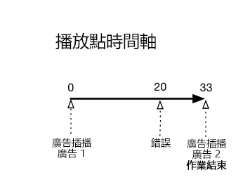
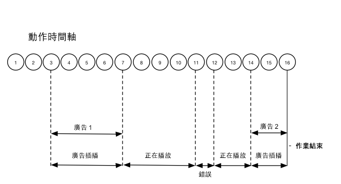

# 時間軸 2 - 使用者放棄工作階段 {#timeline--2-user-abandons-session}

## VOD、前段廣告、中段廣告、使用者提早放棄內容

下列圖表說明播放磁頭時間軸和使用者動作的對應時間軸。每個動作及其隨附請求的詳細資訊如下。








## 動作詳細資訊

### Action 1 - Start session {#Action-1}

| Action | 動作時間軸 (秒) | 播放點位置 (秒) | 用戶端要求 |
| --- | :---: | :---: | --- |
| 自動播放或按下播放按鈕 | 0 | 0 | `/api/v1/sessions` |

**實施詳細資料**

這個呼叫代表&#x200B;_使用者有意願播放_&#x200B;視訊。It returns a Session ID ( `{sid}` ) to the client that is used to identify all subsequent tracking calls within the session. 播放器狀態尚未進入「正在播放」，而是「正在開始」。[要求的作業參數](/help/media-collection-api/mc-api-ref/mc-api-sessions-req.md) 必須包含在請求主體的 `params` 地圖中。在後端，這個呼叫會產生 Adobe Analytics 起始呼叫。

**範例要求內文**

```
{
    playerTime: {
        playhead: 0,
        ts: <timestamp>
    },
    eventType:sessionStart, params: {
        "media.playerName": "sample-html5-api-player",
        "analytics.trackingServer": "[ _YOUR-TS_ ]",
        "analytics.reportSuite": "[ _YOUR-RSID_ ]",
        "analytics.visitorId": "[ _YOUR-VISITOR-ID_ ]",
        "media.contentType": "VOD",
        "media.length": 60.3333333333333,
        "media.id": "VA API Sample Player",
        "visitor.marketingCloudOrgId": "[YOUR-MCID]",
        "media.name": "ClickMe",
        "media.channel": "sample-channel",
        "media.sdkVersion": "va-api-0.0.0",
        "analytics.enableSSL": false
    }
}
```

### Action 2 - Ping timer start {#Action-2}

| Action | 動作時間軸 (秒) | 播放點位置 (秒) | 用戶端要求 |
| --- | :---: | :---: | --- |
| 應用程式開始 Ping 事件計時器 | 0 | 0 |  |

**實施詳細資料**

啓動應用程式的ping計時器。接著，第一個ping事件應在有前段廣告時觸發1秒，其他廣告則為10秒。

### Action 3 - Ad break start {#Action-3}

| Action | 動作時間軸 (秒) | 播放點位置 (秒) | 用戶端要求 |
| --- | :---: | :---: | --- |
| 追蹤前段廣告插播開始 | 0 | 0 | `/api/v1/sessions/{sid}/events` |

**實施詳細資料**

前段廣告必須追蹤。廣告追蹤只能在廣告插播中進行。

**範例要求內文**

```
{
    playerTime: {
        playhead: 0,
        ts: <timestamp>
    },
    eventType:adBreakStart, params: {
        "media.ad.podFriendlyName": "ad_pod1",
        "media.ad.podIndex": 0,
        "media.ad.podSecond": 0
    }
}
```

### Action 4 - Ad start {#Action-4}

| Action | 動作時間軸 (秒) | 播放點位置 (秒) | 用戶端要求 |
| --- | :---: | :---: | --- |
| 追蹤前段廣告 #1 開始 | 0 | 0 | `/api/v1/sessions/{sid}/events` |

**實施詳細資料**

12 秒的廣告開始。

**範例要求內文**

```
{
    playerTime: {
        playhead: 0,
        ts: <timestamp>
    },
    eventType:adStart, params: {
        "media.ad.podFriendlyName": "ad_pod1",
        "media.ad.name": "Ad 1",
        "media.ad.id": "002",
        "media.ad.length": 7,
        "media.ad.podPosition": 1,
        "media.ad.playerName": "Sample Player",
        "media.ad.advertiser": "Ad Guys",
        "media.ad.campaignId": "1",
        "media.ad.creativeId": "42",
        "media.ad.siteId": "XYZ",
        "media.ad.creativeURL": "https://xyz-creative.com",
        "media.ad.placementId": "sample-placement2"
    },
}
```

### Action 5 - Ad pings {#Action-5}

| Action | 動作時間軸 (秒) | 播放點位置 (秒) | 用戶端要求 |
| --- | :---: | :---: | --- |
| 應用程式傳送 Ping 事件 | 1 | 0 | `/api/v1/sessions/{sid}/events` |

**實施詳細資料**

每秒Ping後端。(未顯示後續的廣告轉換率，但符合簡短程度)。

**範例要求內文**

```
{
    playerTime: {
        playhead: 0,
        ts: <timestamp>
    },
    eventType:ping
}
```

### Action 6 - Ad complete {#Action-6}

| Action | 動作時間軸 (秒) | 播放點位置 (秒) | 用戶端要求 |
| --- | :---: | :---: | --- |
| 追蹤前段廣告 #1 完成 | 12 | 0 | `/api/v1/sessions/{sid}/events` |

**實施詳細資料**

第一個前段廣告結束。

**範例要求內文**

```
{
    playerTime: {
        playhead: 0,
        ts: <timestamp>
    },
    eventType:adComplete
}
```

### Action 7 - Ad break complete {#Action-7}

| Action | 動作時間軸 (秒) | 播放點位置 (秒) | 用戶端要求 |
| --- | :---: | :---: | --- |
| 追蹤前段廣告插播完成 | 12 | 0 | `/api/v1/sessions/{sid}/events` |

**實施詳細資料**

廣告插播結束。在整個廣告插播期間，播放器均保持「正在播放」狀態。

**範例要求內文**

```
{
    playerTime: {
        playhead: 0,
        ts: <timestamp>
    },
    eventType:adBreakComplete
}
```

### Action 8 - Play content {#Action-8}

| Action | 動作時間軸 (秒) | 播放點位置 (秒) | 用戶端要求 |
| --- | :---: | :---: | --- |
| 追蹤播放事件 | 12 | 0 | `/api/v1/sessions/{sid}/events` |

**實施詳細資料**

將播放器改變為「正在播放」狀態；開始追蹤內容播放的開始。

**範例要求內文**

```
{
    playerTime: {
        playhead: 0,
        ts: <timestamp>
    },
    eventType:play,
    qoeData: { bitrate: 10000 }
}
```

### Action 9 - Ping {#Action-9}

| Action | 動作時間軸 (秒) | 播放點位置 (秒) | 用戶端要求 |
| --- | :---: | :---: | --- |
| 應用程式傳送 Ping 事件 | 20 | 8 | `/api/v1/sessions/{sid}/events` |

**實施詳細資料**

每隔 10 秒 Ping 後端一次

**範例要求內文**

```
{
    playerTime: {
        playhead: 8ß,
        ts: <timestamp>
    },
    eventType:ping
}
```

### Action 10 - Ping {#Action-10}

| Action | 動作時間軸 (秒) | 播放點位置 (秒) | 用戶端要求 |
| --- | :---: | :---: | --- |
| 應用程式傳送 Ping 事件 | 30 | 18 | `/api/v1/sessions/{sid}/events` |

**實施詳細資料**

每隔 10 秒 Ping 後端一次

**範例要求內文**

```
{
    playerTime: {
        playhead: 18,
        ts: <timestamp>
    },
    eventType:ping
}
```

### Action 11 - Error {#Action-11}

| Action | 動作時間軸 (秒) | 播放點位置 (秒) | 用戶端要求 |
| --- | :---: | :---: | --- |
| 發生錯誤，應用程式傳送錯誤資訊。 | 32 | 20 | `/api/v1/sessions/{sid}/events` |

**實施詳細資料**


**範例要求內文**

```
{
    playerTime: {
        playhead: 20,
        ts: <timestamp>
    },
    eventType:error
}
```

### Action 12 - Play content {#Action-12}

| Action | 動作時間軸 (秒) | 播放點位置 (秒) | 用戶端要求 |
| --- | :---: | :---: | --- |
| 應用程式從錯誤中恢復，使用者按下「播放」 | 37 | 20 | `/api/v1/sessions/{sid}/events` |

**實施詳細資料**


**範例要求內文**

```
{
    playerTime: {
        playhead: 18,
        ts: <timestamp>
    },
    eventType:play, qoeData: { bitrate: 10000 }
}
```

### Action 13 - Ping {#Action-13}

| Action | 動作時間軸 (秒) | 播放點位置 (秒) | 用戶端要求 |
| --- | :---: | :---: | --- |
| 應用程式傳送 Ping 事件 | 40 | 28 | `/api/v1/sessions/{sid}/events` |

**實施詳細資料**

每隔 10 秒 Ping 後端一次

**範例要求內文**

```
{
    playerTime: {
        playhead: 28,
        ts: <timestamp>
    },
    eventType:ping
}
```

### Action 14 - Ad break start {#Action-14}

| Action | 動作時間軸 (秒) | 播放點位置 (秒) | 用戶端要求 |
| --- | :---: | :---: | --- |
| 追蹤中段廣告插播開始 | 45 | 33 | `/api/v1/sessions/{sid}/events` |

**實施詳細資料**

持續 8 秒的中段廣告: 傳送 `adBreakStart`。

**範例要求內文**

```
{
    playerTime: {
        playhead: 33,
        ts: <timestamp>
    },
    eventType:adBreakStart, params: {
        "media.ad.podFriendlyName": "ad_pod2",
        "media.ad.podIndex": 1,
        "media.ad.podSecond": 33
    }
}
```

### Action 15 - Ad start {#Action-15}

| Action | 動作時間軸 (秒) | 播放點位置 (秒) | 用戶端要求 |
| --- | :---: | :---: | --- |
| 追蹤中段廣告 #1 開始 | 45 | 33 | `/api/v1/sessions/{sid}/events` |

**實施詳細資料**

追蹤中段廣告。

**範例要求內文**

```
{
    playerTime: { playhead: 33, ts: <timestamp>
    },
    eventType:adStart, params: {
        "media.ad.podFriendlyName": "ad_pod1",
        "media.ad.name": "Ad 1",
        "media.ad.id": "002",
        "media.ad.length": 8,
        "media.ad.podPosition": 1,
        "media.ad.playerName": "Sample Player",
        "media.ad.advertiser": "Ad Guys",
        "media.ad.campaignId": "7",
        "media.ad.creativeId": "40",
        "media.ad.siteId": "XYZ",
        "media.ad.creativeURL": "https://xyz_creative.com",
        "media.ad.placementId": "sample_placement2"
    },
}
```

### Action 16 - Close app {#Action-16}

| Action | 動作時間軸 (秒) | 播放點位置 (秒) | 用戶端要求 |
| --- | :---: | :---: | --- |
| 使用者關閉應用程式。應用程式判斷使用者已放棄檢視，而且不會返回此工作階段。 | 48 | 33 | `/api/v1/sessions/{sid}/events` |

**實施詳細資料**

傳送 `sessionEnd` 給 VA 後端，指出應立即關閉工作階段，而且不需要進一步處理。

**範例要求內文**

```
{
    playerTime: {
        playhead: 33,
        ts: <timestamp>
    },
    eventType:sessionEnd
}
```


