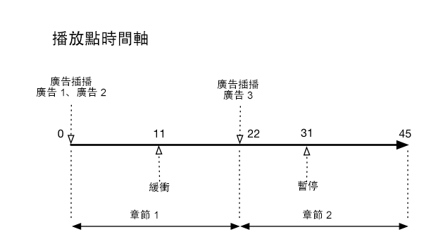
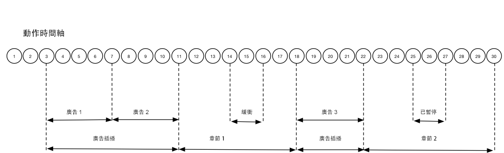

# 時間軸 3 - 章節 {#timeline-3-chapters}

## VOD、前段廣告、暫停、緩衝、檢視內容到結束為止


下列圖表說明播放磁頭時間軸和使用者動作的對應時間軸。每個動作及其隨附請求的詳細資訊如下。








## 動作詳細資訊


### Action 1 - Start session {#Action-1}

| Action | 動作時間軸 (秒) | 播放點位置 (秒) | 用戶端要求 |
| --- | :---: | :---: | --- |
| 自動播放或按下「播放」按鈕，開始載入視訊。 | 0 | 0 | `/api/v1/sessions` |

**實施詳細資訊**

This call signals _the intention of the user to play_ a video. It returns a Session ID ( `{sid}` ) to the client that is used to identify all subsequent tracking calls within the session. 播放器狀態尚未進入「正在播放」，而是「正在開始」。[要求的作業參數](../../media-collection-api/mc-api-ref/mc-api-sessions-req.md) 必須包含在請求主體的 `params` 地圖中。在後端，這個呼叫會產生 Adobe Analytics 起始呼叫。

**範例要求內文**

```
{
    playerTime: {
        playhead: 0,
        ts: <timestamp>
    },
    eventType:sessionStart, params: {
        "media.playerName": "sample-html5-api-player",
        "analytics.trackingServer": "[ _YOUR-TS_ ]",
        "analytics.reportSuite": "[ _YOUR_RSID_ ]",
        "analytics.visitorId": "[ _YOUR_VISITOR_ID_ ]",
        "media.contentType": "VOD",
        "media.length": 60.3333333333333,
        "media.id": "VA API Sample Player",
        "visitor.marketingCloudOrgId": "[YOUR_MCID]",
        "media.name": "ClickMe",
        "media.channel": "sample-channel",
        "media.sdkVersion": "va-api-0.0.0",
        "analytics.enableSSL": false
    }
}
```

### Action 2 - Ping timer starts {#Action-2}

| Action | 動作時間軸 (秒) | 播放點位置 (秒) | 用戶端要求 |
| --- | :---: | :---: | --- |
| 應用程式開始 Ping 事件計時器 | 0 | 0 |  |

**實施詳細資訊**

啓動您的Ping計時器。接著，第一個ping事件應在有前段廣告時觸發1秒，其他廣告則為10秒。

### Action 3 - Ad break start {#Action-3}

| Action | 動作時間軸 (秒) | 播放點位置 (秒) | 用戶端要求 |
| --- | :---: | :---: | --- |
| 追蹤前段廣告插播開始 | 0 | 0 | `/api/v1/sessions/{sid}/events` |

**實施詳細資訊**

廣告追蹤只能在廣告插播中進行。

**範例要求內文**

```
{
    playerTime: {
        playhead: 0,
        ts: <timestamp>
    },
    eventType:adBreakStart, params: {
        "media.ad.podFriendlyName": "ad_pod1",
        "media.ad.podIndex": 0, "media.ad.podSecond": 0
    }
}
```

### Action 4 - Ad start {#Action-4}

| Action | 動作時間軸 (秒) | 播放點位置 (秒) | 用戶端要求 |
| --- | :---: | :---: | --- |
| 追蹤前段廣告 #1 開始 | 0 | 0 | `/api/v1/sessions/{sid}/events` |

**實施詳細資訊**

開始追蹤第一個前段廣告，其持續時間為 15 秒。包括該 `adStart` 的中繼資料。

**範例要求內文**

```
{
    playerTime: {
        playhead: 0,
        ts: <timestamp>
    },
    eventType:adStart, params: {
        "media.ad.podFriendlyName": "ad_pod1",
        "media.ad.name": "Ad 1",
        "media.ad.id": "001",
        "media.ad.length": 15,
        "media.ad.podPosition": 1,
        "media.ad.playerName": "Sample Player",
        "media.ad.advertiser": "Ad Guys",
        "media.ad.campaignId": "1",
        "media.ad.creativeId": "42",
        "media.ad.siteId": "XYZ",
        "media.ad.creativeURL": "https://xyz_creative.com",
        "media.ad.placementId": "sample_placement"
    },
    customMetadata: {
        "myCustomData1": "CustomData1",
        "myCustomData2": "CustomData2"
    }
}
```

### Action 5 - Ad pings {#Action-5}

| Action | 動作時間軸 (秒) | 播放點位置 (秒) | 用戶端要求 |
| --- | :---: | :---: | --- |
| 應用程式傳送 Ping 事件 | 10 | 0 | `/api/v1/sessions/{sid}/events` |

**實施詳細資訊**

每秒Ping後端。(非簡短的後續廣告轉換率未顯示)。

**範例要求內文**

```
{
    playerTime: {
        playhead: 0,
        ts: <timestamp>
    },
    eventType:ping
}
```

### Action 6 - Ad complete {#Action-6}

| Action | 動作時間軸 (秒) | 播放點位置 (秒) | 用戶端要求 |
| --- | :---: | :---: | --- |
| 追蹤前段廣告 #1 完成 | 15 | 0 | `/api/v1/sessions/{sid}/events` |

**實施詳細資訊**

追蹤第一個前段廣告的結尾。

**範例要求內文**

```
{
    playerTime: {
        playhead: 0,
        ts: <timestamp>
    },
    eventType:adComplete
}
```

### Action 7 - Ad start {#Action-7}

| Action | 動作時間軸 (秒) | 播放點位置 (秒) | 用戶端要求 |
| --- | :---: | :---: | --- |
| 追蹤前段廣告 #2 開始 | 15 | 0 | `/api/v1/sessions/{sid}/events` |

**實施詳細資訊**

追蹤第二個前段廣告開始，其持續時間為 7 秒。

**範例要求內文**

```
{
    playerTime: {
        playhead: 0,
        ts: <timestamp>
    },
    eventType:adStart, params: {
        "media.ad.podFriendlyName": "ad_pod1",
        "media.ad.name": "Ad 2",
        "media.ad.id": "002",
        "media.ad.length": 7,
        "media.ad.podPosition": 1,
        "media.ad.playerName": "Sample Player",
        "media.ad.advertiser": "Ad Guys",
        "media.ad.campaignId": "2",
        "media.ad.creativeId": "44",
        "media.ad.siteId": "XYZ",
        "media.ad.creativeURL": "https://xyz_creative.com",
        "media.ad.placementId": "sample_placement2"
    },
}
```

### Action 8 - Ad pings {#Action-8}

| Action | 動作時間軸 (秒) | 播放點位置 (秒) | 用戶端要求 |
| --- | :---: | :---: | --- |
| 應用程式傳送 Ping 事件 | 16 | 0 | `/api/v1/sessions/{sid}/events` |

**實施詳細資訊**

每秒Ping後端。(非簡短的後續廣告轉換率未顯示)。

**範例要求內文**

```
{
    playerTime: {
        playhead: 0,
        ts: <timestamp>
    },
    eventType:ping
}
```

### Action 9 - Ad complete {#Action-9}

| Action | 動作時間軸 (秒) | 播放點位置 (秒) | 用戶端要求 |
| --- | :---: | :---: | --- |
| 追蹤前段廣告 #2 完成 | 22 | 0 | `/api/v1/sessions/{sid}/events` |

**實施詳細資訊**

追蹤第二個前段廣告的結尾。

**範例要求內文**

```
{
    playerTime: {
        playhead: 0,
        ts: <timestamp>
    },
    eventType:adComplete
}
```

### Action 10 - Ad break complete {#Action-10}

| Action | 動作時間軸 (秒) | 播放點位置 (秒) | 用戶端要求 |
| --- | :---: | :---: | --- |
| 追蹤前段廣告插播完成 | 22 | 0 | `/api/v1/sessions/{sid}/events` |

**實施詳細資訊**

廣告插播結束。在整個廣告插播期間，播放狀態均保持「正在播放」。

**範例要求內文**

```
{
    playerTime: {
        playhead: 0,
        ts: <timestamp>
    },
    eventType:adBreakComplete
}
```

### Action 11 - Play content {#Action-11}

| Action | 動作時間軸 (秒) | 播放點位置 (秒) | 用戶端要求 |
| --- | :---: | :---: | --- |
| 追蹤播放事件 | 22 | 0 | `/api/v1/sessions/{sid}/events` |

**實施詳細資訊**

在 `adBreakComplete` 事件之後，使用 `play` 事件將播放器置於「正在播放」狀態。

**範例要求內文**

```
{
    playerTime: {
        playhead: 0,
        ts: <timestamp>
    },
    eventType:play
}
```

### Action 12 - Chapter start {#Action-12}

| Action | 動作時間軸 (秒) | 播放點位置 (秒) | 用戶端要求 |
| --- | :---: | :---: | --- |
| 追蹤章節開始事件 | 23 | 1 | `/api/v1/sessions/{sid}/events` |

**實施詳細資訊**

在播放事件後，追蹤第一個章節的開始。

**範例要求內文**

```
{
    playerTime: {
        playhead: 0,
        ts: <timestamp>
    },
    eventType:chapterStart, params: {
        "media.chapter.index": 1,
        "media.chapter.offset": 0, "media.chapter.length": 20, "media.chapter.friendlyName": "Chapter Uno"
    },
}
```

### Action 13 - Ping {#Action-13}

| Action | 動作時間軸 (秒) | 播放點位置 (秒) | 用戶端要求 |
| --- | :---: | :---: | --- |
| 應用程式傳送 Ping 事件 | 30 | 8 | `/api/v1/sessions/{sid}/events` |

**實施詳細資訊**

每隔 10 秒 Ping 後端一次

**範例要求內文**

```
{
    playerTime: {
        playhead: 8,
        ts: <timestamp>
    },
    eventType:ping
}
```

### Action 14 - Buffer start {#Action-14}

| Action | 動作時間軸 (秒) | 播放點位置 (秒) | 用戶端要求 |
| --- | :---: | :---: | --- |
| 發生緩衝開始事件 | 33 | 11 | `/api/v1/sessions/{sid}/events` |

**實施詳細資訊**

追蹤移至「緩衝」狀態。

**範例要求內文**

```
{
    playerTime: {
        playhead: 11,
        ts: <timestamp>
    },
    eventType:bufferStart
}
```

### Action 15 - Buffer end (play) {#Action-15}

| Action | 動作時間軸 (秒) | 播放點位置 (秒) | 用戶端要求 |
| --- | :---: | :---: | --- |
| 緩衝結束後，應用程式追蹤內容的繼續播放 | 36 | 11 | `/api/v1/sessions/{sid}/events` |

**實施詳細資訊**

緩衝在 3 秒後結束，因此請讓播放器回復「正在播放」狀態。您必須傳送另一個追蹤播放事件來結束緩衝狀態。**`play`呼叫之後呼叫`bufferStart`會呼叫後端的「BufferEnd」呼叫，** 所以不需要 `bufferEnd` 事件。

**範例要求內文**

```
{
    playerTime: {
        playhead: 11,
        ts: <timestamp>
    },
    eventType:play
}
```

### Action 16 - Ping {#Action-16}

| Action | 動作時間軸 (秒) | 播放點位置 (秒) | 用戶端要求 |
| --- | :---: | :---: | --- |
| 應用程式傳送 Ping 事件 | 40 | 15 | `/api/v1/sessions/{sid}/events` |

**實施詳細資訊**

每隔 10 秒 Ping 後端一次

**範例要求內文**

```
{
    playerTime: {
        playhead: 15,
        ts: <timestamp>
    },
    eventType:ping
}
```

### Action 17 - Chapter end {#Action-17}

| Action | 動作時間軸 (秒) | 播放點位置 (秒) | 用戶端要求 |
| --- | :---: | :---: | --- |
| 應用程式追蹤章節結束 | 45 | 20 | `/api/v1/sessions/{sid}/events` |

**實施詳細資訊**

第一個章節結束，緊接著是第二個廣告插播。

**範例要求內文**

```
{
    playerTime: {
        playhead: 20,
        ts: <timestamp>
    },
    eventType:chapterEnd
}
```

### Action 18 - Ad break start {#Action-18}

| Action | 動作時間軸 (秒) | 播放點位置 (秒) | 用戶端要求 |
| --- | :---: | :---: | --- |
| 追蹤中段廣告插播開始 | 46 | 21 | `/api/v1/sessions/{sid}/events` |

**實施詳細資訊**

持續 8 秒的中段廣告: 傳送 `adBreakStart`。

**範例要求內文**

```
{
    playerTime: {
        playhead: 21,
        ts: <timestamp>
    },
    eventType:adBreakStart, params: {
        "media.ad.podFriendlyName": "ad_pod2",
        "media.ad.podIndex": 1, "media.ad.podSecond": 21
    }
}
```

### Action 19 - Ad start {#Action-19}

| Action | 動作時間軸 (秒) | 播放點位置 (秒) | 用戶端要求 |
| --- | :---: | :---: | --- |
| 追蹤中段廣告 #3 開始 | 46 | 21 | `/api/v1/sessions/{sid}/events` |

**實施詳細資訊**

追蹤中段廣告。

**範例要求內文**

```
{
    playerTime: {
        playhead: 21,
        ts: <timestamp>
    },
    eventType:adStart, params: {
        "media.ad.podFriendlyName": "ad_pod2",
        "media.ad.name": "Ad 3",
        "media.ad.id": "003",
        "media.ad.length": 8,
        "media.ad.podPosition": 2,
        "media.ad.playerName": "Sample Player",
        "media.ad.advertiser": "Ad Guys",
        "media.ad.campaignId": "7",
        "media.ad.creativeId": "40",
        "media.ad.siteId": "XYZ",
        "media.ad.creativeURL": "https://xyz_creative.com",
        "media.ad.placementId": "sample_placement2"
    },
}
```

### Action 20 - Ad Pings {#Action-20}

| Action | 動作時間軸 (秒) | 播放點位置 (秒) | 用戶端要求 |
| --- | :---: | :---: | --- |
| 應用程式傳送 Ping 事件 | 47 | 21 | `/api/v1/sessions/{sid}/events` |

**實施詳細資訊**

每秒Ping後端。(非簡短的後續廣告轉換率未顯示)。

**範例要求內文**

```
{
    playerTime: {
        playhead: 21,
        ts: <timestamp>
    },
    eventType:ping
}
```

### Action 21 - Ad complete {#Action-21}

| Action | 動作時間軸 (秒) | 播放點位置 (秒) | 用戶端要求 |
| --- | :---: | :---: | --- |
| 追蹤中段廣告 #1 完成 | 54 | 21 | `/api/v1/sessions/{sid}/events` |

**實施詳細資訊**

中段廣告完成。

**範例要求內文**

```
{
    playerTime: {
        playhead: 21,
        ts: <timestamp>
    },
    eventType:adComplete
}
```

### Action 22 - Ad break complete {#Action-22}

| Action | 動作時間軸 (秒) | 播放點位置 (秒) | 用戶端要求 |
| --- | :---: | :---: | --- |
| 追蹤中段廣告插播完成 | 54 | 21 | `/api/v1/sessions/{sid}/events` |

**實施詳細資訊**

廣告插播完成。

**範例要求內文**

```
{
    playerTime: {
        playhead: 21,
        ts: <timestamp>
    },
    eventType:adBreakComplete
}
```

### Action 23 - Chapter start {#Action-23}

| Action | 動作時間軸 (秒) | 播放點位置 (秒) | 用戶端要求 |
| --- | :---: | :---: | --- |
| 追蹤第 2 章開始 | 55 | 22 | `/api/v1/sessions/{sid}/events` |

**實施詳細資訊**


**範例要求內文**

```
{
    playerTime: {
        playhead: 22,
        ts: <timestamp>
    },
    eventType:chapterStart, params: {
        "media.chapter.index": 2,
        "media.chapter.offset": 22, "media.chapter.length": 22, "media.chapter.friendlyName": "Chapter Dos"
    },
}
```

### Action 24 - Ping {#Action-24}

| Action | 動作時間軸 (秒) | 播放點位置 (秒) | 用戶端要求 |
| --- | :---: | :---: | --- |
| 應用程式傳送 Ping 事件 | 60 | 27 | `/api/v1/sessions/{sid}/events` |

**實施詳細資訊**

每隔 10 秒 Ping 後端一次

**範例要求內文**

```
{
    playerTime: {
        playhead: 27,
        ts: <timestamp>
    },
    eventType:ping
}
```

### Action 25 - Pause {#Action-25}

| Action | 動作時間軸 (秒) | 播放點位置 (秒) | 用戶端要求 |
| --- | :---: | :---: | --- |
| 使用者按下「暫停」 | 64 | 31 | `/api/v1/sessions/{sid}/events` |

**實施詳細資訊**

使用者動作會將播放狀態移至「暫停」。

**範例要求內文**

```
{
    playerTime: {
        playhead: 31,
        ts: <timestamp>
    },
    eventType:pauseStart
}
```

### Action 26 - Ping {#Action-26}

| Action | 動作時間軸 (秒) | 播放點位置 (秒) | 用戶端要求 |
| --- | :---: | :---: | --- |
| 應用程式傳送 Ping 事件 | 70 | 31 | `/api/v1/sessions/{sid}/events` |

**實施詳細資訊**

每隔 10 秒 Ping 後端一次播放器依然處於「正在緩衝」狀態；使用者在內容中停滯 20 秒。怒氣沖沖...

**範例要求內文**

```
{
    playerTime: {
        playhead: 31,
        ts: <timestamp>
    },
    eventType:ping
}
```

### Action 27 - Play content {#Action-27}

| Action | 動作時間軸 (秒) | 播放點位置 (秒) | 用戶端要求 |
| --- | :---: | :---: | --- |
| 使用者按下「播放」繼續播放主要內容 | 74 | 31 | `/api/v1/sessions/{sid}/events` |

**實施詳細資訊**

將播放狀態改變為「正在播放」。**`play`之後的`pauseStart`呼叫意味著傳送「」呼叫到後端**，因此不需要 `resume`resume 事件。

**範例要求內文**

```
{
    playerTime: {
        playhead: 31,
        ts: <timestamp>
    },
    eventType:play
}
```

### Action 28 - Ping {#Action-28}

| Action | 動作時間軸 (秒) | 播放點位置 (秒) | 用戶端要求 |
| --- | :---: | :---: | --- |
| 應用程式傳送 Ping 事件 | 80 | 37 | `/api/v1/sessions/{sid}/events` |

**實施詳細資訊**

每隔 10 秒 Ping 後端一次

**範例要求內文**

```
{
    playerTime: {
        playhead: 37,
        ts: <timestamp>
    },
    eventType:ping
}
```

### Action 29 - Chapter end {#Action-29}

| Action | 動作時間軸 (秒) | 播放點位置 (秒) | 用戶端要求 |
| --- | :---: | :---: | --- |
| 第 2 章結束 | 87 | 44 | `/api/v1/sessions/{sid}/events` |

**實施詳細資訊**

追蹤第二個和最終章節的結尾。

**範例要求內文**

```
{
    playerTime: {
        playhead: 0,
        ts: <timestamp>
    },
    eventType:chapterEnd
}
```

### Action 30 - Session complete {#Action-30}

| Action | 動作時間軸 (秒) | 播放點位置 (秒) | 用戶端要求 |
| --- | :---: | :---: | --- |
| 使用者完成觀賞內容到結束為止。 | 88 | 45 | `/api/v1/sessions/{sid}/events` |

**實施詳細資訊**

傳送 `sessionComplete` 到後端，指出使用者已完成所有內容的觀賞。

**範例要求內文**

```
{
    playerTime: {
        playhead: 45,
        ts: <timestamp>
    },
    eventType:sessionComplete
}
```


>[!NOTE]
>
>**沒有搜尋事件？-** 媒體收集 API 對於 `seekStart` 或 `seekComplete` 事件的支援並不明確。這是因為有些播放器會在使用者拖曳時產生大量的此類事件，因此只要數百位使用者就能輕易讓後端服務的網路頻寬遇到瓶頸。Adobe 根據裝置時間戳記來運算心率持續時間，而非依賴播放點位置，藉此解決搜尋事件明確支援的問題。

