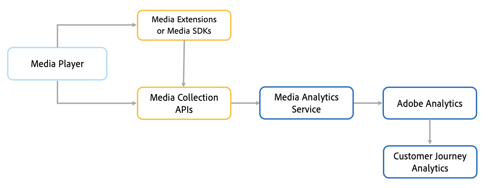

# Adobe Analytics for串流媒體概述

Adobe Analytics for Streaming Media 是 Adobe Analytics 的附加元件，針對音訊、視訊和廣告提供強大的測量工具。透過Analytics for Streaming Media，您可取得持續時間、停止和開始的幾乎即時、精細的詳細資訊，以便評估及結合視訊與音訊量度。 這些深入分析可讓您了解客戶的檢視和收聽習慣，並透過高度個人化的建議提升參與度。

Adobe Analytics for Streaming Media可讓您追蹤整個客戶歷程（在您的網站和串流應用程式之間）。 您可以將串流媒體量度與其他Adobe Analytics功能(例如Audience Analytics、行動裝置或跨裝置分析)結合。 這些量度可輕鬆整合至Adobe Analytics報表和其他Adobe Experience Platform產品。 媒體測量可讓您將資料分為多個維度和區段，以擷取完整詳細分析所需的所有中繼資料。如此便能分析資料，並將成功條件歸因於完整使用的媒體、平均逗留時間以及完成的廣告。

您可以測量掉格、緩衝逗留時間和平均位元速率等與體驗品質(QoE)相關的重要傳送量度。 這些量度可與您的網站或應用程式資料結合，以視覺化方式呈現客戶路徑和興趣，借此提供增強的建議，並使用Adobe Experience Platform提供個人化客戶體驗。

## 運作方式

串流媒體追蹤資料是使用Media SDK、媒體收集API或媒體擴充功能（含標籤）從播放器收集而來。 所有精細資料（最多10秒）都會傳送至Media Analytics服務，以收集和處理每個個別播放工作階段的資料。 播放工作階段結束後，計算的追蹤資料會傳送至Adobe Analytics以儲存並製作報表。 透過Adobe Customer Journey Analytics(CJA)實作，資料可以使用Analytics Data Connector(ADC)傳送至CJA，讓客戶能將CJA當作報表工具。

<!--  -->

## 功能

Adobe Analytics for Streaming Media 擁有即時監控、詳細分析、可化為實際行動的深入分析和營利商機等多項優勢。

* **即時分析**:利用關鍵效能量度（例如媒體開始）跨多個管道做出即時且可操作的決策。

* **推動參與**:透過較少的緩衝事件和了解廣告在內容中應播放的位置和時間，提供干擾較少的流暢體驗，並重複造訪，以與使用者充分互動。

* **整體圖片**:合併所有內容經銷商的多個資料點，以完整檢視所有媒體活動。透過Federated Analytics功能測量所有可能管道的參與度和檢視/收聽次數。

* **提高粒度**:從最精細的層級評估檢視行為，包括個別訪客的每日時間、每分鐘的同時檢閱者或聽眾人數，以及使用內容的平均持續時間。

* **精密測量**:測量用於使用媒體的多部裝置，包括OTT、智慧型手機、平板電腦、桌上型電腦等，以監控使用者的參與模式和習慣。

* **區段**:將分類套用至您的播放器、裝置、類型、章節，並顯示每個類別如何影響整體的檢視/收聽次數，以及客戶對內容、音訊、廣告和結合的參與度。
