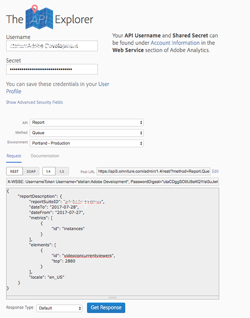

# 取得並行檢視者 JSON 報表資料{#get-concurrent-viewers-json-report-data}

您可以使用 Analytics API _*1.4 版*_ 來取得並行檢視者報表資料：
* [Analytics API](https://github.com/AdobeDocs/analytics-1.4-apis)
* [Swagger](https://adobedocs.github.io/analytics-1.4-apis/swagger-docs.html#/Report/Report.Get)

1. 使用 UI 上建置的任何區段來篩選資料。若要依據特定內容 ID 進行篩選，請建立新的區段。
1. 將要求內文中的 `elements` -> `id` 設為 `videoconcurrentviewers`。
1. 要求足夠的資料量。為確保資料中沒有間隙，Adobe 建議要求 3200 個資料點。

   * 您在報表中指定的資料範圍會&#x200B;_在視訊工作階段結束時_收集所有同時觀看者資料。
因此，您必須說明在某一天開始並在午夜後結束 (亦即隔天) 的工作階段。

   * 請要求一天以上的資料量，但在您的分析中，_*只能使用第一天的資料*_。

此案例的要求裝載範例如下所示：

```
{
  "reportDescription":{
    "reportSuiteID":"[YOUR_RSID]",
    "dateFrom":"2018-07-01",
    "dateTo":"2018-07-02",
    "metrics":[
      {
        "id":"instances"
      }
    ],
    "elements":[
      {
        "id":"videoconcurrentviewers",
        "top":"3200"
      }
    ],
    "segments":[
      {
        "id":"s1234_58ca4fc7e4b0abc238707bb9"                                         
      }
    ],
    "sortBy":"instances",
    "locale":"en_US"
  }
}
```

<!--
You can extract the concurrent viewers report data using the Experience Cloud API Explorer as follows. 

1. Navigate to: [https://www.adobe.io.](https://www.adobe.io)
1. Select and enter the following information in the API Explorer form:

    * **API -** Select "Report".
    * **Method -** Select "Queue".
    * **Environment -** Select your data center.
    * Request JSON - Specify the following:

        * `reportSuiteID` - For info on reports suites: [Report Suites](https://experienceleague.adobe.com/docs/analytics/admin/manage-report-suites/report-suites-admin.html)
        
        * `dateTo` - End date of the report.         
        
          >[!NOTE]
          >
          >The maximum time period supported is two days.

        * `dateFrom` - Start date of the report.
        * `elements : id` - Set to `"videoconcurrentviewers"`
        
        * `elements : top` - Specify the number of entries to be returned.

      Sample request body:

      ```    
      {
          "reportDescription": {
              "reportSuiteID": "[Your Report Suite ID]",
              "dateTo": "2017-09-07",
              "dateFrom": "2017-09-07"
              "metrics": [
                  {
                      "id": "instances"
                  }
              ],
              "elements": [
                  {
                      "id": "videoconcurrentviewers",
                      "top": 2880
                  }
              ]
              "locale": "en_US"
          }
      }
      
      ```

      >[!TIP]
      >
      >Some sessions are ended on the next day, and at that point the data will be available for reporting. In that case the best approach is to select 2 days (2880 minutes) of data, and use only the data for the first day (1440 minutes).

1. Click **Get Response**.

   In the Response field, you should get a `reportID`.
1. In the form, change **Method** to "Get".
1. Enter the value of the `reportID` you received in Step 3, and click **Get Response**.

   The concurrent viewers report data, in JSON format, is presented in the Response field.
   
   For example:
   
    

   

-->
