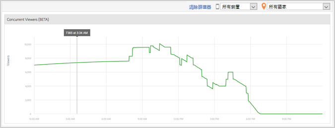

# 媒體同時檢閱者{#media-concurrent-viewers}

「媒體同時檢閱者」控制面板會顯示一天當中同時觀看人數。您可依內容、裝置類型或國家/地區來篩選這項資料。

>[!TIP]
>
>如果所選間隔不是整天，則不會顯示任何資料。

## 報表功能 {#section_11F8BCB98042490DAD0EA0B7EDA80569}

以下為此報表的部分功能:

* 此報表不具有即時性質。會發生 Adobe Analytics 正常延遲。
* 此報表涵蓋 24 小時之內的資料。X 軸是根據報表套裝時區的一日時間。
* 此報表可以「分鐘」為單位顯示同時觀看者人數。
* *「媒體同時檢閱者報表」*&#x200B;可顯示所有視訊內容的總現正觀看或收聽人數。
* *「媒體詳細資料」*&#x200B;報表內有「同時檢閱者」報表，顯示觀看或收聽某一特定媒體項目的檢閱者人數。
* 此報表僅顯示一天當中的資料。
* 客戶可檢視同時觀看者報表的歷史記錄 (僅限單一天)。

## 限制 {#section_F159BC0213134FE4A997E52EECC7BB9D}

以下為此報表的部分限制:

* 不可匯出資料 (例如 ReportBuilder)。
* 不可以表格格式呈現資料。
* 不可透過電子郵件傳送報表。
* 即使不追蹤廣告，您也必須重新啟動媒體追蹤功能並且選擇「媒體廣告」模組。
* 使用具有暫停追蹤功能的心率程式庫時，此功能可提供準確的資料。

