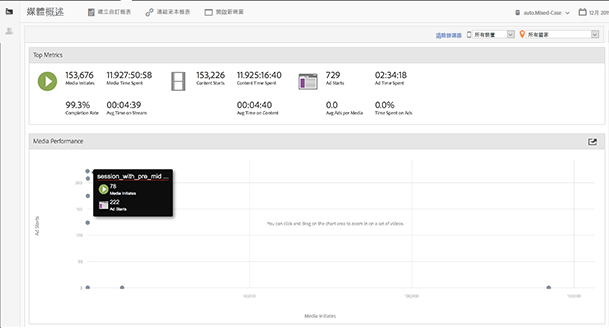
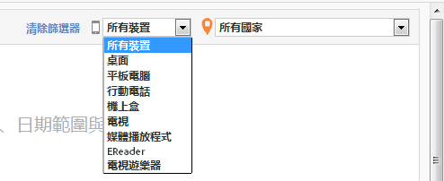
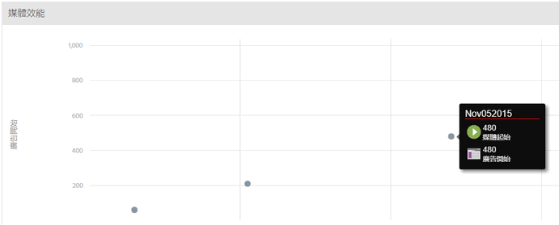

# 媒體概述{#media-overview}

「媒體概述」控制面板的設計可讓您監視網站上的各個媒體。「媒體概述」畫面會顯示數個彙總測量，供您快速監測媒體是否如預期般執行。圖形會在廣告開始旁顯示內容開始，讓您快速檢視每個媒體項目的這些量度。

{width="672px"}

## 快速篩選 {#quick-filters}

依裝置或地理區域快速顯示媒體量度:

{width="400px"}

## 媒體效能 {#media-performance}

按一下並拖曳以放大，然後暫留以檢視特定媒體的詳細量度。按一下  

來重設檢視。

{width="400px"}

