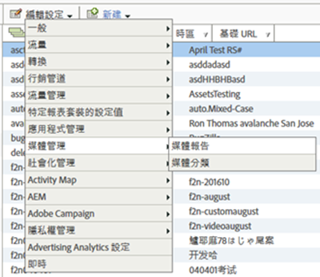

# 啟用媒體報表{#media-reports-enablement}

必須先設定收集媒體度量的每個報表套裝，才能傳送媒體資料。

>[!TIP]
>
>為了運用新功能，現有的Media Analytics客戶應重新啟用其RSID的媒體追蹤。

1. In [Reports &amp; Analytics](https://my.omniture.com/login/) click **[!UICONTROL Admin &gt; Report Suites].**
1. Select the report suite(s) where you are collecting media data and click **[!UICONTROL Edit Settings &gt; Media Management &gt; Media Reporting].**

   {width="400px"}

1. On the **[!UICONTROL Media Reporting]** page, enable **[!UICONTROL Media Core],** and optionally enable **[!UICONTROL Media Ads],** **[!UICONTROL Media Chapters],** and **[!UICONTROL Media Quality].**

   媒體測量包含下列模組:

   * **媒體核心**

      核心媒體測量用於媒體內容。這會使用解決方案（或自訂）eVar來追蹤內容、內容類型、內容播放器名稱和內容頻道。 解決方案（或自訂）事件將用於媒體開始、內容開始、內容完成和內容逗留時間。

   * **媒體廣告**

      媒體廣告測量用於測量媒體內容中的廣告。 這將使用解決方案 eVar 來測量廣告、廣告播放器名稱、廣告 Pod 和 Pod 位置中的廣告。解決方案事件將用於廣告開始、廣告完成、廣告逗留時間和視訊逗留時間。

   * **媒體章節**

      視訊章節測量是用於章節測量。 章節是單一媒體內容的分類。 這將使用解決方案 eVar 來儲存章節 ID。解決方案事件將用於章節開始、章節結束、章節逗留時間。將提供章節名稱和章節位置的其他章節中繼資料做為章節 ID 的分類。

   * **媒體品質**

      視頻質量測量用於測量內容回放的質量。 這將使用解決方案 eVar 來儲存開始時間、緩衝事件、緩衝時間長度總計、位元速率參數、平均位元速率、錯誤及掉格。解決方案事件將用於: 開始時間、開始前掉格、緩衝影響的資料流、緩衝事件、緩衝時間長度總計、位元速率變更影響串流、位元速率變更、平均位元速率、錯誤影響、錯誤事件、掉格影響的資料流，以及掉格。

   * **視訊與視訊廣告中繼資料**

      中繼資料可附加至媒體和／或廣告，以進一步說明該媒體／廣告並加以分類。 標準化的媒體和廣告中繼資料將透過解決方案變數和分類收集。 這些值包含:「節目」、「季數」、「集數」、「資產 ID」、「類型」、「首播日期」、「首次數位化日期」、「內容評等」、「創作者」、「網路」、「節目類型」、「廣告載入」、「MVPD」、「已授權」、「播出時段」、「媒體工作階段 ID」、「廣告商」、「促銷活動 ID」及「創作 ID」。

   * **音訊和音訊廣告中繼資料**

      可以將中繼資料附加至音訊和/或廣告，以進一步描述並分類該音訊/廣告。標準化的音訊和廣告中繼資料將會透過解決方案變數和分類收集。包含的值為: 藝人、專輯、標籤、作者、出版社、電視台、節目、季數、集數、資產 ID、類型、首播日期、首次數位化日期、內容評等、創作者、網路、節目類型、廣告載入、MVPD、已授權、時段、媒體工作階段 ID、廣告商、促銷活動 ID 以及創作 ID。
   啟用每個模組會保留一組變數，並建立一組新的報表。由於品質的例外情況，除非已完成對應的實施，否則報表中將不會有資料。如果有啟用，實施核心模組也會實施品質模組。

   如果您尚未追蹤廣告、章節或播放品質，您可以隨時啟用其他選項。

1. Click **[!UICONTROL Save].**

   If this report suite is already configured to collect media data, after you click **[!UICONTROL Save]**, an additional configuration page is displayed. 如果您看見&#x200B;**[!UICONTROL 「媒體核心測量」]頁面，請繼續進行下一個步驟。**

1. (Conditional) On the **[!UICONTROL Media Core measurement]** page, choose to continue using custom variables or choose to use solution variables.

   | 選項 | 附註 |
   | --- | --- |
   | 繼續使用自訂變數 | 利弊：<ul> <li> **優點:** 內容趨勢會在移轉之後繼續運作。 </li> <li> **** 缺點：需要您保留兩個自訂eVar和三個自訂事件，以分配給媒體。 您會重新獲得一個自訂 eVar 和一個自訂事件的使用。 </li> </ul> 若要繼續使用自訂變數: <ol> <li>Select **[!UICONTROL Use Custom Variables,]** then click **[!UICONTROL Save.]** </li> <li>When prompted, map your current custom eVars and events and then click **[!UICONTROL Save:]** </li> </ol> |
   | 移轉至解決方案變數 | 利弊：<ul> <li> **優點:** 您會重新獲得三個自訂 eVar 和四個自訂事件的使用。 </li> <li> **缺點:** 您會遺失媒體報表的&#x200B;**所有**&#x200B;歷史趨勢和比較。這表示在移轉至心率之前，您無法追蹤任何日期的內容檢視或內容播放時間。 </li> </ul> **限制:** 請勿移轉至解決方案變數，除非您確定不要保留此趨勢。所有客戶應只在他們需要保留歷史持續性時，才使用解決方案變數及處理規則，將媒體資料放置到現有的 prop 和 eVar。若要移轉至解決方案變數：選取「 **[!UICONTROL 使用解決方案變數]** 」，然後按一 **[!UICONTROL 下「儲存]」。** 重    要：移轉至解決方案變數會導致您遺失 **媒體報告的** 所有歷史趨勢和比較。 |

>[!IMPORTANT]
>
>請勿變更「量度」和中繼資料表格(例如音訊和視訊參數 )中列出的任何變數的分類名稱，這些變數在「報告／保留變數」下方會描述為「分類」。 媒體分類是在報表套裝啟用媒體追蹤時定義的。 Adobe會不時新增屬性，當這發生時，客戶必須重新啟用其報表套裝，才能存取新的媒體屬性。 在更新程式中，Adobe會檢查變數的名稱，以判斷分類是否啟用。 如果其中有遺失，Adobe會再次新增遺失的。
