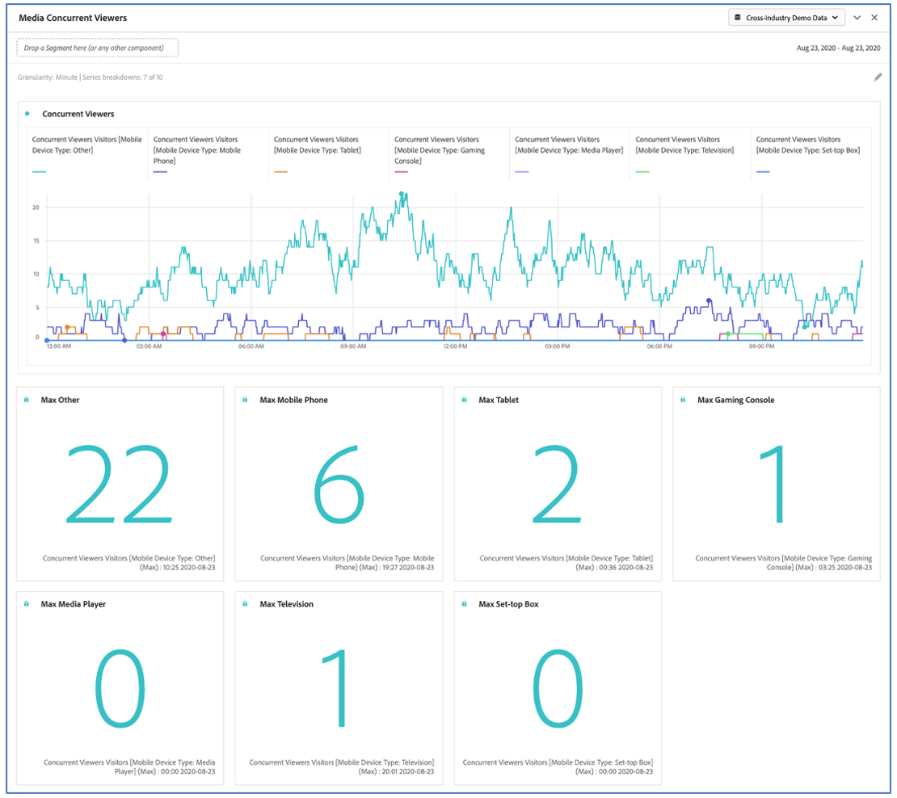

# 媒體並排檢視器{#media-concurrent-viewers}

對於Media Analytics客戶，「媒體並行檢視器」面板可讓您瞭解並行性最高的發生位置，或中斷的發生位置，以便提供內容品質和檢視器參與度的寶貴洞見，並協助疑難排解或規劃容量和規模。  [更多詳情](https://docs.adobe.com/content/help/en/analytics/analyze/analysis-workspace/panels/media-concurrent-viewers.html)

## 面板輸出

