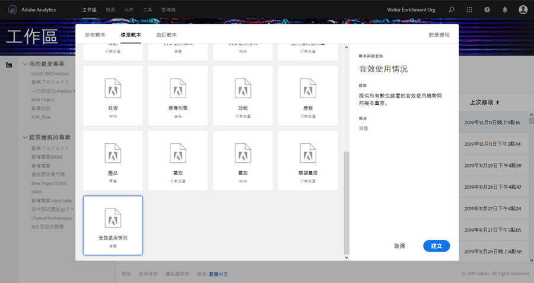
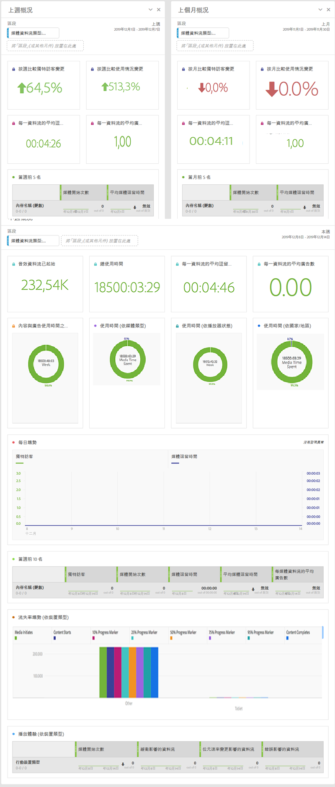

# 媒體工作區範本{#media-workspace-templates}

Adobe Analytics「工作區」讓您能快速設定控制面板，分析追蹤資料。建立新專案或前往「工作區」管理現有專案時，可以選擇涵蓋常見追蹤情況的標準範本，例如「贏取」、「音訊」和「視訊」等使用情況。您也可以建立、修改和儲存專屬自訂範本。

建立或管理專案時，可使用 Adobe Analytics「工作區」標籤的範本。第一次前往「工作區」時，畫面會顯示建立新專案或開啟現有專案的選項。

* **建立新專案 -** 按一下「工作區」的&#x200B;**[!UICONTROL 「建立新專案」]按鈕時，畫面會顯示所選範本集合 (包含「標準」和「自訂」) 的對話方塊:**

   

   For example, if you choose the **[!UICONTROL Audio Consumption]** template, a project with the following audio-oriented dashboard is presented:

   

* **管理專案 -** 可在現有專案修改資料顯示方式，並「另存新檔」以建立專屬自訂範本集合。

