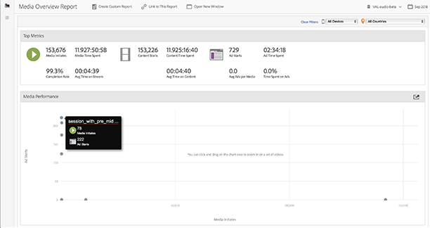

# 媒體概觀{#media-overview}

「媒體概觀」控制面板的設計可讓您監視網站上的各個媒體。 「媒體概觀」畫面會顯示數個彙總測量，供您快速監測媒體是否如預期般執行。 圖表會在[[!UICONTROL 廣告開始]](/help/reporting/metrics/ad-starts.md)旁顯示[[!UICONTROL 內容開始]](/help/reporting/metrics/content-starts.md)，讓您快速檢視每個媒體專案的這些量度。

<!--
{width="672px"}
-->

## 快速篩選 {#quick-filters}

依裝置或地理區域快速顯示媒體量度：

<!--
{width="400px"}
-->

## 媒體效能 {#media-performance}

按一下並拖曳以放大顯示，然後暫留以檢視特定媒體的精細量度。 按一下 

在縮放之後重設檢視。

<!--
{width="400px"}
-->
