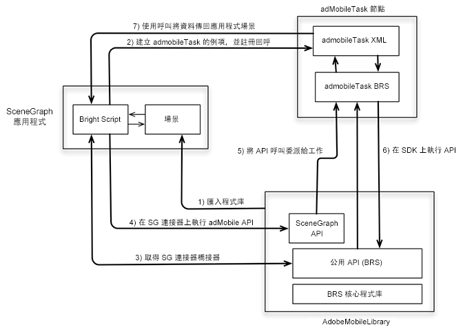

# 在 SceneGraph (Roku) 中進行追蹤{#tracking-in-scenegraph-roku}

## 簡介 {#section_vfr_zcz_y2b}

Roku 推出一款用於開發應用程式的新程式設計架構: SceneGraph XML 程式設計架構。這個新架構包含兩個新的重要概念:

* SceneGraph 轉譯應用程式螢幕畫面
* SceneGraph 螢幕畫面的 XML 設定

Adobe Mobile SDK for Roku 是以 BrightScript 撰寫。SDK 使用許多不適用於在 SceneGraph 上執行的應用程式 (例如執行緒) 的元件。因此，打算使用 SceneGraph 架構的 Roku 應用程式開發人員無法呼叫 Adobe Mobile SDK API (後者類似於舊版 BrightScript 應用程式中提供的 API)。

## 架構 {#section_dj5_1dz_y2b}

為了將 SceneGraph 支援加入 AdobeMobile SDK，Adobe 已新增一個新的 API，該 API 在 AdobeMobile SDK 和 `adbmobileTask` 之間建立連接器橋接器。後者是用於 SDK 之 API 執行的 SceneGraph 節點。(在本文件其他章節中詳細說明 `adbmobileTask` 的用法。)

連接器橋接器的執行方式如下所示:

* 橋接器傳回 AdobeMobile SDK 的 SceneGraph 相容例項。SceneGraph 相容 SDK 具有舊版 SDK 開放的所有 API。
* 您在 SceneGraph 中使用 AdobeMobile SDK API 的方式與使用舊版 API 的方式非常類似。
* 橋接器也開放針對傳回某些資料之 API 接聽回呼的機制。



## 元件 {#section_jwl_wqx_1bb}

**SceneGraph 應用程式:**

* 透過 SceneGraph 連接器橋接器 API 使用 `AdobeMobileLibrary` API。
* 針對預期的輸出資料變數在 `adbmobileTask` 上註冊回應回呼。

**AdobeMobileLibrary:**

* 公開一組公用 API (舊版)，包括連接器橋接器 API。
* 傳回包裝所有舊版公用 API 的 SceneGraph 連接器例項。
* 與 `adbmobileTask` SceneGraph 節點通訊以執行 API。

**adbmobileTask 節點:**

* 在背景執行緒上執行 `AdobeMobileLibrary` API 的 SceneGraph 任務節點。
* 作為委派以將資料傳回應用程式場景。

## 公用 SceneGraph API {#section_jyd_hdz_y2b}

### ADBMobileConnector

| 類別 | 方法名稱 | 說明 |
|---|---|---|
| **常數** |  |  |
|  | `sceneGraphConstants` | Returns an object containing `SceneGraphConstants`. 如需詳細資料，請參閱上表。 |
|  |  |  |
| **除錯記錄** |  |  |
|  | `setDebugLogging` | SceneGraph API 可在 ADBMobile SDK 上設定除錯記錄。 |
|  | `getDebugLogging` | SceneGraph API 可在 ADBMobile SDK 上取得除錯記錄。 |
|  | 如需更多資訊，請參閱舊版 SDK 的「除錯記錄」區段。 |  |
|  |  |  |
| **隱私權狀態 / 選擇退出** |  |  |
|  | `setPrivacyStatus` | SceneGraph API 可在 ADBMobile SDK 上設定隱私權狀態。 |
|  | `getPrivacyStatus` | SceneGraph API 可在 ADBMobile SDK 上取得隱私權狀態。 |
|  | 如需更多資訊，請參閱舊版 SDK 的「選擇退出/隱私權狀態」區段。 |  |
|  |  |  |
| **Analytics** |  |  |
|  | `trackState` | SceneGraph API 可在 ADBMobile SDK 上追蹤狀態。 |
|  | `trackAction` | SceneGraph API 可在 ADBMobile SDK 上追蹤動作。 |
|  | `trackingIdentifier` | SceneGraph API 可從 ADBMobile SDK 上取得追蹤識別碼。 |
|  | `userIdentifier` | SceneGraph API 可從 ADBMobile SDK 上取得使用者識別碼。 |
|  | `setUserIdentifier` | SceneGraph API 可從 ADBMobile SDK 上設定使用者識別碼。 |
|  | `getAllIdentifiers` | SceneGraph API 會擷取已知且由 Roku SDK 保存的所有使用者身分識別資料。 |
|  | 如需更多資訊，請參閱舊版 SDK 的「Analytics」區段。 |  |
|  |  |  |
| **Experience Cloud** |  |  |
|  | `visitorSyncIdentifiers` | SceneGraph API 可從 ADBMobile SDK 上同步 Experience Cloud 識別碼。 |
|  | `visitorMarketingCloudID` | SceneGraph API 可從 ADBMobile SDK 上取得 Experience Cloud ID。 |
|  | 如需更多資訊，請參閱舊版 SDK 的「Experience Cloud」一節。 |  |
|  |  |  |
| **Audience Manager** |  |  |
|  | `audienceSubmitSignal` | SceneGraph API 使用特徵傳送對象管理訊號。 |
|  | `audienceVisitorProfile` | SceneGraph API 可從 ADBMobile SDK 取得 Audience Manager 訪客設定檔。 |
|  | `audienceDpid` | SceneGraph API 可從 ADBMobile SDK 取得對象 Dpid。 |
|  | `audienceDpuuid` | SceneGraph API 可從 ADBMobile SDK 取得對象 Dpuuid。 |
|  | `audienceSetDpidAndDpuuid` | SceneGraph API 可在 ADBMobile SDK 上設定對象 Dpid 和 Dpuuid。 |
|  | 如需更多資訊，請參閱舊版 SDK 的「Audience Manager」一節。 |  |
|  |  |  |
| **MediaHeartbeat** |  |  |
|  | `mediaTrackLoad` | SceneGraph API 可為 MediaHeartbeat 追蹤載入視訊內容。 |
|  | mediaTrackStart | SceneGraph API 可使用 MediaHeartbeat 啟動視訊追蹤工作階段。 |
|  | `mediaTrackUnload` | SceneGraph API 可從 MediaHeartbeat 追蹤卸載視訊內容。 |
|  | `mediaTrackPlay` | SceneGraph API 可追蹤視訊內容的播放。 |
|  | mediaTrackPause | SceneGraph API 可追蹤暫停的視訊內容。 |
|  | `mediaTrackComplete` | SceneGraph API 可完成視訊內容的追蹤播放。 |
|  | `mediaTrackError` | SceneGraph API 可追蹤播放錯誤。 |
|  | mediaTrackEvent | SceneGraph API 可在追蹤期間追蹤播放事件。例如: 廣告、章節。 |
|  | `mediaUpdatePlayhead` | SceneGraph API 可在視訊追蹤期間將播放點更新傳送至 MediaHeartbeat。 |
|  | `mediaUpdateQoS` | SceneGraph API 可在視訊追蹤期間將 QoS 更新傳送至 MediaHeartbeat。 |
|  | 如需更多資訊，請參閱舊版 SDK 的「MediaHeartbeat」一節。 |  |

### SceneGraphConstants

| 常數名稱 | 說明 |
|---|---|
| `API_RESPONSE` | Used to retrieve the response object from `adbmobileTask` node's `adbmobileApiResponse` field |
| `DEBUG_LOGGING` | `apiName` 用於 `getDebugLogging` |
| `PRIVACY_STATUS` | `apiName` 用於 `getPrivacyStatus` |
| `TRACKING_IDENTIFIER` | `apiName` 用於 `trackingIdentifier` |
| `USER_IDENTIFIER` | `apiName` 用於 `userIdentifier` |
| `VISITOR_MARKETING_CLOUD_ID` | `apiName` 用於 `visitorMarketingCloudID` |
| `AUDIENCE_VISITOR_PROFILE` | `apiName` 用於 `audienceVisitorProfile` |
| `AUDIENCE_DPID` | `apiName` 用於 `audienceDpid` |
| `AUDIENCE_DPUUID` | `apiName` 用於 `audienceDpuuid` |

### adbmobileTask 節點

<table>
<thead>
<tr>
<td> 欄位 </td><td> 類型 </td><td> 預設值 </td><td> 使用狀況 </td>
</tr>
</thead>
<tbody>
<tr>
<td> adbmobileApiCall </td>
<td> assocarray </td>
<td> Invalid </td>
<td> 請勿修改此欄位或讓應用程式使用此欄位。此欄位由 ADBMobile SceneGraphConnector 用於透過 SceneGraph 節點路由 API 呼叫並擷取回應。因此，此索引鍵/欄位已針對 SceneGraph 相容性保留供 AdobeMobileSDK 使用。<b>重要:</b> 此欄位的任何修改都可能導致 AdobeMobileSDK 無法正常運作。</td>
</tr>
<tr>
<td> adbmobileApiResponse </td>
<td> assocarray </td>
<td> Invalid </td>
<td> 唯讀所有在AdobeMobileSDK上執行的API都會在此欄位上傳回回應。註冊回呼以接聽此欄位的更新，藉此接收回應物件。以下是回應物件的格式:  
<codeblock>
response={「APIName」：&lt; sceneGraphics。
 API_ NAME&gt;
「ReturnValue：&lt; API_ REPORT&gt;} 
</codeblock>
此回應物件的例項將在 AdobeMobileSDK 上針對任何 API 呼叫傳送，預計該 API 呼叫會根據 API 參考指南傳回值。例如，visitorMarketingCloudID()的API呼叫將傳回下列回應物件： 
<codeblock>
response={「APIName」：m.
 ADBMobileConstants.
 Visitor_ MARKETING_ CLOUD_ ID
「ReturnValue：「07050x25671x33760x72644x14」} 
</codeblock>
或者，回應資料也可能無效: 
<codeblock>
response={
「API」：m.
 ADBMobileConstants.
 Visitor_ MARKETING_ CLOUD_ ID
「ReturnValue：無效} 
</codeblock>
</td>
</tr>
</tbody>
</table>

### `adbmobile.brs`

#### `getADBMobileConnectorInstance`

API 簽章: `ADBMobile().getADBMobileConnectorInstance()`\
Input: `adbmobileTask`
Return Type: `ADBMobileConnector`

#### `sgConstants`

API Signature: `ADBMobile().sgConstants()`
Input: None\
傳回類型: `SceneGraphConstants`

>[!NOTE]
>Refer to the `ADBMobileConnector` API reference for details.

### ADBMobile 常數

|  功能  | 常數名稱 | 說明   |
|---|---|---|
| 版本設定 | `version` | 擷取 AdobeMobileLibrary 版本資訊的常數 |
| 隱私權/選擇退出 | `PRIVACY_STATUS_OPT_IN` | 隱私權狀態選擇加入的常數 |
|  | `PRIVACY_STATUS_OPT_OUT` | 隱私權狀態選擇退出的常數 |
| MediaHeartbeat 常數 | Refer to the constants on this page: <br/><br/>[Media Heartbeat Methods.](../../sdk-implement/track-av-playback/track-core/track-core-roku.md) | 搭配MediaHeartbeat API使用這些常數 |
| 標準中繼資料 | Refer to the constants on this page: <br/><br/>[Standard Metadata Parameters.](../../sdk-implement/track-av-playback/impl-std-metadata/impl-std-metadata-roku.md) | 使用這些常數以附加 MediaHeartbeat API 中的標準視訊/廣告中繼資料 |

Globally defined utility `MediaHeartbeat` APIs on the legacy AdobeMobileLibrary are accessible *as is* in the SceneGraph enviromnent because they do not use any Brightscript components that are unavailable in SceneGraph nodes. 如需關於這些方法的更多資訊，請參閱下表:

### 適用於 MediaHeartbeat 的全域方法

| 方法 | 說明 |
| --- | --- |
| `adb_media_init_mediainfo` | 此方法會傳回初始化的媒體資訊物件 `Function adb_media_init_mediainfo(name As String, id As String, length As Double, streamType As String) As Object` |
| `adb_media_init_adinfo` | 此方法會傳回初始化的廣告資訊物件 `Function adb_media_init_adinfo(name As String, id As String, position As Double, length As Double) As Object` |
| `adb_media_init_chapterinfo` | This method returns initialized Chapter Information object.  `Function adb_media_init_adbreakinfo(name As String, startTime as Double, position as Double) As Object` |
| `adb_media_init_adbreakinfo` | This method returns initialized AdBreak Information object.  `Function adb_media_init_chapterinfo(name As String, position As Double, length As Double, startTime As Double) As Object` |
| `adb_media_init_qosinfo` | This method returns an initialized QoS Information object.  `Function adb_media_init_qosinfo(bitrate As Double, startupTime as Double, fps as Double, droppedFrames as Double) As Object` |

## 實施 {#section_dbz_ydz_y2b}

1. **下載Roku Library-** 下載 [最新的Roku程式庫。](https://github.com/Adobe-Marketing-Cloud/media-sdks/releases/tag/roku-v2.2.0)

1. **設定您的開發環境**

   1. Copy `adbmobile.brs` (AdobeMobileLibrary) into your `pkg:/source/` directory.

   1. For Scene Graph support, copy `adbmobileTask.brs` and `adbMobileTask.xml` into your `pkg:/components/` directory.

1. **初始化**

   1. Import `adbmobile.brs` into your Scene.

      ```
      <script type="text/brightscript" uri="pkg:/source/adbmobile.brs" />
      ```

   1. 將 `adbmobileTask` 節點例項建立在您的場景中。

      ```
      m.adbmobileTask = createObject("roSGNode", "adbmobileTask")
      ```

   1. 使用 `adbmobile` 例項取得 SceneGraph 適用的instance of `adbmobileTask` 連接器例項。 

      ```
      m.adbmobile = ADBMobile().getADBMobileConnectorInstance(m.adbmobileTask)
      ```

   1. Get `adbmobile` SG constants.

      ```
      m.adbmobileConstants = m.adbmobile.sceneGraphConstants()
      ```

   1. 註冊回撥以便為所有 `AdbMobile` API 呼叫接收回應物件。

      ```
      m.adbmobileTask.ObserveField(m.adbmobileConstants.API_RESPONSE,  
                                   "onAdbmobileApiResponse") 
      
      ' Sample implementation of the callback 
      ' Listen for all the constants for which API calls are made on the SDK 
      function onAdbmobileApiResponse() as void 
          responseObject = m.adbmobileTask[m.adbmobileConstants.API_RESPONSE] 
      
          if responseObject <> invalid 
              methodName = responseObject.apiName 
              retVal = responseObject.returnValue 
      
              if methodName = m.adbmobileConstants.DEBUG_LOGGING 
                  if retVal 
                      print "API Response: DEBUG LOGGING: " + "True" 
                  else 
                      print "API Response: DEBUG LOGGING: " + "False" 
                  endif 
              else if methodName = m.adbmobileConstants.PRIVACY_STATUS 
                  print "API Response: PRIVACY STATUS: " + retVal 
              else if methodName = m.adbmobileConstants.TRACKING_IDENTIFIER 
                  if retVal <> invalid 
                      print "API Response: TRACKING IDENTIFIER: " + retVal 
                  else 
                      print "API Response: TRACKING IDENTIFIER: " + "invalid" 
                  endif 
              else if methodName = m.adbmobileConstants.USER_IDENTIFIER 
                  if retVal <> invalid 
                      print "API Response: USER IDENTIFIER: " + retVal 
                  else 
                      print "API Response: USER IDENTIFIER: " + "invalid" 
                  endif 
              else if methodName = m.adbmobileConstants.VISITOR_MARKETING_CLOUD_ID 
                  if retVal <> invalid 
                      print "API Response: MCID: " + retVal 
                  else 
                      print "API Response: MCID: " + "invalid" 
                  endif 
              else if methodName = m.adbmobileConstants.AUDIENCE_DPID 
                  if retVal <> invalid 
                      print "API Response: AUDIENCE DPID: " + retVal 
                  else 
                      print "API Response: AUDIENCE DPID: " + "invalid" 
                  endif 
              else if methodName = m.adbmobileConstants.AUDIENCE_DPUUID 
                  if retVal <> invalid 
                      print "API Response: AUDIENCE DPUUID: " + retVal 
                  else 
                      print "API Response: AUDIENCE DPUUID: " + "invalid" 
                  endif 
              else if methodName = m.adbmobileConstants.AUDIENCE_VISITOR_PROFILE 
                  if retVal <> invalid 
                      print "API Response: AUDIENCE VISITOR PROFILE: Valid Object" 
                  else 
                      print "API Response: AUDIENCE VISITOR PROFILE: " + "invalid" 
                  endif 
              endif 
          endif 
      end function 
      ```

## 實作範例 {#section_mld_lfz_y2b}

### 舊版 SDK 上的 API 呼叫範例

```
'get an instance of SDK 
m.adbmobile = ADBMobile() 
   
'execute setter APIs 
m.adbmobile.setDebugLogging(true) 
   
'execute getter APIs 
debugLogging = m.adbmobile.getDebugLogging()
```

### SG SDK 上的 API 呼叫範例

```
'create adbmobileTask instance 
m.adbmobileTask = createObject("roSGNode", "adbmobileTask") 
   
'get an instance of SDK using task instance 
m.adbmobile =  
  ADBMobile().getADBMobileConnectorInstace(m.adbmobileTask) 
m.adbmobileConstants = m.adbmobile.sceneGraphConstants() 
'execute setter APIs 
m.adbmobile.setDebugLogging(true) 
  
'execute getter APIs 
m.adbmobileTask.ObserverField(m.adbConstants.API_RESPONSE,  
                              "onAdbmobileApiResponse") 
m.adbmobile.getDebugLogging() 
   
'listen for return data in registered callbacks 
function onAdbmobileApiResponse() as void 
    responseObject = m.adbmobileTask[m.adbmobileConstants.API_RESPONSE] 
  
        if responseObject <> invalid 
            methodName = responseObject.apiName 
            retVal = responseObject.returnValue 
  
        if methodName = m.adbmobileConstants.DEBUG_LOGGING 
            if retVal 
                print "API Response: DEBUG LOGGING: " + "True" 
            else 
                print "API Response: DEBUG LOGGING: " + "False" 
         endif 
    endif 
end function
```

