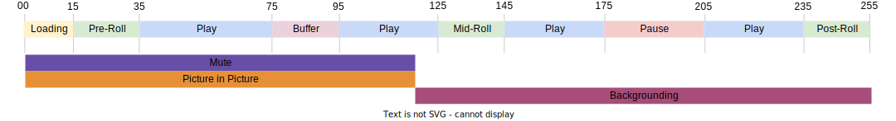

# 多播放器狀態追蹤

有時，兩個播放器狀態會同時開始和結束，或狀態的結尾也會是另一個狀態的開始，如下圖所示：



目前的實作允許兩種情況：
- `stateStart(pictureInPicture)` - t0
- `stateStart(mute)` - t0
- `stateEnd(mute)` - t1
- `stateEnd(pictureInPicture)` - t1
- `stateStart(fullScreen)` - t1
- `stateEnd(fullScreen)` - t2

不過，這需要您發出多個 `stateStart` 和 `stateEnd` 事件，以發出多個同時狀態變更的訊號。 為了最佳化此常見行為，新 `statesUpdate` 已實作事件類型，會結束狀態清單並啟動新狀態清單。

使用新 `statesUpdate` 事件，則上述事件清單會變成：
- `statesUpdate(statesEnd=[], statesStart=[pictureInPicture, mute])` - t0
- `statesUpdate(statesEnd=[mute, pictureInPicture], statesStart=[fullScreen])` - t1
- `statesUpdate(statesEnd=[fullScreen], statesStart=[])` - t2

就相同行為而言，狀態更新呼叫的數量已從6個減少為3個。 最後一個事件也可能很簡單 `stateEnd(fullScreen)`.

## Media Collection API 實作 {#mpst-api}

您可以使用媒體收集API來實作多個播放器狀態追蹤。

### 範例

下列是多播放器狀態追蹤的媒體收集API實作範例。

```
// statesUpdate (ex: mute and pictureInPicture are switched on)
http(s)://<Analytics_Visitor_Namespace>.hb-api.omtrdc.net/api/v1/sessions/<SID>/events
{
  "eventType": "statesUpdate",
  "params": {
    "statesStart": [
      {
        "media.state.name": "mute"
      },
      {
        "media.state.name": "pictureInPicture"
      }
    ]
  },
  "playerTime": {
    "playhead": 0,
    "ts": 1569999130627
  }
}
```

```
// statesUpdate (ex: mute and pictureInPicture are switched off, fullScreen is switched on)
http(s)://<Analytics_Visitor_Namespace>.hb-api.omtrdc.net/api/v1/sessions/<SID>/events
{
  "eventType": "statesUpdate",
  "params": {
    "statesEnd": [
      {
        "media.state.name": "mute"
      },
      {
        "media.state.name": "pictureInPicture"
      }
    ],
    "statesStart": [
      {
        "media.state.name": "fullScreen"
      }
    ]
  },
  "playerTime": {
    "playhead": 0,
    "ts": 1569999130627
  }
}
```

```
// statesUpdate (ex: fullScreen is switched off)
http(s)://<Analytics_Visitor_Namespace>.hb-api.omtrdc.net/api/v1/sessions/<SID>/events
{
  "eventType": "statesUpdate",
  "params": {
    "statesEnd": [
      {
        "media.state.name": "fullScreen"
      }
    ]
  },
  "playerTime": {
    "playhead": 0,
    "ts": 1569999130627
  }
}
```

## Media SDK 實作

不實施Media SDK。
