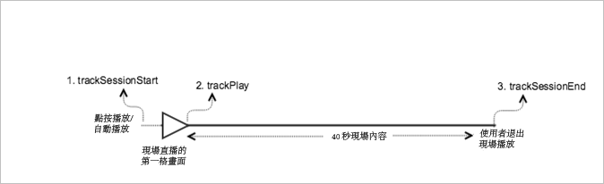

# 即時主要內容{#live-main-content}

## 藍本 {#scenario}

此情境中，一個沒有廣告的即時資產在加入即時資料流後，播放了 40 秒。

| 觸發 | 心率方法 | 網路呼叫 | 附註   |
|---|---|---|---|
| 使用者點按&#x200B;**[!UICONTROL 「播放」]** | `trackSessionStart` | Analytics 內容開始、心率內容開始 | 可能是使用者點按&#x200B;**[!UICONTROL 播放]**&#x200B;或自動播放事件。 |
| 媒體播放的第一個時間格。 | `trackPlay` | 心率內容播放 | 此方法會觸發計時器。只要繼續播放，便會每 10 秒傳送心率。 |
| 內容播放。 |  | 內容心率 |  |
| 工作階段已結束。 | `trackSessionEnd` |  | `SessionEnd` 表示檢視工作階段的結尾。即使使用者未持續使用到媒體完成，仍必須呼叫此 API。 |

## 參數 {#parameters}

您在 Adobe Analytics 內容開始呼叫上看到的許多相同值，也會在 Heartbeat 內容開始呼叫上看到。您也將看到 Adobe 用來在 Adobe Analytics 中填入各種「媒體」報表的許多其他參數。我們不會在此說明所有內容，只會說明真正重要的那些內容。

### 心率內容開始

| 參數 | 值 | 附註 |
|---|---|---|
| `s:sc:rsid` | &lt;Analytics 報表套裝 ID> |  |
| `s:sc:tracking_serve` | &lt;您的 Analytics 追蹤伺服器 URL> |  |
| `s:user:mid` | `s:user:mid` | 應該符合 Adobe Analytics 內容開始呼叫上的中間值 |
| `s:event:type` | &quot;start&quot; |  |
| `s:asset:type` | &quot;main&quot; |  |
| `s:asset:mediao_id` | &lt;您的媒體名稱> |  |
| `s:stream:type` | live |  |
| `s:meta:*` | 可選 | 媒體上設定的自訂中繼資料 |

## 內容心率 {#content-heartbeats}

在媒體播放期間，對於主要內容，計時器將每隔 10 秒傳送一或多個心率 (或 Ping)；對於廣告，則為每秒。這些心率將包含播放、廣告、緩衝和其他部分項目的相關資訊。每個心率的確切內容不在本文件的討論範圍，這裡要確認的重點在於，繼續播放能否會一致觸發心率。

在內容心率中，尋找幾個特定項目：

| 參數 | 值 | 附註 |
|---|---|---|
| `s:event:type` | &quot;play&quot; |  |
| `l:event:playhead` | &lt;playhead position> 例如 50、60、70 | 這應該反映播放點目前的位置。 |

## 心率內容完成 {#heartbeat-content-complete}

此情境中不會有完成呼叫，因為即時資料流從不會結束。

## 播放點值設定

對於LIVE流，您需要將playhead值設定為自該天午夜UTC以來的秒數，以便在報告中，分析員可以確定用戶在24小時視圖內加入和離開LIVE流的時間點。

### 開始時

對於LIVE媒體，當用戶開始播放流時，需要設定 `l:event:playhead` 到該天午夜UTC後的秒數。 與此相對的是，在 VOD 中，您會將播放點設為「0」。注：使用進度標籤時，需要內容持續時間，並且需要以從媒體項開始開始以秒數（從0開始）更新播放頭。

例如，假設「即時」資料流事件在午夜開始並持續執行 24 小時 (`a.media.length=86400`; `l:asset:length=86400`)。接著，假設使用者在中午 12:00 開始播放該「即時」資料流。在此方案中，應設定 `l:event:playhead` 到43200（自UTC當天午夜以秒計的12小時）。

### 暫停時

使用者暫停播放時，必須套用開始播放時所套用的同一個「即時播放點」邏輯。當用戶返回播放LIVE流時，必須設定 `l:event:playhead` 值根據自午夜UTC以來的新秒數， _不_ 到用戶暫停LIVE流的點。

## 程式碼範例 {#sample-code}



### Android

以下是預期的 API 呼叫順序：

```java
// Set up mediaObject 
MediaObject mediaInfo = MediaHeartbeat.createMediaObject( 
  Configuration.MEDIA_NAME,  
  Configuration.MEDIA_ID,  
  Configuration.MEDIA_LENGTH,  
  MediaHeartbeat.StreamType.LIVE 
); 

HashMap<String, String> mediaMetadata = new HashMap<String, String>(); 
mediaMetadata.put(CUSTOM_VAL_1, CUSTOM_KEY_1); 
mediaMetadata.put(CUSTOM_VAL_2, CUSTOM_KEY_2); 

// 1. Call trackSessionStart() when the user clicks Play or if autoplay is used,  
//    i.e., there is an intent to start playback.  
_mediaHeartbeat.trackSessionStart(mediaInfo, mediaMetadata); 

...... 
...... 

// 2. Call trackPlay() when the playback actually starts, i.e., when the first  
//    frame of main content is rendered on the screen. 
_mediaHeartbeat.trackPlay(); 

....... 
....... 

// 3. Call trackSessionEnd() when user ends the playback session.  
//    Since the user does not watch live media to completion, there  
//    is no need to call trackComplete().  
_mediaHeartbeat.trackSessionEnd(); 
....... 
....... 
```

### iOS 應用程式

以下是預期的 API 呼叫順序：

```
// Set up mediaObject 
ADBMediaObject *mediaObject =  
[ADBMediaHeartbeat createMediaObjectWithName:MEDIA_NAME  
                   length:MEDIA_LENGTH  
                   streamType:ADBMediaHeartbeatStreamTypeLIVE]; 
 
NSMutableDictionary *mediaContextData = [[NSMutableDictionary alloc] init]; 
[mediaContextData setObject:CUSTOM_VAL_1 forKey:CUSTOM_KEY_1]; 
[mediaContextData setObject:CUSTOM_VAL_2 forKey:CUSTOM_KEY_2]; 
 
// 1. Call trackSessionStart when the user clicks Play or if autoplay is used,  
//    i.e., there is an intent to start playback. 
[_mediaHeartbeat trackSessionStart:mediaObject data:mediaContextData]; 
...... 
...... 
 
// 2. Call trackPlay when the playback actually starts, i.e., when the first  
//    frame of the main content is rendered on the screen. 
[_mediaHeartbeat trackPlay]; 
....... 
....... 
 
// 3. Call trackSessionEnd when user ends the playback session. Since the user  
//    does not watch live media to completion, there is no need to call  
//    trackComplete. 
[_mediaHeartbeat trackSessionEnd]; 
........ 
........ 
```

### JavaScript

以下是預期的 API 呼叫順序：

```js
// Set up mediaObject 
var mediaInfo =  
MediaHeartbeat.createMediaObject(Configuration.MEDIA_NAME,  
                                 Configuration.MEDIA_ID,  
                                 Configuration.MEDIA_LENGTH,  
                                 MediaHeartbeat.StreamType.VOD); 

var mediaMetadata = { 
  CUSTOM_KEY_1 : CUSTOM_VAL_1,  
  CUSTOM_KEY_2 : CUSTOM_VAL_2,  
  CUSTOM_KEY_3 : CUSTOM_VAL_3 
}; 

// 1. Call trackSessionStart() when Play is clicked or if autoplay  
//    is used, i.e., there's an intent to start playback. 
this._mediaHeartbeat.trackSessionStart(mediaInfo, mediaMetadata); 

...... 
...... 

// 2. Call trackPlay() when the playback actually starts, i.e., when the  
//    first frame of media is rendered on the screen. 
this._mediaHeartbeat.trackPlay(); 

....... 
....... 

// 3. Call trackSessionEnd() when user ends the playback session.  
//    Since user does not watch live media to completion, there is  
//    no need to call trackComplete(). 
this._mediaHeartbeat.trackSessionEnd(); 

........ 
........ 
```
