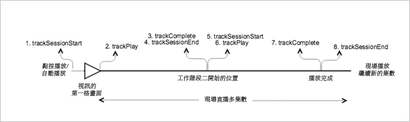

# 具有循序追蹤的即時主要內容{#live-main-content-with-sequential-tracking}

## 藍本 {#section_E4B558253AD84ED59256EDB60CED02AE}

在此案例中，有一個沒有廣告的即時資產，在加入即時資料流後播放了 40 秒。

這是與[沒有廣告的 VOD 播放](/help/sdk-implement/tracking-scenarios/vod-no-intrs-details.md)案例相同的案例，只是一部分內容被刪除，並且搜尋是從主要內容中的某個點到另一個點間完成。

| 觸發 | 心率方法 | 網路呼叫   | 附註   |
| --- | --- | --- | --- |
| 使用者點按[!UICONTROL 播放] | `trackSessionStart` | Analytics 內容開始、心率內容開始 | Measurement Library 不知道有前段廣告，因此這些網路呼叫完全等同於[沒有廣告的 VOD 播放](/help/sdk-implement/tracking-scenarios/vod-no-intrs-details.md)案例。 |
| 內容播放的第一個時間格。 | `trackPlay` | 心率內容播放 | 當章節內容在主要內容之前播放時，Heartbeats 會在章節開始時啟動。 |
| 內容播放 |  | 內容心率 | 此網路呼叫完全等同於[沒有廣告的 VOD 播放](/help/sdk-implement/tracking-scenarios/vod-no-intrs-details.md)案例。 |
| 工作階段 1 結束 (第 1 集結束) | `trackComplete` `trackSessionEnd` | 心率內容完成 | 完成表示已到達第 1 集的工作階段 1，並完整觀看。開始下一集的工作階段之前，必須結束此工作階段。 |
| 第 2 集開始 (工作階段 2 開始) | `trackSessionStart` | Analytics內容開始心率內容開始 | 這是因為使用者觀看了第一集並繼續觀看其他集 |
| 媒體的第一個畫格 | `trackPlay` | 心率內容播放 | 此方法會觸發計時器，並且從此點開始，只要播放繼續，便會每 10 秒傳送心率。 |
| 內容播放 |  | 內容心率 |  |
| 工作階段結束 (第 2 集結束) | `trackComplete` `trackSessionEnd` | 心率內容完成 | 完成表示已到達第 2 集的工作階段 2，並完整觀看。開始下一集的工作階段之前，必須結束此工作階段。 |

## 參數 {#section_D52B325B99DA42108EF560873907E02C}

### 心率內容開始

| 參數 | 值 | 附註 |
|---|---|---|
| `s:sc:rsid` | &lt;Your Adobe Report Suite ID&gt; |  |
| `s:sc:tracking_serve` | &lt;Your Analytics Tracking Server URL&gt; |  |
| `s:user:mid` | `s:user:mid` | 應該符合 Adobe Analytics 內容開始呼叫上的中間值 |
| `s:event:type` | `"start"` |  |
| `s:asset:type` | `"main"` |  |
| `s:asset:media_id` | &lt;您的媒體名稱&gt; |  |
| `s:stream:type` | `live` |  |
| `s:meta:*` | *可選* | 媒體上設定的自訂中繼資料 |

## 心率內容播放 {#section_B6AD9225747943F881DCA8E6A1D5710E}

這應該看起來大多與心率內容開始呼叫完全相同，但主要的差異在於「s:event:type」參數。所有參數應該仍在此就定位。

| 參數 | 值 | 附註 |
|---|---|---|
| `s:event:type` | `"play"` |  |
| `s:asset:type` | `"main"` |  |

## 內容心率 {#section_7B387303851A43E5993F937AE2B146FE}

在媒體播放期間，會有計時器每10秒傳送一或多個心率。這些心率將包含關於播放、廣告、緩衝和一些其他項目的資訊。每個心率的確切內容不在本文件的範圍，要驗證的重要項目為，當播放繼續時會一致地觸發心率。

在內容心率中，尋找一些特定項目:

| 參數 | 值 | 附註 |
|---|---|---|
| `s:event:type` | `"play"` |  |
| `l:event:playhead` | &lt;playhead position&gt; 例如 50、60、70 | 這應該反映播放點目前的位置。 |

## 心率內容完成 {#section_2CA970213AF2457195901A93FC9D4D0D}

播放任何集完成時 (播放點跨過集界限)，會傳送心率內容完成呼叫。這類似其他 Heartbeat 呼叫，但將包含某些特定項目:

| 參數 | 值 | 附註 |
|---|---|---|
| `s:event:type` | `"complete"` |  |
| `s:asset:type` | `"main"` |  |

## 程式碼範例 {#section_mpx_q2j_x2b}



### Android

以下是預期的 API 呼叫順序:

```java
// Set up mediaObject 
MediaObject mediaInfo = MediaHeartbeat.createMediaObject( 
  Configuration.MEDIA_NAME,  
  Configuration.MEDIA_ID,  
  Configuration.MEDIA_LENGTH,  
  MediaHeartbeat.StreamType.LIVE 
); 

HashMap<String, String> mediaMetadata = new HashMap<String, String>(); 
mediaMetadata.put(CUSTOM_VAL_1, CUSTOM_KEY_1); 
mediaMetadata.put(CUSTOM_VAL_2, CUSTOM_KEY_2); 

// 1. Call trackSessionStart() when the user clicks Play or if autoplay is used,  
//    i.e., when there is an intent to start playback.  
_mediaHeartbeat.trackSessionStart(mediaInfo, mediaMetadata); 

...... 
...... 

// 2. Call trackPlay() when the playback actually starts, i.e., when the first  
//    frame of main content is rendered on the screen.  
_mediaHeartbeat.trackPlay(); 

....... 
....... 

// 3. Call trackComplete() when the playback reaches the end of session,  
//    i.e., when the media completes and finishes playing 1st episode/session.  
_mediaHeartbeat.trackComplete(); 

........ 
........ 

// 4. Call trackSessionEnd() to end session 1 
_mediaHeartbeat.trackSessionEnd(); 

........ 
........ 

// Start tracking session 2 /episode 2 of the same live stream.  
// There is no need to reinstantiate a mediaHeartbeat instance for tracking sesison 2. 
// Set up mediaObject 
MediaObject mediaInfo = MediaHeartbeat.createMediaObject( 
  Configuration.MEDIA_NAME,  
  Configuration.MEDIA_ID,  
  Configuration.MEDIA_LENGTH,  
  MediaHeartbeat.StreamType.LIVE 
); 

HashMap<String, String> mediaMetadata = new HashMap<String, String>(); 
mediaMetadata.put(CUSTOM_VAL_1, CUSTOM_KEY_1); 
mediaMetadata.put(CUSTOM_VAL_2, CUSTOM_KEY_2); 

// 5. Call trackSessionStart() when the playhead reaches a point that denotes the 
//    start of session 2 
_mediaHeartbeat.trackSessionStart(mediaInfo, mediaMetadata); 

...... 
...... 

// 6. Call trackPlay() to start tracking session 2 playback  
_mediaHeartbeat.trackPlay(); 

....... 
....... 

// 7. Call trackComplete() when the playback reaches the end of session 2,  
//    i.e., the media completes and finishes playing.  
_mediaHeartbeat.trackComplete(); 

........ 
........ 

// 8. Call trackSessionEnd() to end session 2 
_mediaHeartbeat.trackSessionEnd(); 

........ 
........ 

// Continue similarly tracking further sessions in the live stream if required 
```

### iOS 應用程式

以下是預期的 API 呼叫順序:

```
// Set up mediaObject 
ADBMediaObject *mediaObject =  
[ADBMediaHeartbeat createMediaObjectWithName:MEDIA_NAME  
                   length:MEDIA_LENGTH  
                   streamType:ADBMediaHeartbeatStreamTypeLIVE]; 
  
NSMutableDictionary *mediaContextData = [[NSMutableDictionary alloc] init]; 
[mediaContextData setObject:CUSTOM_VAL_1 forKey:CUSTOM_KEY_1]; 
[mediaContextData setObject:CUSTOM_VAL_2 forKey:CUSTOM_KEY_2]; 
  
// 1. Call trackSessionStart when the user clicks Play or if autoplay is used,  
//    i.e., there is an intent to start playback. 
[_mediaHeartbeat trackSessionStart:mediaObject data:mediaContextData]; 
...... 
...... 
  
// 2. Call trackPlay when the playback actually starts, i.e., when the first  
//    frame of main content is rendered on the screen. 
[_mediaHeartbeat trackPlay]; 
....... 
....... 

// 3. Call trackComplete when the playback reaches the end of session,  
//    i.e., when the media completes and finishes playing the first 
//    episode/session. 
[_mediaHeartbeat trackComplete]; 
....... 
....... 

// 4. Call trackSessionEnd to end session 1 
[_mediaHeartbeat trackSessionEnd]; 
........ 
........ 

// Start tracking session 2 / episode 2 of the same live stream, No need to  
// reinstantiate mediaHeartbeat instance for tracking sesison 2. 

// Set up mediaObject 
ADBMediaObject *mediaObject =  
[ADBMediaHeartbeat createMediaObjectWithName:MEDIA_NAME  
                   length:MEDIA_LENGTH  
                   streamType:ADBMediaHeartbeatStreamTypeLIVE]; 
 
NSMutableDictionary *mediaContextData = [[NSMutableDictionary alloc] init]; 
[mediaContextData setObject:CUSTOM_VAL_1 forKey:CUSTOM_KEY_1]; 
[mediaContextData setObject:CUSTOM_VAL_2 forKey:CUSTOM_KEY_2]; 
 
// 5. Call trackSessionStart when the playhead reaches a point that denotes  
//    start of session 2 
[_mediaHeartbeat trackSessionStart:mediaObject data:mediaContextData]; 
...... 
...... 
 
// 6. Call trackPlay to start tracking session 2 playback 
[_mediaHeartbeat trackPlay]; 
....... 
....... 
 
// 7. Call trackComplete when the playback reaches the end of session 2,  
//    i.e., when the media completes and finishes playing. 
[_mediaHeartbeat trackComplete]; 
........ 
........ 
 
// 8. Call trackSessionEnd to end the session 2 
[_mediaHeartbeat trackSessionEnd]; 
........ 
........ 

// Continue tracking further sessions in live stream similarly if required 
```

### JavaScript

以下是預期的 API 呼叫順序:

```js
// Set up mediaObject 

var mediaInfo = MediaHeartbeat.createMediaObject( 
  Configuration.MEDIA_NAME,  
  Configuration.MEDIA_ID,  
  Configuration.MEDIA_LENGTH,  
  MediaHeartbeat.StreamType.VOD 
); 

var mediaMetadata = { 
  CUSTOM_KEY_1 : CUSTOM_VAL_1,  
  CUSTOM_KEY_2 : CUSTOM_VAL_2,  
  CUSTOM_KEY_3 : CUSTOM_VAL_3 
}; 

// 1. Call trackSessionStart() when Play is clicked or if autoplay is used,  
//    i.e., there's an intent to start playback. 
this._mediaHeartbeat.trackSessionStart(mediaInfo, mediaMetadata); 

...... 
...... 

// 2. Call trackPlay() when the playback actually starts, i.e., when the  
//    first frame of media is rendered on the screen. 
this._mediaHeartbeat.trackPlay(); 

....... 
....... 

// 3. Call trackComplete() when the playback reaches the end of a session,  
//    i.e., whn playback completes and finishes playing the 1st episode/session. 
this._mediaHeartbeat.trackComplete(); 

........ 
........ 

// 4. Call trackSessionEnd() to end session 1 
this._mediaHeartbeat.trackSessionEnd(); 

........ 
........ 

// Start tracking session 2/episode 2 of the same live stream. There is no need  
// to reinstantiate a mediaHeartbeat instance for tracking sesison 2. 

// Set up mediaObject 
var mediaInfo2 = MediaHeartbeat.createMediaObject( 
  Configuration.MEDIA_NAME,  
  Configuration.MEDIA_ID,  
  Configuration.MEDIA_LENGTH,  
  MediaHeartbeat.StreamType.LIVE 
); 

var mediaMetadata2 = { 
  CUSTOM_KEY_1 : CUSTOM_VAL_1,  
  CUSTOM_KEY_2 : CUSTOM_VAL_2,  
  CUSTOM_KEY_3 : CUSTOM_VAL_3 
}; 

// 5. Call trackSessionStart() when the playhead reaches a point that denotes  
//    the start of session 2 
this._mediaHeartbeat.trackSessionStart(mediaInfo2, mediaMetadata2); 

...... 
...... 

// 6. Call trackPlay() to start tracking session 2 playback 
this._mediaHeartbeat.trackPlay(); 

....... 
....... 

// 7. Call trackComplete() when the playback reaches the end of session 2,  
//    i.e., playback completes and finishes playing. 
this._mediaHeartbeat.trackComplete(); 

........ 
........ 

// 8. Call trackSessionEnd() to end session 2 
this._mediaHeartbeat.trackSessionEnd(); 

........ 
........ 

// Continue tracking further sessions in live stream similarly if required 
```

