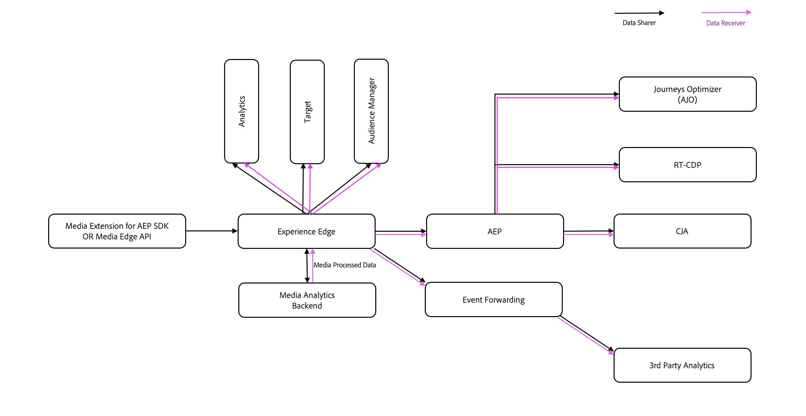

# 同盟媒體{#federated-media}

Federated Media服務提供一套系統，可供在兩個合作夥伴之間共用串流媒體資料（音訊和視訊）。
串流媒體收集附加元件建立的標準化測量資料是同盟媒體的標誌，可讓相同的資料從多個來源匯入單一報表。
透過同盟媒體管理的規則和邏輯，可輕鬆控管資料，並依照不同合作關係的需求個別調整資料。
同盟媒體讓音訊與視訊測量更有效率、更簡化且更易於付諸執行。

## 優點 {#benefits}

* **透明：**&#x200B;各公司使用同一套邏輯，避免資料建立涉及黑箱作業
* **廣泛：**&#x200B;瞭解不同合作關係、平台和裝置間，音訊與視訊觀看量的完整觸及範圍和影響
* **安全：**&#x200B;透過規則和邏輯控管伺服器端的資料共用
* **標準化：**&#x200B;和您的合作夥伴使用相同的資料語言
* **易於執行：**&#x200B;透過 Adobe Analytics 量化音訊與視訊資料，以便衡量播放器基準、監控趨勢和偵測異常
* **集中：**&#x200B;在單一 Adobe 位置蒐集音訊與視訊測量資料
* **符合合約:**&#x200B;輕鬆符合資料共享的法律需求
* **即時：**&#x200B;近乎即時傳送和接收資料
* **簡便：**&#x200B;只需利用 Adobe SDK 單次標記播放器，便可與多位合作夥伴共用資料。

## 定義 {#definitions}

* **傳送者：**&#x200B;在擁有的播放器上產生音訊與視訊分析資料的客戶
* **接收者：**&#x200B;接收來自傳送者之音訊與視訊分析資料的客戶

## 要求 {#requirements}

* **媒體資料流合約：**&#x200B;傳送者與接收者在取得 Adobe Analytics 內音訊與視訊資料的存取權前，必須先簽署適用於媒體資料流的 Adobe Analytics 合約。如需更多詳細資訊，請與您的帳戶團隊聯絡。
* **同盟增補合約：**&#x200B;每一位傳送者與接收者在傳送或接收資料前，必須擁有一份與 Adobe 簽署的增補合約。每位客戶須各擁有一份增補合約，而非一段合作關係共用一份。如需更多詳細資訊，請與您的帳戶團隊聯絡。

* **串流媒體收集附加元件實作：**&#x200B;傳送者必須在將作為同盟資料集一部分的所有播放器上實作串流媒體收集附加元件。 只有串流媒體資料可用於同盟。 如需詳細資訊，請參閱[Adobe串流媒體集合附加元件概述](/help/media-overview.md)。

* **Adobe 諮詢合約:**&#x200B;若要進行接收者和傳送者之間同盟規則的初始設定，建議您與諮詢服務人員合作檢閱資料並建立資料共享協定。

## 下載同盟媒體表單

若要參與同盟媒體，請下載並完成[同盟規則協定](assets/federated_analytics_form.pdf)表單。

## 程序 {#process}

1. 傳送者與接收者共同合作填寫「同盟規則協定」表單。「同盟規則協定」表單含有我們工程團隊專用的特殊欄位，「僅限」使用 Adobe Acrobat 編輯。[免費下載 Acrobat。](https://get.adobe.com/reader/)
1. 在能取得資料檔案的前提下，諮詢服務可提供接收者範例資料檔案，內含來自傳送者播放器的實際資料，以便進一步確認資料共用規則已妥善定義。
1. 傳送者與接收者可確保資料共享協定符合雙方之間的所有合約需求。
1. 諮詢服務會將填妥的表單傳送至 Adobe 工程技術部門，以建立資料共用規則。
1. 資料會與開發Adobe Analytics報表套裝或Adobe Experience Platform資料流共用，接收者可在此檢閱及驗證資料。
1. 接收者一旦確認資料正確，Adobe工程將更新規則以指向生產Analytics報表套裝或Adobe Experience Platform資料流。
1. 接收者將檢閱及驗證Analytics生產報表套裝或Adobe Experience Platform資料流中的資料。
1. 若日後資料組發生變更，傳送者或接收者可提交客戶服務票證尋求支援。
