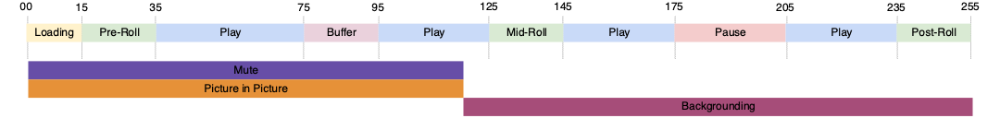

# 多播放器狀態追蹤

有時兩個播放器狀態會同時開始和結束，或者一個狀態的結束也是另一個狀態的開始，如下圖所示：



目前的實施允許兩種情況：
- `stateStart(pictureInPicture)` - t0
- `stateStart(mute)` - t0
- `stateEnd(mute)` - t1
- `stateEnd(pictureInPicture)` - t1
- `stateStart(fullScreen)` - t1
- `stateEnd(fullScreen)` - t2

但是，這需要您發出多個 `stateStart` 和 `stateEnd` 事件來表示多項同時的狀態變更。為了將這種常見行為最佳化，已實施了一個新的 `statesUpdate` 事件類型，這會結束一個狀態清單並開始一個新的狀態清單。

使用新的 `statesUpdate` 事件，上面的事件清單會變成：
- `statesUpdate(statesEnd=[], statesStart=[pictureInPicture, mute])` - t0
- `statesUpdate(statesEnd=[mute, pictureInPicture], statesStart=[fullScreen])` - t1
- `statesUpdate(statesEnd=[fullScreen], statesStart=[])` - t2

對於相同的行為，狀態更新呼叫的數量已從六減為三。最後一次活動
也可能是一個簡單的 `stateEnd(fullScreen)`。

## Media Collection API 實施 {#mpst-api}

您可以使用 Media Collection API 來實施多播放器狀態追蹤。

### 範例

下面顯示了用於多播放器狀態追蹤的 Media Collection API 實施範例。

```
// statesUpdate (ex: mute and pictureInPicture are switched on)
http(s)://<Analytics_Visitor_Namespace>.hb-api.omtrdc.net/api/v1/sessions/<SID>/events
{
  "eventType": "statesUpdate",
  "params": {
    "statesStart": [
      {
        "media.state.name": "mute"
      },
      {
        "media.state.name": "pictureInPicture"
      }
    ]
  },
  "playerTime": {
    "playhead": 0,
    "ts": 1569999130627
  }
}
```

```
// statesUpdate (ex: mute and pictureInPicture are switched off, fullScreen is switched on)
http(s)://<Analytics_Visitor_Namespace>.hb-api.omtrdc.net/api/v1/sessions/<SID>/events
{
  "eventType": "statesUpdate",
  "params": {
    "statesEnd": [
      {
        "media.state.name": "mute"
      },
      {
        "media.state.name": "pictureInPicture"
      }
    ],
    "statesStart": [
      {
        "media.state.name": "fullScreen"
      }
    ]
  },
  "playerTime": {
    "playhead": 0,
    "ts": 1569999130627
  }
}
```

```
// statesUpdate (ex: fullScreen is switched off)
http(s)://<Analytics_Visitor_Namespace>.hb-api.omtrdc.net/api/v1/sessions/<SID>/events
{
  "eventType": "statesUpdate",
  "params": {
    "statesEnd": [
      {
        "media.state.name": "fullScreen"
      }
    ]
  },
  "playerTime": {
    "playhead": 0,
    "ts": 1569999130627
  }
}
```

## Media SDK 實施

無 Media SDK 實施。
