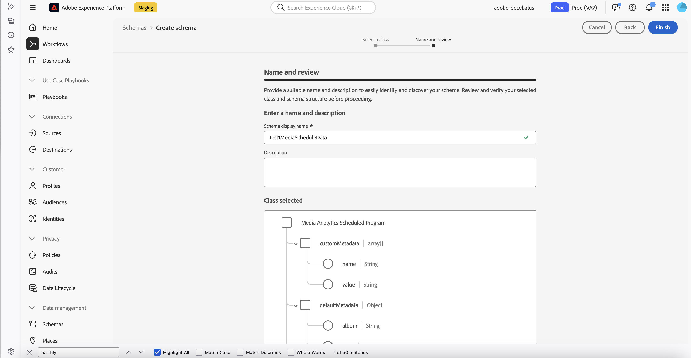

# 上傳排程資料以追蹤即時內容

>[!AVAILABILITY]
>
>本文中描述的功能處於發佈的有限測試階段，可能尚未開放使用於您的環境中。此功能開放使用時，便會刪除此備註。如需發行程式的相關資訊，請參閱[Customer Journey Analytics功能發行](https://experienceleague.adobe.com/en/docs/analytics-platform/using/releases/releases)。

您可以上傳過去直播串流媒體內容的排程資料，以更輕鬆且更準確地追蹤直播內容的收視率。 您可以追蹤個別方案的收視率，甚至追蹤特定主題或方案區段。

以下是支援排程資料上傳的直播內容範例：

* FAST (免費廣告支援的電視) 平台

* 本地串流

* 現場體育賽事

* 新聞或時事節目

## 功能

使用過去直播串流媒體內容的排程資料上傳時，可以使用各種功能。 本節說明有助於分析程式效能的一些主要功能。

無論您以何種方式實施串流媒體收集，均可使用這些功能。

* **準確地追蹤方案排程**：識別您想要分析的時段內，即時資料流中每個個別方案的開始和結束時間。 有了精確的開始和結束時間，精確的執行時間就會得到精確反映，並且可以針對每個檢視器工作階段進行分析。

  例如，在直播體育賽事結束之前，精確的開始和結束時間並不一定知道。 排程資料上傳可讓您在程式完成後更新開始和結束時間，以取得準確的報告。

* **追蹤個別主題或方案區段**：為特定主題或方案區段（時段）建立新的以時間為基礎的維度。 這些以時間為基礎的維度可讓您在更具體的層級分析節目的收視率，有助於收集哪些主題或節目區段最能引起共鳴的見解。

  例如，在分析直播體育賽事（例如足球比賽）時，您可以為上半場、下半場及下半場建立個別的維度。 以這種方式追蹤方案中的特定主題或區段，可讓您更詳細地劃分檢視者行為。

* **在Journey Optimizer中建立使用者歷程**：追蹤某人在特定工作階段中檢視了哪些程式（或甚至是該人檢視了哪些主題或程式區段），然後在Adobe Journey Optimizer中使用此資料為觀看了特定程式或對特定主題表現出興趣的客戶建立使用者歷程。

## 瞭解排程資料如何適用於串流媒體

串流媒體排程資料功能的運作方式如下：

1. 從排程方案資料集中讀取排程方案記錄，依排程日期篩選。

   僅適用於過去24小時到48小時發生的計畫。

2. 從媒體資料集中讀取媒體關閉事件，依日期及排程程式記錄中的XDM路徑進行篩選。

3. 對於每個媒體關閉事件，會產生相同數目的媒體排程開始事件，因為顯示與媒體工作階段重疊。

   每個媒體排程開始事件都包含排程的名稱和長度。

   此外，名為&#x200B;**scheduleTimePlayed**&#x200B;的新時間量度包含媒體工作階段與排程程式重疊的秒數。 排程開始事件的時間戳記是節目開始時的時間戳記。

4. 將新的排程開始事件寫入AEP媒體資料集。

## 先決條件

若要上傳過去直播內容的排程資料，您的串流媒體環境必須符合以下先決條件：

* 必須啟用串流媒體收集來追蹤您要上傳排程資料的內容，如[追蹤總覽](/help/use-cases/track-av-playback/track-core-overview.md)中所述。<!--specifics??? -->

* 搭配Customer Journey Analytics使用串流媒體收集。 Adobe Analytics不提供上傳排程資料的功能。

## 在AEP中建立方案排程資料集

您必須先在Experience Platform中建立方案排程資料集，才能推送排程資訊：

1. 根據&#x200B;**Media Analytics排程程程式** XDM類別建立結構描述。

   

   這是Media Analytics已排程程式類別的XDM定義。

   [https://github.com/adobe/xdm/blob/master/components/fieldgroups/tv-schedule/media-analytics-scheduled-program.schema.json](https://github.com/adobe/xdm/blob/master/components/fieldgroups/tv-schedule/media-analytics-scheduled-program.schema.json)

1. 根據您建立的結構描述建立資料集。

1. 繼續下列區段，[推播排程資訊](#push-schedule-information)。

## 推播排程資訊

在您[建立方案排程資料集](#create-a-program-schedule-dataset-in-aep)之後，您可以推送排程資訊：

1. 使用排程資訊建立.json檔案。

   .json檔案必須包含一連串排程程式物件，以符合XDM架構。

1. 上傳.json檔案：

   >[!NOTE]
   >
   >本節中的cURL範例使用下列變數：
   >
   >* 若要使用Adobe Developer進行驗證：
   >     * CUSTOMER_API_KEY
   >     * AUTH_TOKEN
   >* 組織識別碼：CUSTOMER_ORG_ID
   >* 在設定中建立的記錄資料集的資料集ID： DATASET_ID
   >* 在檔案上傳中使用的第一個請求中建立的批次ID： BATCH_ID
   >* 用來推送記錄的檔案名稱：FILE_NAME

   1. 建立新批次，然後從回應中取得批次ID。

      考慮以下使用cURL建立新AEP批次的範例：

      ```
          curl -i 'https://platform.adobe.io/data/foundation/import/batches' \
          -X POST \
          -H 'Accept: application/json' \
          -H 'x-api-key: <CUSTOMER_API_KEY>' \
          -H 'x-gw-ims-org-id: <CUSTOMER_ORG_ID>' \
          -H 'Content-Type: application/json' \
          -H 'Authorization: Bearer <OAUTH_TOKEN>' \
          --data-raw '{"datasetId":"<DATASET_ID>","inputFormat":{"format":"json","isMultiLineJson":true},"tags":{"test":["2"]}}'
      
          HTTP/1.1 201 Created
          {
              "id": "BATCH_ID",
              "imsOrg": "CUSTOMER_ORG_ID",
              "updated": 1749838941763,
              "status": "loading",
              "created": 1749838941763,
              "relatedObjects": [
                  {
                      "type": "dataSet",
                      "id": "DATASET_ID"
                  }
              ],
              "version": "1.0.0",
              ............
          }
      ```

   1. 推送包含使用批次ID之程式排程資料記錄的.json檔案。

      若要推送排程資訊，您應該使用AEP批次API，如[批次擷取API總覽](https://experienceleague.adobe.com/en/docs/experience-platform/ingestion/batch/overview)所述。

      請考慮以下使用cURL來推送包含排程記錄的檔案的範例：

      ```
          curl -i 'https://platform.adobe.io/data/foundation/import/batches/<BATCH_ID>/datasets/<DATASET_ID>/files/<FILE_NAME>' \
          -X PUT \
          -H 'x-api-key: <CUSTOMER_API_KEY>' \
          -H 'x-gw-ims-org-id: <CUSTOMER_ORG_ID>' \
          -H 'Content-Type: application/json' \
          -H 'Authorization: Bearer <OAUTH_TOKEN>' \
          --upload-file ./schedule_21_05_2025.json`
      ```

   1. 完成批次。

      請考慮以下使用cURL完成批次的範例：

      ```
          curl -i 'https://platform.adobe.io/data/foundation/import/batches/<BATCH_ID>?action=COMPLETE' \
          -X POST \
          -H 'x-api-key: <CUSTOMER_API_KEY>' \
          -H 'x-gw-ims-org-id: <CUSTOMER_ORG_ID>' \
          -H 'Content-Type: application/json' \
          -H 'Authorization: Bearer <OAUTH_TOKEN>'
      ```

1. 繼續下列章節，[向Adobe客戶服務](#log-a-support-ticket-with-adobe-customer-care)登入支援票證。

## 向Adobe客戶服務登記支援票證

向Adobe客戶服務登記支援票證，並提供下列資訊：

* **媒體資料集**：指定從中讀取媒體工作階段資料的資料集的資料集ID。

* **排程資料集**：指定排程記錄所要推送之資料集的資料集ID。

* **輸出媒體資料集**：指定儲存排程開始事件之資料集的資料集ID。

  此資料集ID可與媒體資料集所使用的資料集ID相同。 如果是不同的資料集ID，還是應該有與媒體資料集相同的XDM結構描述。

* **組織識別碼**：指定您的組織識別碼。

## 包含兩個記錄的排程.json檔案範例

下列範例為包含兩個記錄的排程.json檔案。 每個.json檔案都應該包含一天的所有排程程程式。

```
   [
        {
            "_id": "any_identifier_as_id_1",
            "customMetadata": [
                {
                    "name": "Sample value",
                    "value": "Sample value"
                }
            ],
            "defaultMetadata": {
                "album": "Sample value",
                "artist": "Sample value",
                "assetID": "Sample value",
                "author": "Sample value",
                "cdn": "Sample value",
                "dayPart": "Sample value",
                "episode": "Sample value",
                "feed": "Sample value",
                "firstAirDate": "Sample value",
                "firstDigitalDate": "Sample value",
                "genreList": [
                    "Sample value"
                ],
                "label": "Sample value",
                "network": "Sample value",
                "originator": "Sample value",
                "publisher": "Sample value",
                "rating": "Sample value",
                "season": "Sample value",
                "show": "Sample value",
                "showType": "Sample value",
                "station": "Sample value",
                "streamFormat": "Sample value"
            },
            "mediaProgramDetails": {
                "length": 1800,
                "name": "Show Name",
                "startTimestamp": "2025-05-01T00:30:00+00:00"
            },
            "scheduleDate": "2025-05-01",
            "scheduleFilter": {
                "filterPath": "xdm.mediaReporting.sessionDetails.channel",
                "filterValue": "Channel Name"
            },
        },
        {
            "_id": "any_identifier_as_id_2",
            "customMetadata": [
                {
                    "name": "Sample value",
                    "value": "Sample value"
                }
            ],
            "defaultMetadata": {
                "album": "Sample value",
                "artist": "Sample value",
                "assetID": "Sample value",
                "author": "Sample value",
                "cdn": "Sample value",
                "dayPart": "Sample value",
                "episode": "Sample value",
                "feed": "Sample value",
                "firstAirDate": "Sample value",
                "firstDigitalDate": "Sample value",
                "genreList": [
                    "Sample value"
                ],
                "label": "Sample value",
                "network": "Sample value",
                "originator": "Sample value",
                "publisher": "Sample value",
                "rating": "Sample value",
                "season": "Sample value",
                "show": "Sample value",
                "showType": "Sample value",
                "station": "Sample value",
                "streamFormat": "Sample value"
            },
            "mediaProgramDetails": {
                "length": 3600,
                "name": "Show Name 2",
                "startTimestamp": "2025-05-01T01:00:00+00:00"
            },
            "scheduleDate": "2025-05-01",
            "scheduleFilter": {
                "filterPath": "xdm.mediaReporting.sessionDetails.channel",
                "filterValue": "Channel Name"
            }
        }
    ]
```

### 瞭解範例中的排程方案欄位

1. **mediaProgramDetails**：應該包含建立排程開始事件所需的最少資訊：
   * **startTimestamp**：節目開始的時間。
   * **名稱**：節目的易記名稱。
   * **length**：節目持續的秒數。

     >[!IMPORTANT]
     >
     >如果您有多個排程資料請求，它們不能有重疊的開始和結束時間。

1. **scheduleDate**：節目播放的日期。 格式應為YYYY-MM-DD。 它可用來篩選排程資料集，並取得adobe建立排程時開始的所有排程。
1. **scheduleFilter**：用於篩選所有媒體工作階段關閉事件。
   * **filterPath**：用於篩選之欄位的XDM路徑。
   * **filterValue**：用於篩選的值。
1. **customMetadata**：您想要新增至排程啟動事件的自訂中繼資料。 此中繼資料會用於覆寫工作階段關閉事件中存在的自訂中繼資料。
1. **defaultMetadata**：可新增或覆寫媒體關閉呼叫上預設中繼資料的特定維度清單。

   考量下列您可以在Customer Journey Analytics中建立並報告的維度範例：

   * **[「_集名稱_」](https://experienceleague.adobe.com/en/docs/media-analytics/using/implementation/variables/audio-video-parameters#episode)**：此維度可協助您瞭解特定系列中的哪些集數表現最好。

   * **[資產識別碼](https://experienceleague.adobe.com/en/docs/media-analytics/using/implementation/variables/audio-video-parameters#asset-id)**

1. 繼續[在Customer Journey Analytics](#analyze-data-in-customer-journey-analytics)中分析資料。

## 在Customer Journey Analytics中分析資料

如[要求並上傳排程資料檔案](#request-and-upload-the-schedule-data-file)中所述，上傳資料檔案後一天內，您的資料就可以在Customer Journey Analytics中報告了。

若要在Customer Journey Analytics中報告您過去的即時串流媒體資料：

1. 建立新專案或開啟現有專案。

1. 建立您分析過去即時串流媒體資料所需的任何表格或視覺效果，以建置專案。

   建置專案時，請使用您包含在排程資料檔案中並傳送至Adobe客戶服務的資訊。 這包括相符的索引鍵、維度和任何其他中繼資料。 如需詳細資訊，請參閱[要求並上傳排程資料檔](#request-and-upload-the-schedule-data-file)。


<!-- 

Extra

Things they need to upload:
Everything on that slide + other metadata
You can't overlap 2 schedules.
You can build a journey in AJO for the people who watch Mike, Mike, and Mike. e.g. 
This is recurring.
Available to all SKUs? "Increases cost for updated data by 22%, but included in the new higher tier Streaming Media SKU."

You can now upload schedule data of past live content to more easily and accurately track viewership. Live content includes content from FAST (Free Ad Supported TV) platforms or local streams.
You can track which programs a person viewed in a given session, or even which topics or program segments they viewed. These capabilities are available regardless of how you implemented Streaming Media Collection.
Previously, it was difficult to accurately tie a given session to specific programs when analyzing live content, and it wasn't possible to tie a given session to individual topics or program segments.
Schedule data uploads of live content in Streaming Media Collection includes the following capabilities:
Upload schedules for past live content, regardless of your Streaming Media Collection implementation.
Identify the start and end times of each individual program in the live stream for the period of time that you want to analyze. With accurate start and end times, the precise running time is accurately reflected and can be analyzed against each viewer session.
For example, precise beginning and end times are not always known for a live sporting event until the event is over. Schedule data uploads allow you to get accurate reporting by updating the start and end times after the program finishes.
Create new time-based dimensions for specific topics or program segments (time slots) within a given program. These time-based dimensions allow you to analyze viewership of a program at a more specific level, helping to gather insights about which topics or program segments resonated best.
For example, when analyzing a live sporting event, such as a soccer match, you can create separate dimensions for the first half, half time, and second half. This allows for more detailed breakdowns of viewer behavior for specific segments of a program.
These capabilities allow you to:
Analyze show viewership to understand performance.
Target users based on program viewership.
Analyze viewership based on metadata like topic, sports league, sponsorship, and so forth.
Target based on metadata viewership.
Correct media metrics for show dimensions of live sports/events for easier analysis at scale.
Increased ease of use for live sports

-->
