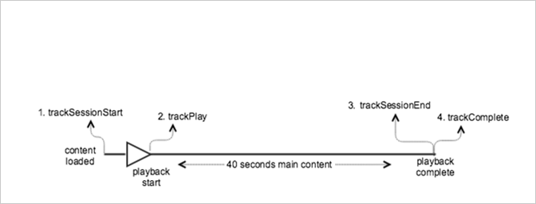

# 沒有廣告的 VOD 播放{#vod-playback-with-no-ads}

## 情境 {#scenario}

此案例有一個 VOD 資產，沒有廣告，從開始到結束播放一次。

| 觸發 | 心率方法 | 網路呼叫 | 附註   |
|---|---|---|---|
| 使用者點按&#x200B;**[!UICONTROL 「播放」]** | `trackSessionStart` | Analytics 內容開始、心率內容開始 | 這可以是使用者點按播放或自動播放事件中的一個。 |
| 媒體的第一個時間格 | `trackPlay` | 心率內容播放 | 此方法會觸發計時器，並且從此點開始，在播放期間每 10 秒即傳送心率。 |
| 內容播放 |  | 內容心率 |  |
| 內容已完成 | `trackComplete` | 心率內容完成 | *完成*&#x200B;表示已到播放點的結尾。 |

## 參數 {#parameters}

您在心率內容開始呼叫上看到的許多相同值，也會在 Adobe Analytics `Content Start` 呼叫上看到。Adobe 使用許多參數來填入各種媒體報表，但下表僅列出最重要的參數：

### 心率內容開始

| 參數 | 值 | 附註   |
|---|---|---|
| `s:sc:rsid` | &lt;Analytics 報表套裝 ID> |  |
| `s:sc:tracking_server` | &lt;您的 Analytics 追蹤伺服器 URL> |  |
| `s:user:mid` | 必須設定 | 應該符合 `Adobe Analytics Content Start` 呼叫上的中間值。 |
| `s:event:type` | `"start"` |  |
| `s:asset:type` | `"main"` |  |
| `s:asset:media_id` | &lt;您的媒體名稱> |  |
| `s:meta:*` | 可選 | 媒體上設定的自訂中繼資料。 |

## 心率內容播放 {#heartbeat-content-play}

這些參數看起來應該與 `Heartbeat Content Start` 呼叫大致相同，但主要的差異為 `s:event:type` 參數。所有其他參數仍應存在。

| 參數 | 值 | 附註   |
|---|---|---|
| `s:event:type` | `"play"` |  |
| `s:asset:type` | `"main"` |  |

## 內容心率 {#content-heartbeats}

在媒體播放期間，計時器至少會每 10 秒傳送一個心率。這些心率包含關於播放、廣告、緩衝等資訊。每個心率的確切內容不在本文件的範圍，但重要問題為，當播放繼續時會一致地觸發心率。

在內容心率中，尋找下列參數：

| 參數 | 值 | 附註   |
|---|---|---|
| `s:event:type` | `"play"` |  |
| `l:event:playhead` | &lt;播放點位置> 例如 50,60,70 | 此參數會反映播放點目前的位置。 |

## 心率內容完成 {#heartbeat-content-complete}

當播放完成時，其表示到達播放點結尾，會傳送 `Heartbeat Content Complete` 呼叫。此呼叫與其他心率呼叫類似，但包含幾個特定參數：

| 參數 | 值 | 附註   |
|---|---|---|
| `s:event:type` | `"complete"` |  |
| `s:asset:type` | `"main"` |  |

## 程式碼範例 {#sample-code}

在此案例中，內容長度為 40 秒，其播放到結尾而沒有任何岔斷。



### Android

```java
// Set up  mediaObject 
MediaObject mediaInfo = MediaHeartbeat.createMediaObject( 
  Configuration.MEDIA_NAME,  
  Configuration.MEDIA_ID,  
  Configuration.MEDIA_LENGTH,  
  MediaHeartbeat.StreamType.VOD 
); 

HashMap<String, String> mediaMetadata = new HashMap<String, String>(); 
mediaMetadata.put(CUSTOM_VAL_1, CUSTOM_KEY_1); 
mediaMetadata.put(CUSTOM_VAL_2, CUSTOM_KEY_2); 

// 1. Call trackSessionStart() when the user clicks Play or if autoplay  
//    is used, i.e., there's an intent to start playback.  
_mediaHeartbeat.trackSessionStart(mediaInfo, mediaMetadata); 

...... 
...... 

// 2. Call trackPlay() when the playback actually starts,  
//    i.e., the first frame of media is rendered on the screen.  
_mediaHeartbeat.trackPlay(); 

....... 
....... 

// 3. Call trackComplete() when the playback reaches the end,  
//    i.e., when the media completes and finishes playing.  
_mediaHeartbeat.trackComplete(); 

........ 
........ 

// 4. Call trackSessionEnd() when the playback session is over.  
//    This method must be called even if the user does not watch  
//    the media to completion.  
_mediaHeartbeat.trackSessionEnd(); 

........ 
........ 
```

### iOS

```
when the user clicks Play 
ADBMediaObject *mediaObject =  
[ADBMediaHeartbeat createMediaObjectWithName:MEDIA_NAME  
                   length:MEDIA_LENGTH  
                   streamType:ADBMediaHeartbeatStreamTypeVOD]; 

NSMutableDictionary *mediaContextData = [[NSMutableDictionary alloc] init]; 
[mediaContextData setObject:CUSTOM_VAL_1 forKey:CUSTOM_KEY_1]; 
[mediaContextData setObject:CUSTOM_VAL_2 forKey:CUSTOM_KEY_2]; 

// 1. Call trackSessionStart when the user clicks Play or if autoplay is used,  
//    i.e., there's an intent to start playback. 
[_mediaHeartbeat trackSessionStart:mediaObject data:mediaContextData]; 
...... 
...... 

// 2. Call trackPlay when the playback actually starts, i.e., when the  
//    first frame of main content is rendered on the screen. 
[_mediaHeartbeat trackPlay]; 
....... 
....... 

// 3. Call trackComplete when the playback reaches the end, i.e.,  
//    when the media completes and finishes playing. 
[_mediaHeartbeat trackComplete]; 
........ 
........ 

// 4. Call trackSessionEnd when the playback session is over. This method  
//    must be called even if the user does not watch the media to completion. 
[_mediaHeartbeat trackSessionEnd]; 
........ 
........ 
```

### JavaScript

```js
// Set up mediaObject 

var mediaInfo = MediaHeartbeat.createMediaObject(Configuration.MEDIA_NAME, Configuration.MEDIA_ID,  
Configuration.MEDIA_LENGTH,MediaHeartbeat.StreamType.VOD); 
var mediaMetadata = { 
  CUSTOM_KEY_1 : CUSTOM_VAL_1,  
  CUSTOM_KEY_2 : CUSTOM_VAL_2,  
  CUSTOM_KEY_3 : CUSTOM_VAL_3 

}; 

// 1. Call trackSessionStart() when the user clicks play, or when autoplay is used,  
//    i.e., there's an intent to start playback. 
this._mediaHeartbeat.trackSessionStart(mediaInfo, mediaMetadata); 

...... 
...... 

// 2. Call trackPlay() when the main content starts, i.e.,  
//    the first frame of the media content is rendered on the screen. 
this._mediaHeartbeat.trackPlay(); 

....... 
....... 

// 3. Call trackComplete() when the playback reaches the end,  
    i.e., the media completes and finishes playing. 
this._mediaHeartbeat.trackComplete(); 

........ 
........ 

// 4. Call trackSessionEnd() when the playback session is over.  
//    This method must be called even if the user does not  
//    watch the media to completion. 
this._mediaHeartbeat.trackSessionEnd(); 

........ 
........
```
