# 將受眾移轉至新的串流媒體欄位

本檔案說明應如何移轉使用Adobe串流媒體收集資料型別「媒體」欄位的對象，以使用名為「[媒體報表詳細資料](https://experienceleague.adobe.com/en/docs/experience-platform/xdm/data-types/media-reporting-details)」的新對應資料型別。

## 移轉對象

若要將對象從名為「媒體」的舊資料型別移轉到名為「[媒體報表詳細資料](https://experienceleague.adobe.com/en/docs/experience-platform/xdm/data-types/media-reporting-details)」的新資料型別，您必須編輯對象，並在每個規則中將已棄用資料型別的舊欄位取代為新資料型別的新對應欄位：

1. 找出包含已棄用「媒體」資料型別欄位的規則。 這是以路徑`media.mediaTimed`開頭的所有欄位。

1. 使用新「[媒體報告詳細資料](https://experienceleague.adobe.com/en/docs/experience-platform/xdm/data-types/media-reporting-details)」資料型別的欄位，複製這些規則。

1. 將這兩個規則維持在適當位置，直到您驗證對象是否如預期般運作為止。

1. 從過時的「媒體」資料型別中移除包含欄位的規則。

1. 驗證對象是否仍如預期般運作。

檢視[音訊和視訊引數](https://experienceleague.adobe.com/en/docs/media-analytics/using/implementation/variables/audio-video-parameters#content-id)頁面上的[內容識別碼](https://experienceleague.adobe.com/zh-hant/docs/media-analytics/using/implementation/variables/audio-video-parameters)引數，以對應舊欄位和新欄位。 舊欄位路徑可在「XDM欄位路徑」屬性下找到，而新欄位路徑可在「報告XDM欄位路徑」屬性下找到。

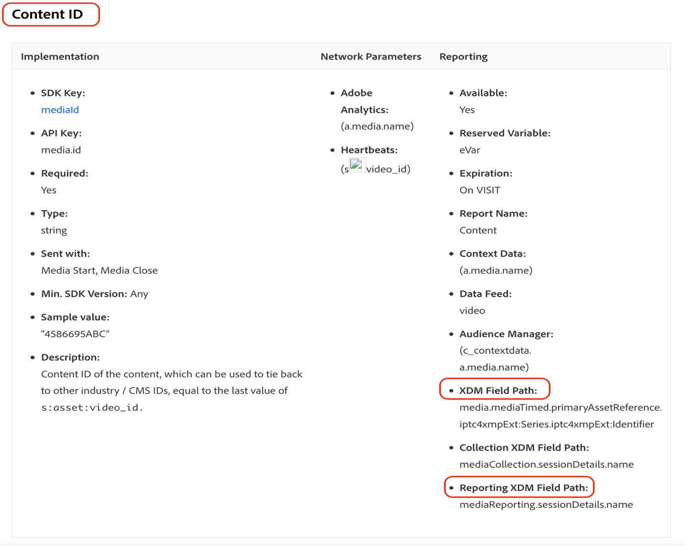

## 範例

若要更輕鬆遵循移轉准則，請考慮以下包含具有單一規則之對象的範例。 由於對象有單一規則，因此您只需要套用移轉指引一次。

1. 選取右上角的&#x200B;[!UICONTROL **編輯對象**]&#x200B;按鈕。

1. 找出為對象設定的規則。

   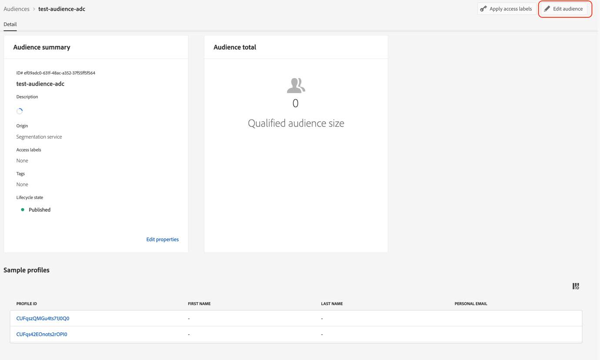

   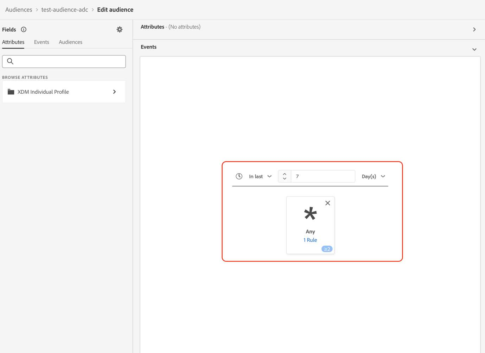

1. 選取規則以開啟其設定。

   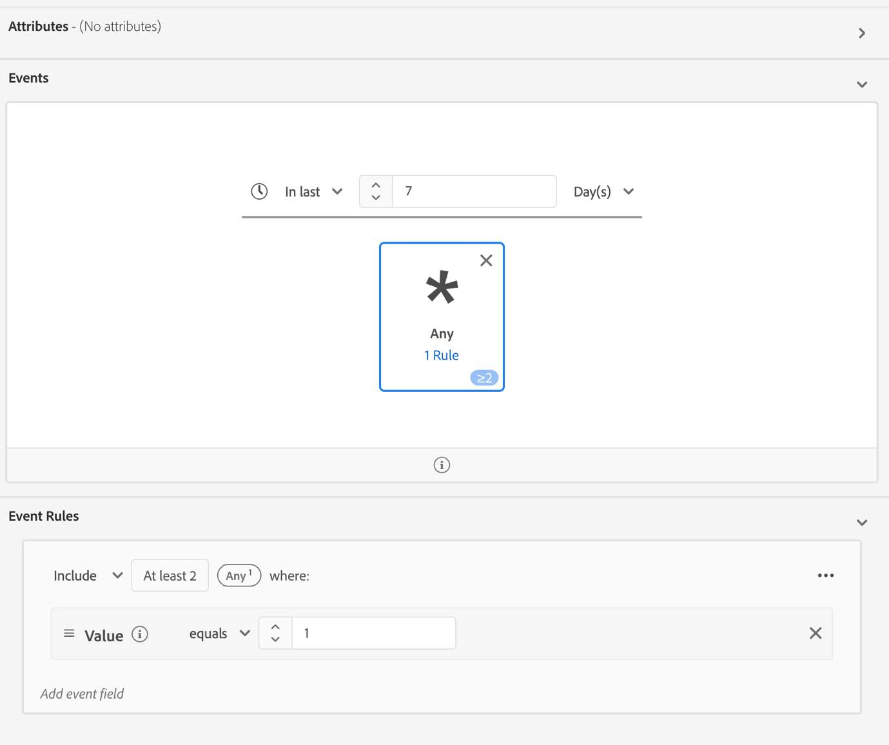

1. （可選）若要檢視規則中使用的欄位路徑，請選取欄位名稱附近的資訊按鈕。

   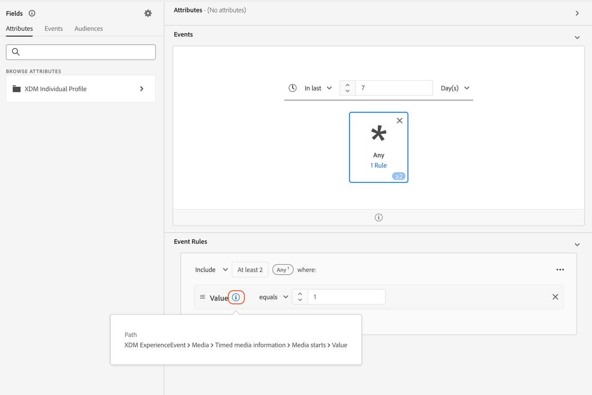

1. 識別欄位名稱（在此例中為「媒體開始」）。

   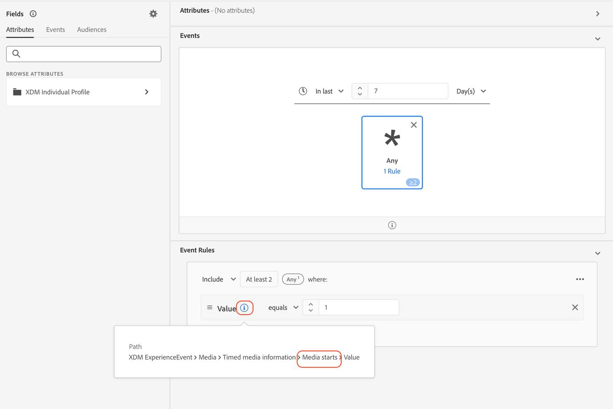

1. 請參閱[音訊和視訊引數](https://experienceleague.adobe.com/zh-hant/docs/media-analytics/using/implementation/variables/audio-video-parameters)頁面，以對應舊欄位。 舊欄位路徑可在「XDM欄位路徑」屬性下找到，而新欄位路徑可在「報告XDM欄位路徑」屬性下找到。 例如，對於[Media Starts](https://experienceleague.adobe.com/en/docs/media-analytics/using/implementation/variables/audio-video-parameters#media-starts)引數，`media.mediaTimed.impressions.value`的對應方是`mediaReporting.sessionDetails.isViewed`。

   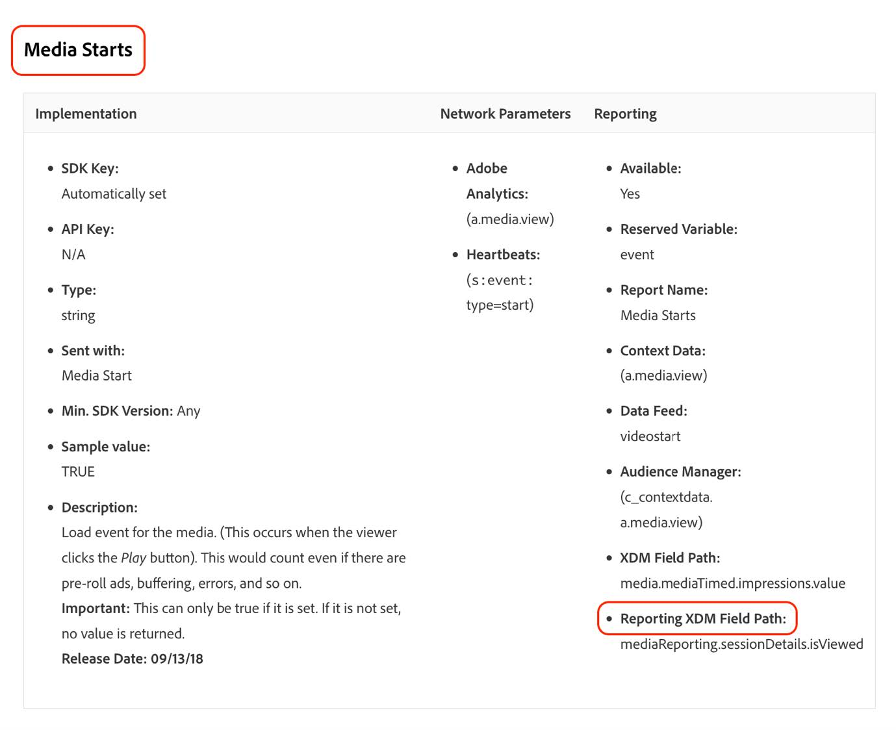

1. 使用新欄位新增與現有規則相同的規則。

   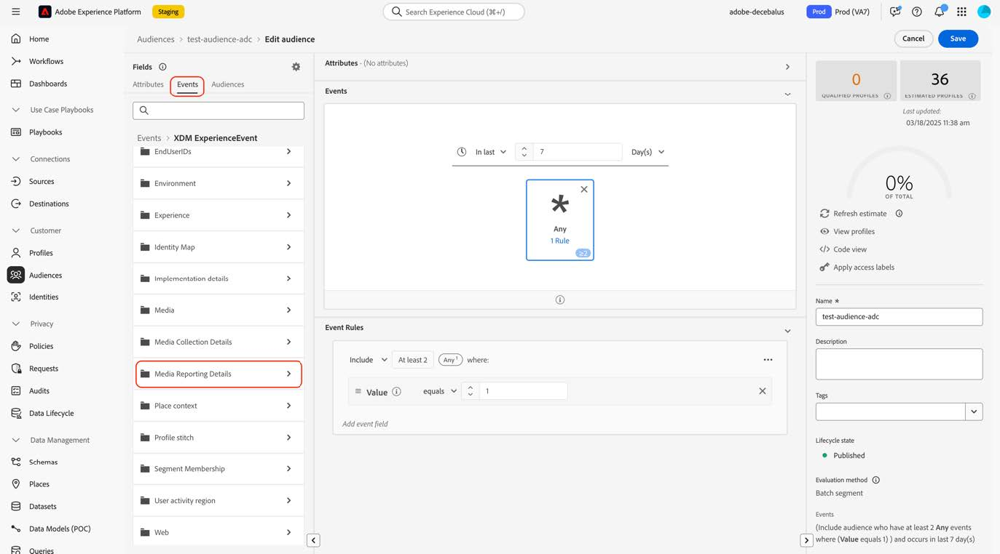

   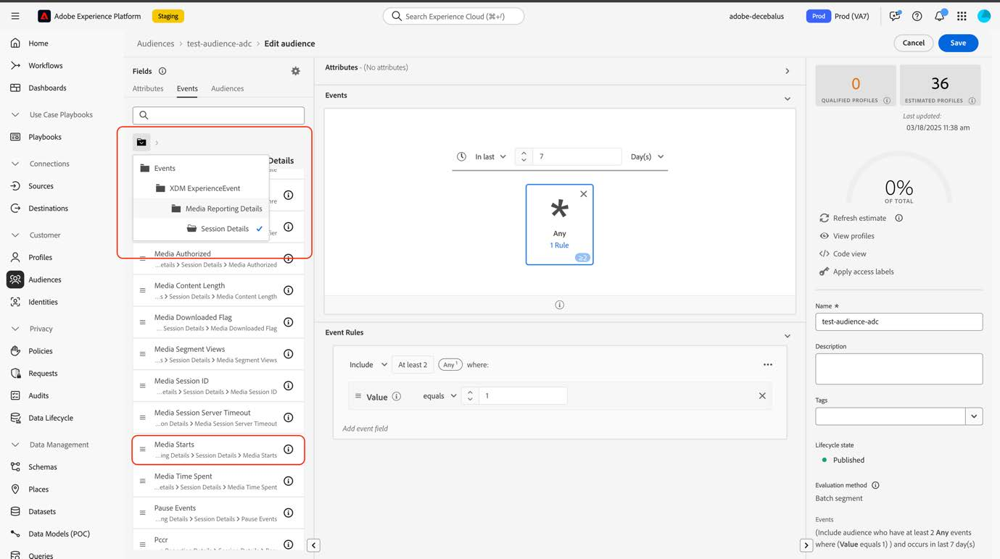

   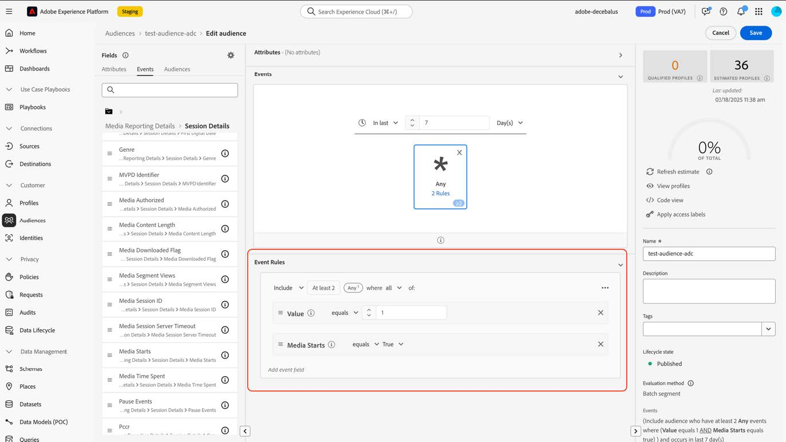

1. 選取「[!UICONTROL **儲存**]」以儲存對象。 您可以維持此設定，直到需要驗證對象是否仍如預期般運作為止。

1. 驗證完成後，請移除舊欄位，然後選取[儲存]以儲存對象。[!UICONTROL ****]

   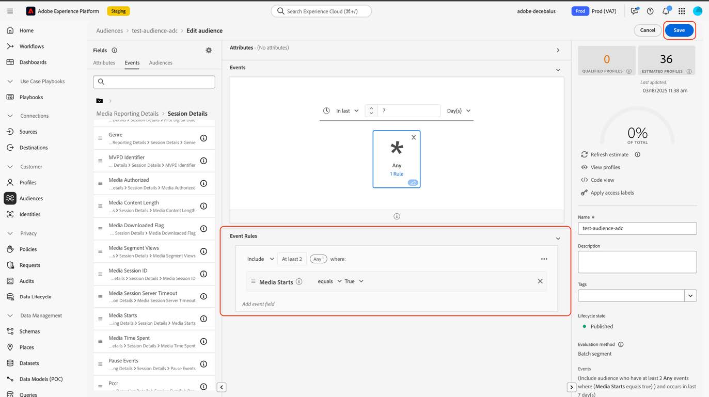

1. 再次驗證對象。

   對象移轉程式已完成。
