# 移轉Customer Journey Analytics以使用新的串流媒體欄位

本檔案說明應如何更新使用名為「Media」的Adobe串流媒體收集資料型別的Customer Journey Analytics設定，以使用名為「[媒體報表詳細資料](https://experienceleague.adobe.com/zh-hant/docs/experience-platform/xdm/data-types/media-reporting-details)」的新對應資料型別。

## 移轉Customer Journey Analytics

若要將Customer Journey Analytics安裝程式從名為「媒體」的舊資料型別移轉到名為「[媒體報告詳細資料](https://experienceleague.adobe.com/zh-hant/docs/experience-platform/xdm/data-types/media-reporting-details)」的新資料型別，您必須更新下列使用舊資料型別的安裝程式：

* 資料檢視

* 衍生欄位

### 移轉資料檢視

若要將資料檢視移轉至新的資料型別：

1. 使用過時的「媒體」資料型別找出所有資料檢視。 這是路徑以`media.mediaTimed`開頭的所有欄位。

1. 進行下列一項：

   * 在這些資料檢視中，插入新「媒體報告詳細資訊」資料型別的欄位。

   * 建立衍生欄位，使用新的「媒體報告詳細資訊」資料型別（如果已設定），或退回到舊的「媒體」資料型別（如果未設定「媒體報告詳細資訊」）。

### 移轉衍生欄位

若要將衍生欄位移轉至新資料型別：

1. 使用過時的「媒體」資料型別，找出所有衍生欄位。 這是包含路徑以`media.mediaTimed`開頭的欄位的所有衍生欄位。

1. 以「媒體報告詳細資訊」的新對應欄位取代衍生欄位中的所有舊欄位。

檢視[音訊和視訊引數](https://experienceleague.adobe.com/zh-hant/docs/media-analytics/using/implementation/variables/audio-video-parameters#content-id)頁面上的[內容識別碼](https://experienceleague.adobe.com/zh-hant/docs/media-analytics/using/implementation/variables/audio-video-parameters)引數，以對應舊欄位和新欄位。 舊欄位路徑可在「XDM欄位路徑」屬性下找到，而新欄位路徑可在「報告XDM欄位路徑」屬性下找到。

## 範例

為了更方便遵循移轉准則，請考慮以下範例，其中包含具有來自舊版已棄用「媒體」資料型別之欄位的資料檢視。 在此資料檢視中，您需要新增對應欄位。

### 更新資料檢視

您可以使用下列任一選項來更新資料檢視：

#### 選項1

1. 找出使用過時資料型別中舊欄位的量度或維度。

   資料檢視中的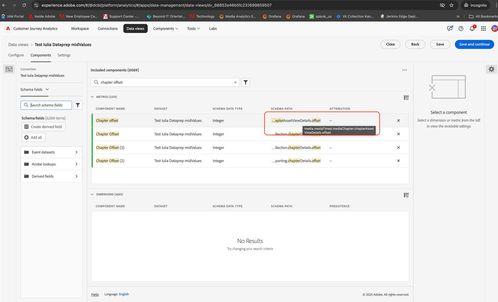

1. 檢查[章節引數](https://experienceleague.adobe.com/zh-hant/docs/media-analytics/using/implementation/variables/chapter-parameters#chapter-offset)文章中[章節位移](https://experienceleague.adobe.com/zh-hant/docs/media-analytics/using/implementation/variables/chapter-parameters)區段中對應的新欄位。

1. 在資料檢視中找出新的對應欄位。

   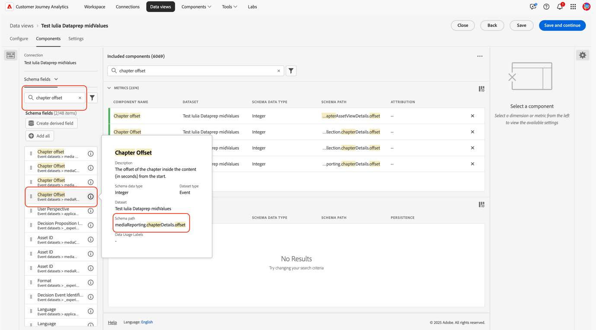

1. 將新欄位拖曳至量度或維度。

1. 針對使用已棄用「媒體」資料型別欄位的所有量度和維度，重複此程式。

#### 選項2

此選項會建立衍生欄位，以根據特定事件現有的值，從舊欄位選取值或從新欄位選取值。 此衍生欄位會取代任何使用它的專案中的舊「媒體」資料型別。

如果您想要為「章節名稱」建立衍生欄位，此欄位會使用新的「媒體報告詳細資訊」資料型別（如果已設定），或者如果未設定「媒體報告詳細資訊」資料型別，則會退回舊的「媒體」資料型別：

1. 將「Case When」子句拖曳至衍生欄位。

   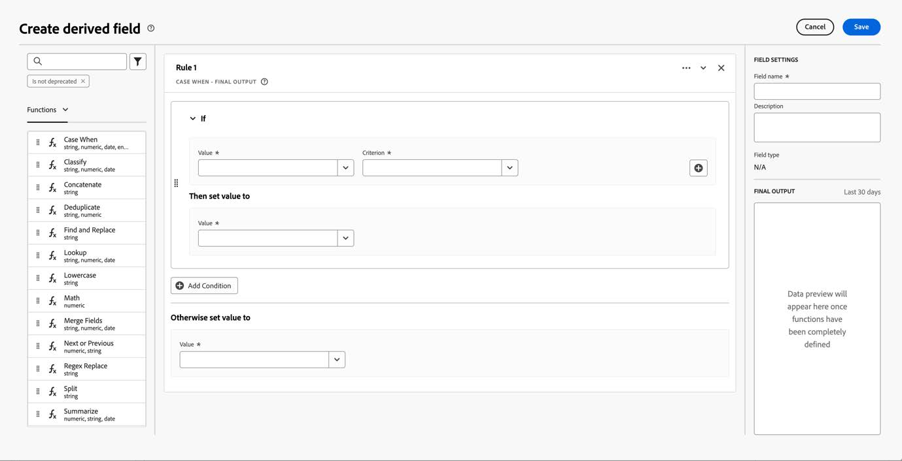

1. 使用&#x200B;[!UICONTROL **報告XDM欄位路徑**]&#x200B;的值填入&#x200B;**If**&#x200B;子句，如[章節引數](https://experienceleague.adobe.com/zh-hant/docs/media-analytics/using/implementation/variables/chapter-parameters#chapter-name)頁面上的[章節名稱](https://experienceleague.adobe.com/zh-hant/docs/media-analytics/using/implementation/variables/chapter-parameters)引數所示。

   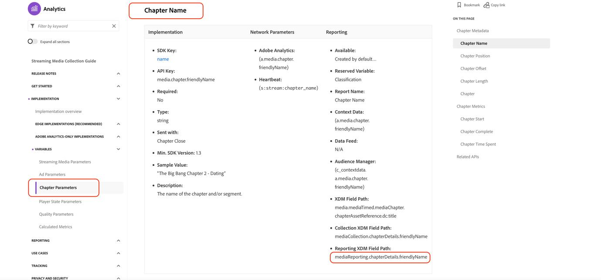

   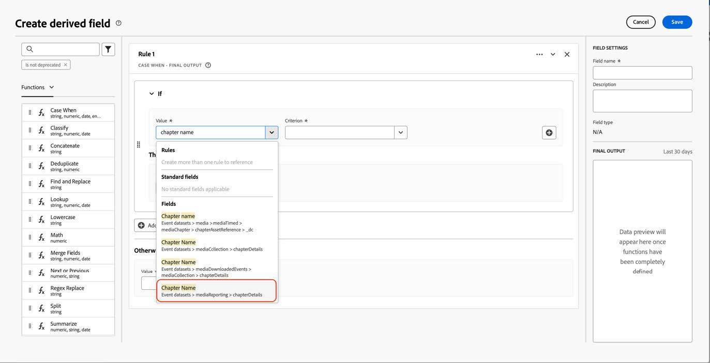

   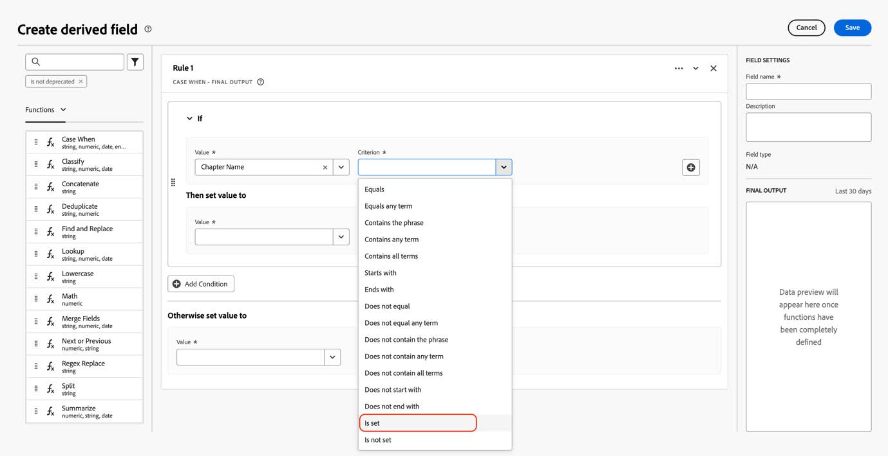

   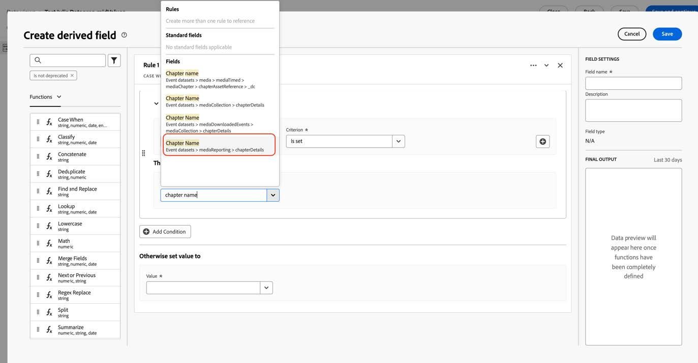

1. 使用已遭取代之「媒體」資料型別的舊欄位填入遞補值。

   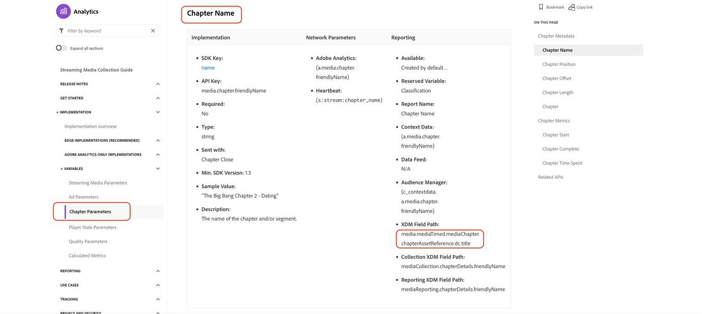

   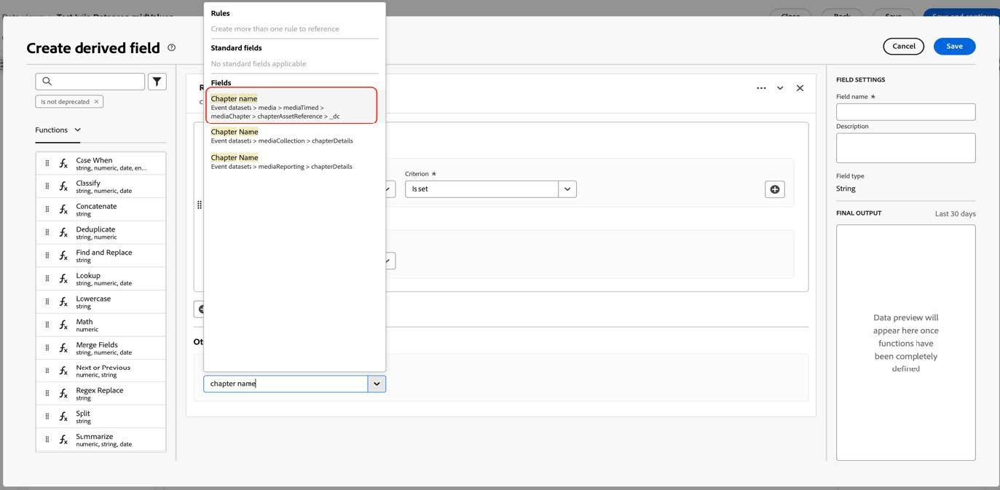

   這是衍生欄位的最終定義。

   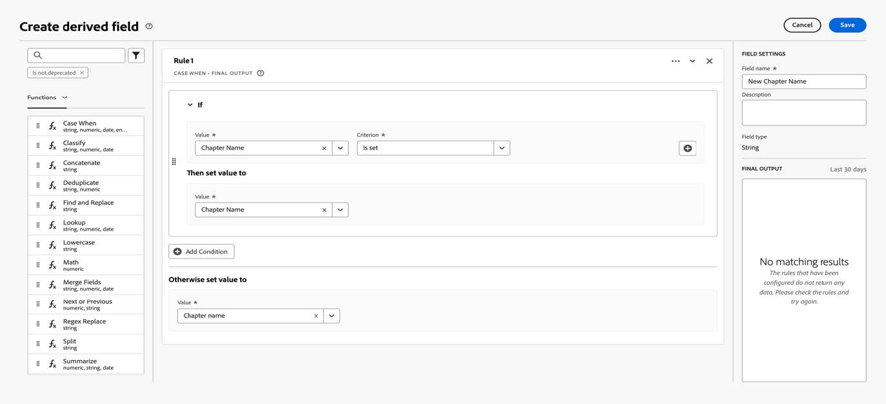

1. 若要更新衍生欄位，請找到使用舊版已棄用欄位的衍生欄位（路徑以`media.mediaTimed`開頭）。

   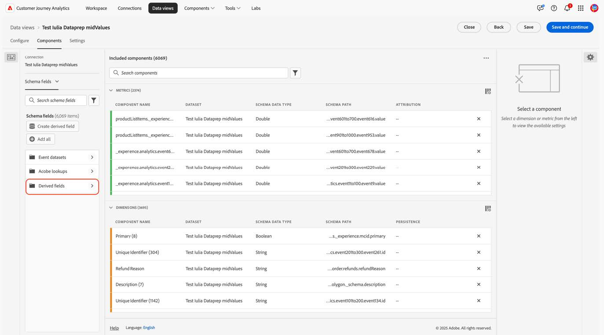

1. 將游標移至您要更新的衍生欄位上，然後選取&#x200B;[!UICONTROL **編輯**]&#x200B;圖示。

1. 找出舊資料型別的所有欄位（以`media.mediaTimed`開頭的路徑），並將它們取代為新的對應欄位。

   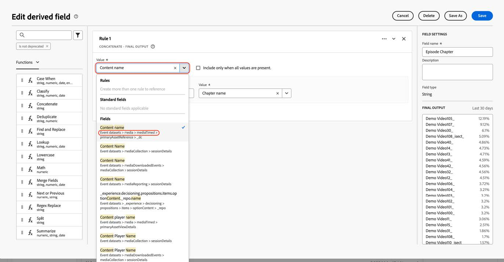

1. 檢查[串流媒體引數](https://experienceleague.adobe.com/zh-hant/docs/media-analytics/using/implementation/variables/audio-video-parameters#content-name-variable)文章中[內容名稱（變數）](https://experienceleague.adobe.com/zh-hant/docs/media-analytics/using/implementation/variables/audio-video-parameters#content-name-variable)區段中對應的新欄位。

1. 以新欄位取代舊欄位。

   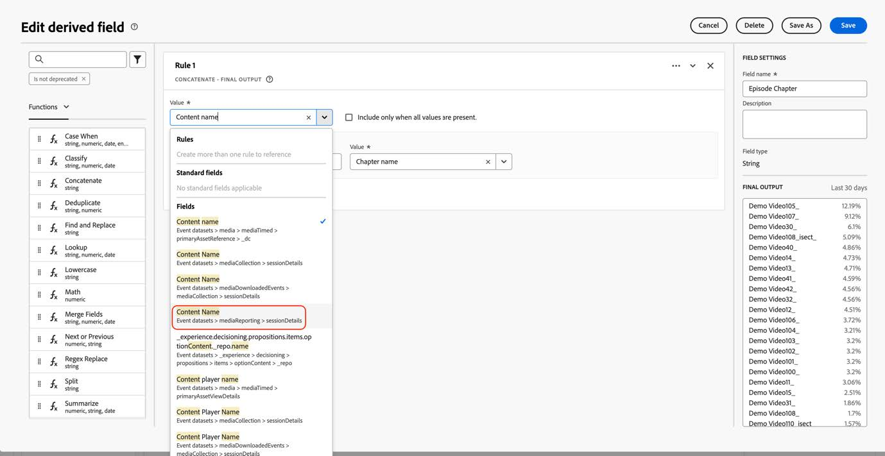

1. 使用舊版已棄用的「媒體」資料型別的欄位，對所有衍生欄位重複此程式。

   CJA設定的移轉已完成。

