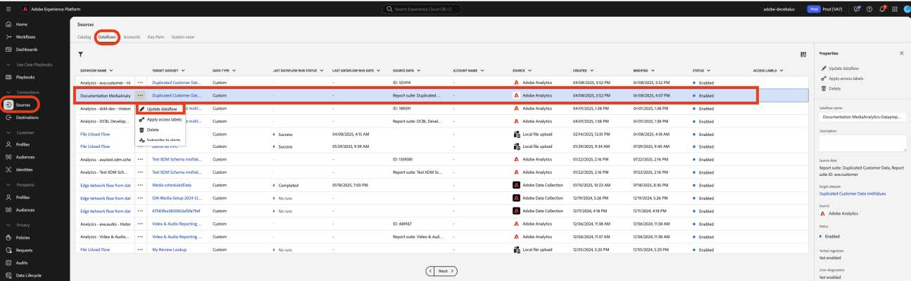
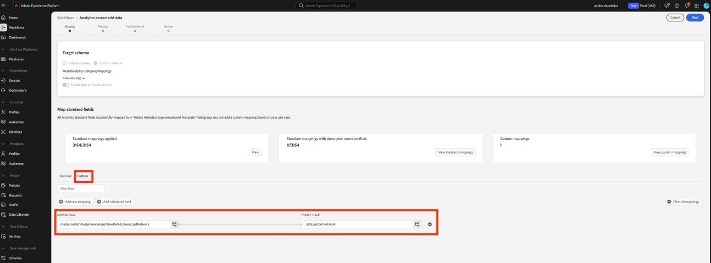
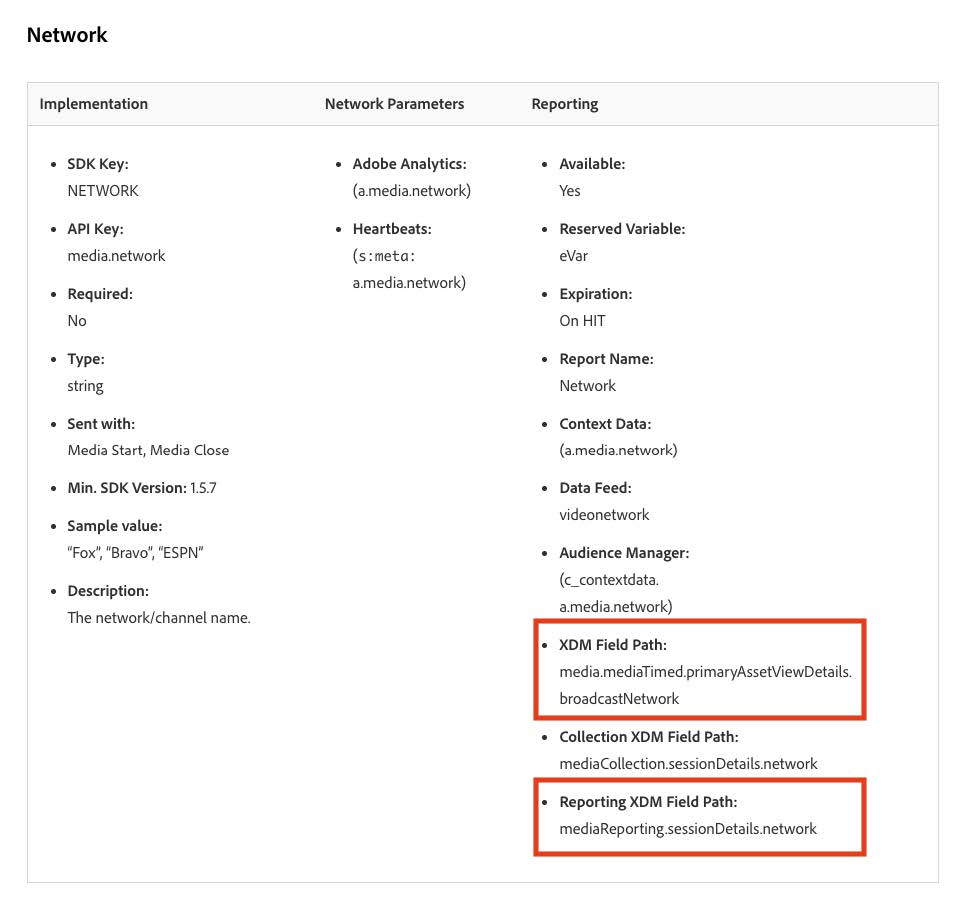
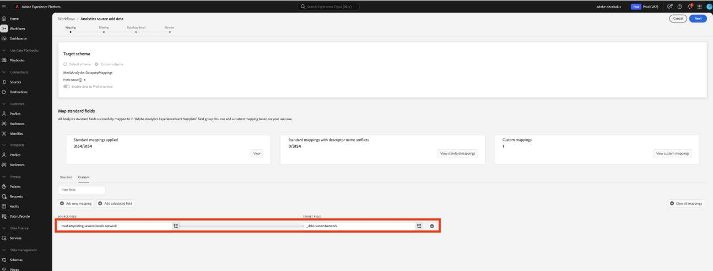
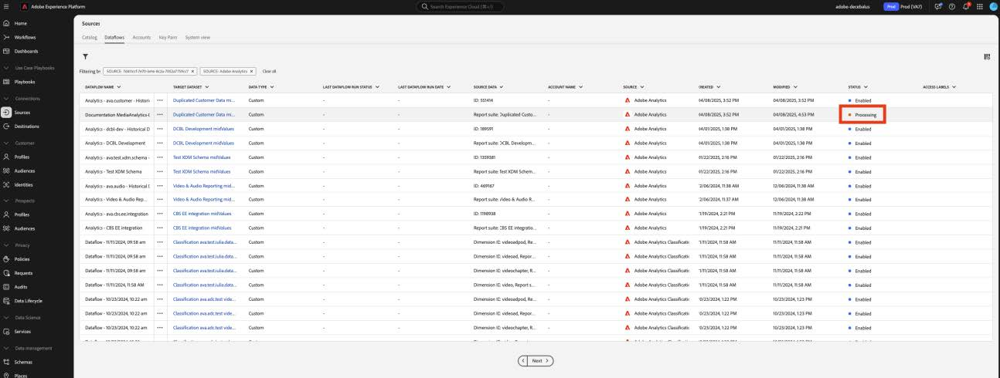
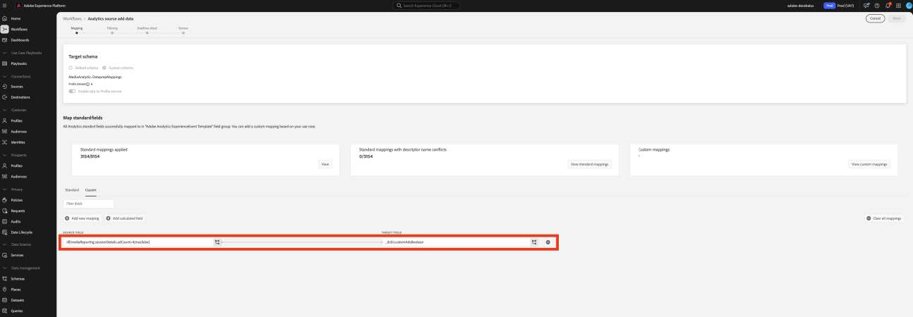

# 將自訂欄位的資料準備移轉至新的串流媒體欄位

本檔案說明移轉資料準備服務的程式，該服務位於為Adobe串流媒體收集資料啟用的Adobe資料收集流程之上。 移轉會從名為「Media」的Adobe串流媒體收集資料型別轉換資料準備對應，以使用名為「[媒體報表詳細資料](https://experienceleague.adobe.com/en/docs/experience-platform/xdm/data-types/media-reporting-details)」的新對應資料型別。

## 移轉自訂欄位的資料準備

若要將「資料準備」對應從名為「媒體」的舊資料型別移轉到名為「[媒體報告詳細資料](https://experienceleague.adobe.com/en/docs/experience-platform/xdm/data-types/media-reporting-details)」的新資料型別，您必須編輯「資料準備」對應：

>[!IMPORTANT]
>
>為避免遺失資料，在完成本節中的步驟之前，請確保已使用新的`mediaReporting`欄位部署Analytics來源聯結器。

1. 在Adobe Experience Platform中的&#x200B;[!UICONTROL **來源**]&#x200B;區段底下，前往&#x200B;[!UICONTROL **資料流**]&#x200B;標籤。

1. 找出負責透過Adobe資料收集將串流媒體資料從Adobe Analytics匯入Adobe Experience Platform的資料流。

1. 選取&#x200B;[!UICONTROL **更新資料流**]，將包含已棄用欄位的每個自訂來源對應，取代為新XDM物件中新的對應欄位，以修改「資料準備」設定。

1. 找出包含已棄用「Media」物件之來源欄位的對應。

1. 使用新「媒體報告詳細資訊」物件的欄位來取代這些來源。

1. 驗證對應是否仍如預期般運作。

檢視[音訊和視訊引數](https://experienceleague.adobe.com/en/docs/media-analytics/using/implementation/variables/audio-video-parameters#content-id)頁面上的[內容識別碼](https://experienceleague.adobe.com/zh-hant/docs/media-analytics/using/implementation/variables/audio-video-parameters)引數，以對應舊欄位和新欄位。 舊欄位路徑可在「XDM欄位路徑」屬性下找到，而新欄位路徑可在「報告XDM欄位路徑」屬性下找到。

## 範例

為了更方便遵循移轉准則，請考慮以下包含單一對應的資料流範例。 在此情況下，您只需要套用移轉指引一次。

1. 在Adobe Experience Platform中的&#x200B;[!UICONTROL **來源**]&#x200B;區段底下，前往&#x200B;[!UICONTROL **資料流**]&#x200B;標籤。

1. 找出負責透過Adobe資料收集將串流媒體資料從Adobe Analytics匯入Adobe Experience Platform的資料流。

1. 選取&#x200B;**[!UICONTROL 更新資料流]**&#x200B;以輸入編輯使用者介面，如下圖所示。

   

1. 在&#x200B;**[!UICONTROL 對應]**&#x200B;索引標籤中，選取&#x200B;**[!UICONTROL 自訂]**。

1. 識別依賴`media.mediaTimed`欄位做為來源的自訂對應。

   

   在此範例中，由於您在開發組織的結構描述上建立了自訂欄位群組，因此目標欄位在`_dcbl`下。 自訂欄位群組路徑會因組織名稱而異。

1. 對於使用`media.mediaTimed`物件的每個對應，使用此檔案在`mediaReporting`物件中尋找其對應項。

   例如，對於Network，`media.mediaTimed.primaryAssetViewDetails`.broadcastNetwork的通訊者是`mediaReporting.sessionDetails.network`。

   

1. 在&#x200B;**[!UICONTROL Source欄位]**&#x200B;欄位中，將`media.mediaTimed`路徑取代為`mediaReporting`路徑。 目標欄位保持不變。

   

1. 選取&#x200B;**[!UICONTROL 下一步]**&#x200B;以儲存變更。

   狀態顯示為&#x200B;**[!UICONTROL 正在處理]**。 套用變更後，狀態會顯示為&#x200B;**[!UICONTROL 已啟用]**。

   

## 不同資料型別的範例

在上述範例中，所有相關的資料型別均為String，因此直接取代對應。

如果來源欄位資料型別與目標欄位資料型別不同，您必須遵循[資料準備疑難排解指南](https://experienceleague.adobe.com/en/docs/experience-platform/data-prep/troubleshooting-guide)、[使用資料準備處理資料格式](https://experienceleague.adobe.com/en/docs/experience-platform/data-prep/data-handling)和[資料準備對應函式](https://experienceleague.adobe.com/en/docs/experience-platform/data-prep/data-handling)中的准則。

例如，如果來源型別是字串，而目標型別是布林值，「資料準備」可以自動剖析值並將來源值轉換為布林值。

如果來源型別是數字，而目標型別是布林值，則您需要使用資料操控函式：

與`media.mediaTimed`對應至自訂欄位。

與`mediaReporting`對應至相同的自訂欄位：

