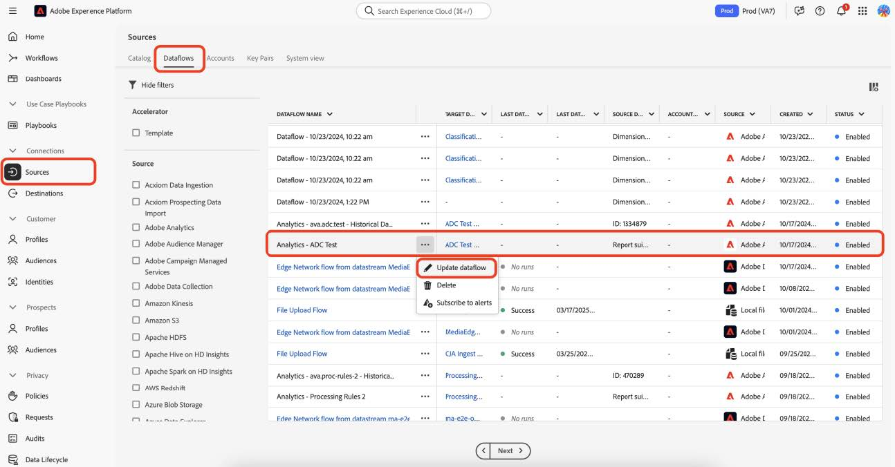
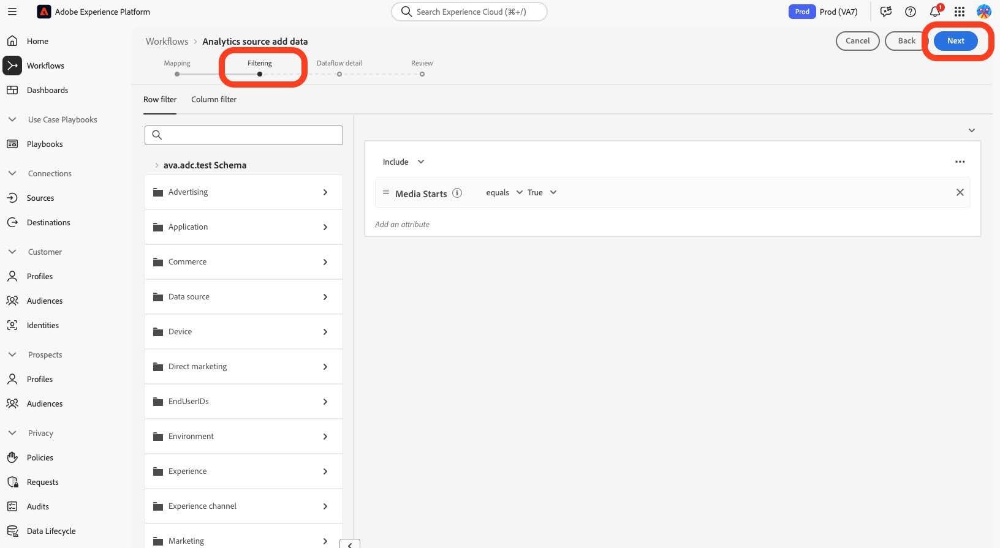
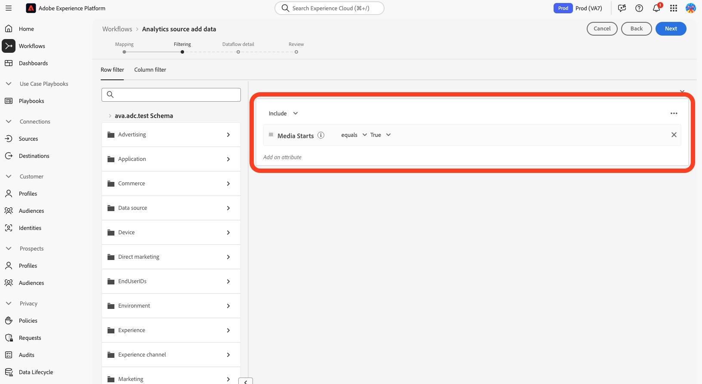
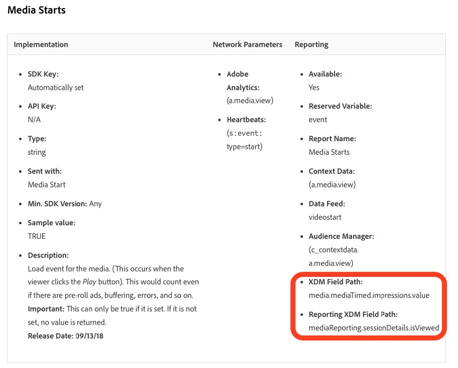
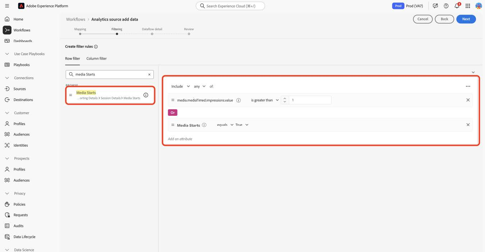

# 將設定檔移轉至新的串流媒體欄位

本檔案說明移轉設定檔篩選服務的程式，該服務位於為Adobe Analytics for Streaming Media資料啟用的Adobe資料收集流程之上。 移轉會使用名為「Media」的Adobe串流媒體收集資料型別，將設定檔篩選服務轉換為使用名為「[媒體報表詳細資料](https://experienceleague.adobe.com/en/docs/experience-platform/xdm/data-types/media-reporting-details)」的新對應資料型別。

## 移轉設定檔

若要將設定檔篩選從名為「媒體」的舊資料型別移轉到名為「[媒體報告詳細資料](https://experienceleague.adobe.com/en/docs/experience-platform/xdm/data-types/media-reporting-details)」的新資料型別，您必須編輯現有的設定檔篩選規則：

1. 在Adobe Experience Platform中的&#x200B;[!UICONTROL **來源**]&#x200B;區段底下，前往&#x200B;[!UICONTROL **資料流**]&#x200B;標籤。

1. 找出負責透過Adobe資料收集將串流媒體資料從Adobe Analytics匯入Adobe Experience Platform的資料流。

1. 選取&#x200B;[!UICONTROL **更新資料流**]，將包含已棄用欄位的每個自訂規則取代為新XDM物件中新的對應欄位，以修改設定檔篩選設定。

1. 找出包含已棄用「媒體」物件欄位的篩選器。

1. 從新的「媒體報告詳細資訊」物件新增欄位，以附加這些篩選器。

1. 在兩個欄位之間使用OR運運算元；

1. 驗證設定檔是否仍如預期般運作。

檢視[音訊和視訊引數](https://experienceleague.adobe.com/en/docs/media-analytics/using/implementation/variables/audio-video-parameters#content-id)頁面上的[內容識別碼](https://experienceleague.adobe.com/zh-hant/docs/media-analytics/using/implementation/variables/audio-video-parameters)引數，以對應舊欄位和新欄位。 舊欄位路徑可在「XDM欄位路徑」屬性下找到，而新欄位路徑可在「報告XDM欄位路徑」屬性下找到。

## 範例

為了更方便遵循移轉准則，請考慮以下包含單一設定檔篩選規則的資料流範例。 在此情況下，由於只有單一規則，因此您只需要套用移轉指引一次。

1. 在Adobe Experience Platform中的&#x200B;[!UICONTROL **來源**]&#x200B;區段底下，前往&#x200B;[!UICONTROL **資料流**]&#x200B;標籤。

1.找出負責透過Adobe Analytics將串流媒體資料從Adobe Analytics匯入Adobe Experience Platform的資料流。

1. 選取&#x200B;**[!UICONTROL 更新資料流]**&#x200B;以輸入編輯使用者介面，如下圖所示。

   

1. 選取&#x200B;**[!UICONTROL 下一步]**&#x200B;以移至[篩選]索引標籤。

   

1. 在&#x200B;**[!UICONTROL 篩選]**&#x200B;索引標籤上，識別依賴`media.mediaTimed`欄位的篩選規則。

   

   針對使用meda.mediaTimed物件的每個篩選器，使用`mediaReporting`音訊和視訊引數[頁面在](https://experienceleague.adobe.com/zh-hant/docs/media-analytics/using/implementation/variables/audio-video-parameters)物件中尋找其對應項，以對應舊欄位和新欄位。 舊欄位路徑可在「XDM欄位路徑」屬性下找到，而新欄位路徑可在「報告XDM欄位路徑」屬性下找到。 例如，對於[Media Starts](https://experienceleague.adobe.com/en/docs/media-analytics/using/implementation/variables/audio-video-parameters#media-starts)，`media.mediaTimed.impressions.value`的通訊者是`mediaReporting.sessionDetails.isViewed`。

   

1. 將相關的`mediaReporting`欄位拖曳至篩選規則，並在兩個規則之間使用OR運運算元。 使用新欄位時新增與現有規則相同的規則。

   

1. 選取&#x200B;**[!UICONTROL 下一步]**&#x200B;以儲存變更。
